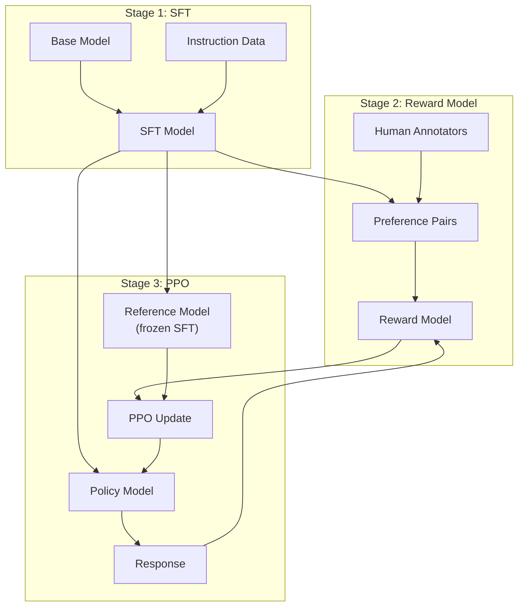
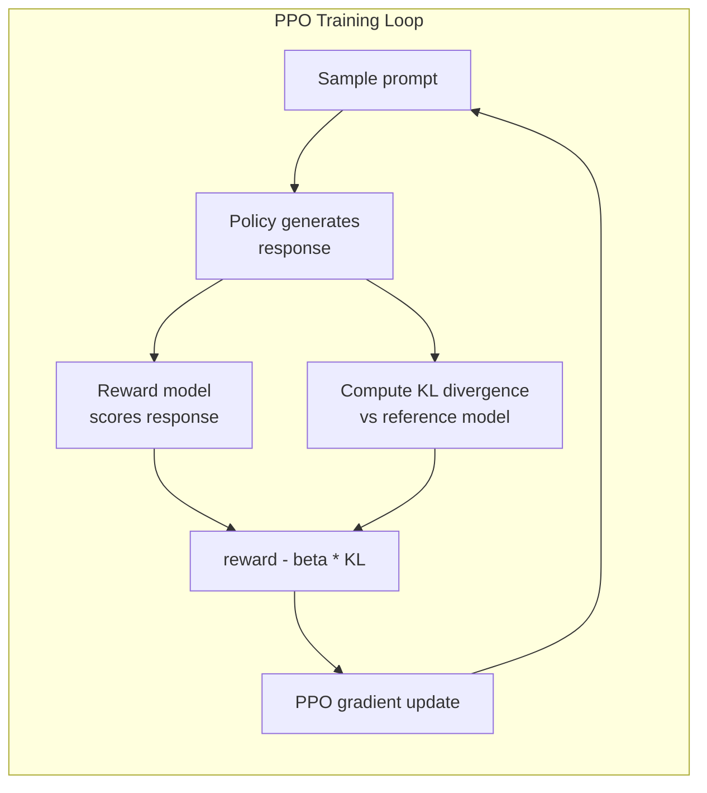

# RLHF: Reward Model + PPO

> SFT teaches the model to follow instructions. But it doesn't teach the model which response is BETTER. Two grammatically correct, factually accurate answers can differ enormously in helpfulness. RLHF is how you encode human judgment into the model's behavior. It's what makes Claude helpful and GPT polite.

**Type:** Build
**Languages:** Python (with numpy)
**Prerequisites:** Phase 10, Lesson 06 (Instruction Tuning / SFT)
**Time:** ~90 minutes

## Learning Objectives

- Build a reward model that scores response quality from human preference pairs (chosen vs rejected)
- Implement the PPO training loop that optimizes a language model policy against the reward model with a KL penalty
- Explain why RLHF requires three models (SFT, reward, policy) and how the KL constraint prevents reward hacking
- Evaluate the effect of RLHF by comparing response quality before and after preference optimization

## The Problem

Ask a model "Explain quantum computing" and it might produce:

**Response A:** "Quantum computing uses qubits that can exist in superposition, meaning they can be 0, 1, or both simultaneously. This allows quantum computers to process certain calculations exponentially faster than classical computers."

**Response B:** "Quantum computing is a type of computing that uses quantum mechanical phenomena. It was first proposed in the 1980s. Richard Feynman suggested that quantum systems could be simulated by quantum computers."

Both responses are factually correct. Both are grammatically sound. But Response A is clearly better. It's more concise, more informative, and better structured. A human would pick A every time.

SFT can't capture this distinction. It trains the model on "correct" responses, but it has no mechanism for saying "this response is better than that one." RLHF solves this. It trains a reward model to predict which response a human would prefer, then uses that reward signal to push the language model toward higher-quality outputs. InstructGPT (the precursor to ChatGPT) used RLHF to dramatically improve GPT-3's helpfulness, truthfulness, and harmlessness.

## The Concept

### The Three Stages

RLHF is not a single training run. It's a pipeline of three sequential stages.

**Stage 1: SFT.** Train a base model on instruction-response pairs (Lesson 06). This gives you a model that can follow instructions but doesn't know which responses are better than others.

**Stage 2: Reward Model.** Collect human preference data: show annotators two responses to the same prompt and ask "which is better?" Train a model to predict these preferences.

**Stage 3: PPO.** Use the reward model to generate a training signal for the language model. The language model generates responses, the reward model scores them, and PPO updates the language model to produce higher-scoring responses. A KL divergence penalty prevents the language model from straying too far from the SFT checkpoint.



### The Reward Model

The reward model is a language model repurposed as a scorer. Take the SFT model, replace the language modeling head with a scalar head. Input: a prompt concatenated with a response. Output: a single scalar reward score.

Training data is human preference pairs. For each prompt, annotators see two responses and pick the better one. This creates training triples: (prompt, preferred_response, rejected_response).

The loss function uses the Bradley-Terry model of pairwise preferences:

```
loss = -log(sigmoid(reward(preferred) - reward(rejected)))
```

Why pairwise comparisons instead of absolute scores? Because humans are terrible at assigning absolute quality scores ("Is this response a 7.3 or a 7.5 out of 10?") but very good at relative comparisons ("Is A better than B?").

### PPO: Proximal Policy Optimization

The objective:

```
maximize: E[R(prompt, response)] - beta * KL(policy || reference)
```

The first term pushes the model to generate high-reward responses. The second term (KL divergence penalty) prevents the model from deviating too far from the SFT checkpoint.

Why the KL penalty? Without it, the model finds degenerate solutions. The reward model is trained on a finite dataset of human preferences. It has blind spots. The language model will exploit those blind spots -- finding outputs that score high on the reward model but are actually nonsensical.



### Reward Hacking

Common failure modes:

| Failure | What happens | Why |
|---------|-------------|-----|
| Verbosity | Model produces longer responses | Annotators preferred longer responses |
| Sycophancy | Model agrees with everything | Annotators preferred agreement |
| Hedging | Model refuses to commit | Hedged responses rarely get marked as wrong |
| Format gaming | Excessive bullet points | Formatted responses looked more "polished" |

Mitigation: stronger KL penalty, training the reward model on adversarial examples, using multiple reward models.

| Model | Comparison Pairs | Annotators | RM Size | PPO Steps |
|-------|-----------------|------------|---------|-----------|
| InstructGPT | 33K | 40 | 6B | 256K |
| Llama 2 Chat | ~1M | undisclosed | 70B | undisclosed |

## Build It

### Step 1: Synthetic Preference Data

```python
import numpy as np

PREFERENCE_DATA = [
    {
        "prompt": "What is the capital of France?",
        "preferred": "The capital of France is Paris.",
        "rejected": "France is a country in Europe. It has many cities. The capital is Paris.",
    },
    {
        "prompt": "Explain gravity in one sentence.",
        "preferred": "Gravity is the force that attracts objects with mass toward each other.",
        "rejected": "Gravity is something that makes things fall down when you drop them.",
    },
    {
        "prompt": "What is 15 times 7?",
        "preferred": "15 times 7 is 105.",
        "rejected": "Let me think about this. 15 times 7. Well, 10 times 7 is 70...",
    },
    {
        "prompt": "Name three programming languages.",
        "preferred": "Python, Rust, and TypeScript.",
        "rejected": "There are many programming languages. Some popular ones include various languages.",
    },
    {
        "prompt": "What year did World War II end?",
        "preferred": "World War II ended in 1945.",
        "rejected": "World War II was a major global conflict. The war ended in the mid-1940s.",
    },
    {
        "prompt": "Define machine learning.",
        "preferred": "Machine learning is a field where algorithms learn patterns from data to make predictions without being explicitly programmed.",
        "rejected": "Machine learning is a type of AI. AI stands for artificial intelligence.",
    },
]
```

### Step 2: Reward Model Architecture

The reward model reuses the transformer architecture but replaces the vocabulary-sized output head with a single scalar projection.

```python
class RewardModel:
    def __init__(self, vocab_size=256, embed_dim=128, num_heads=4,
                 num_layers=4, max_seq_len=128, ff_dim=512):
        self.embedding = Embedding(vocab_size, embed_dim, max_seq_len)
        self.blocks = [
            TransformerBlock(embed_dim, num_heads, ff_dim)
            for _ in range(num_layers)
        ]
        self.ln_f = LayerNorm(embed_dim)
        self.reward_head = np.random.randn(embed_dim) * 0.02

    def forward(self, token_ids):
        seq_len = token_ids.shape[-1]
        mask = np.triu(np.full((seq_len, seq_len), -1e9), k=1)

        x = self.embedding.forward(token_ids)
        for block in self.blocks:
            x = block.forward(x, mask)
        x = self.ln_f.forward(x)

        last_hidden = x[:, -1, :]
        reward = last_hidden @ self.reward_head

        return reward
```

### Step 3: Bradley-Terry Loss

```python
def tokenize_for_reward(prompt, response, vocab_size=256):
    prompt_tokens = [min(t, vocab_size - 1) for t in list(prompt.encode("utf-8"))]
    response_tokens = [min(t, vocab_size - 1) for t in list(response.encode("utf-8"))]
    return prompt_tokens + [0] + response_tokens

def sigmoid(x):
    return np.where(
        x >= 0,
        1.0 / (1.0 + np.exp(-x)),
        np.exp(x) / (1.0 + np.exp(x))
    )

def bradley_terry_loss(reward_preferred, reward_rejected):
    diff = reward_preferred - reward_rejected
    loss = -np.log(sigmoid(diff) + 1e-8)
    return loss

def train_reward_model(rm, preference_data, num_epochs=10, lr=1e-4, max_seq_len=128):
    print(f"Training Reward Model: {len(preference_data)} preference pairs")
    print()

    losses = []
    accuracies = []

    for epoch in range(num_epochs):
        epoch_loss = 0.0
        epoch_correct = 0
        num_pairs = 0

        indices = np.random.permutation(len(preference_data))

        for idx in indices:
            pair = preference_data[idx]

            preferred_tokens = tokenize_for_reward(pair["prompt"], pair["preferred"])
            rejected_tokens = tokenize_for_reward(pair["prompt"], pair["rejected"])

            preferred_ids = np.array(preferred_tokens).reshape(1, -1)
            rejected_ids = np.array(rejected_tokens).reshape(1, -1)

            r_preferred = rm.forward(preferred_ids)[0]
            r_rejected = rm.forward(rejected_ids)[0]

            loss = bradley_terry_loss(r_preferred, r_rejected)

            if r_preferred > r_rejected:
                epoch_correct += 1

            diff = r_preferred - r_rejected
            grad = sigmoid(diff) - 1.0

            rm.reward_head -= lr * grad * rm.ln_f.forward(
                rm.embedding.forward(preferred_ids)
            )[:, -1, :].flatten()

            epoch_loss += loss
            num_pairs += 1

        avg_loss = epoch_loss / max(num_pairs, 1)
        accuracy = epoch_correct / max(num_pairs, 1)
        losses.append(avg_loss)
        accuracies.append(accuracy)

        if epoch % 2 == 0:
            print(f"  Epoch {epoch + 1:3d} | Loss: {avg_loss:.4f} | Accuracy: {accuracy:.1%}")

    return rm, losses, accuracies
```

### Step 4: Simplified PPO Loop

```python
def compute_kl_divergence(policy_logits, reference_logits):
    policy_probs = np.exp(policy_logits - policy_logits.max(axis=-1, keepdims=True))
    policy_probs = policy_probs / policy_probs.sum(axis=-1, keepdims=True)
    policy_probs = np.clip(policy_probs, 1e-10, 1.0)

    ref_probs = np.exp(reference_logits - reference_logits.max(axis=-1, keepdims=True))
    ref_probs = ref_probs / ref_probs.sum(axis=-1, keepdims=True)
    ref_probs = np.clip(ref_probs, 1e-10, 1.0)

    kl = np.sum(policy_probs * np.log(policy_probs / ref_probs), axis=-1)
    return kl.mean()


def generate_response(model, prompt_tokens, max_new_tokens=30, temperature=0.8, max_seq_len=128):
    tokens = list(prompt_tokens)
    for _ in range(max_new_tokens):
        context = np.array(tokens[-max_seq_len:]).reshape(1, -1)
        logits = model.forward(context)
        next_logits = logits[0, -1, :]
        next_logits = next_logits / max(temperature, 1e-8)
        probs = np.exp(next_logits - next_logits.max())
        probs = probs / probs.sum()
        probs = np.clip(probs, 1e-10, 1.0)
        probs = probs / probs.sum()
        next_token = np.random.choice(len(probs), p=probs)
        tokens.append(int(next_token))
    return tokens


def copy_model_weights(source, target):
    target.embedding.token_embed = source.embedding.token_embed.copy()
    target.embedding.pos_embed = source.embedding.pos_embed.copy()
    target.ln_f.gamma = source.ln_f.gamma.copy()
    target.ln_f.beta = source.ln_f.beta.copy()
    for s_block, t_block in zip(source.blocks, target.blocks):
        t_block.attn.W_q = s_block.attn.W_q.copy()
        t_block.attn.W_k = s_block.attn.W_k.copy()
        t_block.attn.W_v = s_block.attn.W_v.copy()
        t_block.attn.W_out = s_block.attn.W_out.copy()
        t_block.ffn.W1 = s_block.ffn.W1.copy()
        t_block.ffn.W2 = s_block.ffn.W2.copy()
        t_block.ffn.b1 = s_block.ffn.b1.copy()
        t_block.ffn.b2 = s_block.ffn.b2.copy()
        t_block.ln1.gamma = s_block.ln1.gamma.copy()
        t_block.ln1.beta = s_block.ln1.beta.copy()
        t_block.ln2.gamma = s_block.ln2.gamma.copy()
        t_block.ln2.beta = s_block.ln2.beta.copy()


def ppo_training(policy_model, reference_model, reward_model, prompts,
                 num_episodes=20, lr=1.5e-5, kl_coeff=0.02, max_seq_len=128):
    print(f"PPO Training: {num_episodes} episodes, lr={lr}, KL coeff={kl_coeff}")
    print()

    rewards_history = []
    kl_history = []

    for episode in range(num_episodes):
        prompt_text = prompts[episode % len(prompts)]
        prompt_tokens = [min(t, 252) for t in list(prompt_text.encode("utf-8"))]

        response_tokens = generate_response(
            policy_model, prompt_tokens,
            max_new_tokens=20, temperature=0.8, max_seq_len=max_seq_len
        )

        response_ids = np.array(response_tokens[:max_seq_len]).reshape(1, -1)
        reward = reward_model.forward(response_ids)[0]

        policy_logits = policy_model.forward(response_ids)
        ref_logits = reference_model.forward(response_ids)
        kl = compute_kl_divergence(policy_logits, ref_logits)

        total_reward = reward - kl_coeff * kl

        rewards_history.append(float(reward))
        kl_history.append(float(kl))

        for block in policy_model.blocks:
            update_scale = lr * total_reward
            block.ffn.W1 += update_scale * np.random.randn(*block.ffn.W1.shape) * 0.01
            block.ffn.W2 += update_scale * np.random.randn(*block.ffn.W2.shape) * 0.01

        if episode % 5 == 0:
            avg_reward = np.mean(rewards_history[-5:])
            avg_kl = np.mean(kl_history[-5:])
            print(f"  Episode {episode:3d} | Reward: {reward:.4f} | KL: {kl:.4f}")

    return policy_model, rewards_history, kl_history
```

### Step 5: Reward Score Comparison

```python
def compare_models(sft_model, rlhf_model, reward_model, prompts, max_seq_len=128):
    print("Model Comparison (reward scores)")
    sft_total = 0.0
    rlhf_total = 0.0

    for prompt in prompts:
        prompt_tokens = [min(t, 252) for t in list(prompt.encode("utf-8"))]

        sft_response = generate_response(sft_model, prompt_tokens, max_new_tokens=20, temperature=0.6)
        rlhf_response = generate_response(rlhf_model, prompt_tokens, max_new_tokens=20, temperature=0.6)

        sft_ids = np.array(sft_response[:max_seq_len]).reshape(1, -1)
        rlhf_ids = np.array(rlhf_response[:max_seq_len]).reshape(1, -1)

        sft_reward = reward_model.forward(sft_ids)[0]
        rlhf_reward = reward_model.forward(rlhf_ids)[0]

        sft_total += sft_reward
        rlhf_total += rlhf_reward

        print(f"  {prompt[:30]:<30} SFT: {sft_reward:+.4f} | RLHF: {rlhf_reward:+.4f}")

    n = len(prompts)
    print(f"  Average SFT: {sft_total/n:.4f} | Average RLHF: {rlhf_total/n:.4f}")
```

## Ship It

This lesson produces `outputs/prompt-reward-model-designer.md` -- a prompt for designing reward model training pipelines.

## Exercises

1. Modify the reward model to use the mean of all hidden states instead of just the last position. Compare accuracy.
2. Implement reward model calibration. After training, compute the average reward for preferred vs rejected responses.
3. Simulate reward hacking. Create a flawed reward model that gives high scores to long responses. Run PPO and observe the policy generating increasingly long outputs.
4. Implement a multi-objective reward using two reward models combined as `R = 0.7 * R_helpful + 0.3 * R_concise`.
5. Compare different KL coefficients (0.001, 0.02, 0.5) and plot the reward and KL curves.

## Key Terms

| Term | What people say | What it actually means |
|------|----------------|----------------------|
| RLHF | "Training with human feedback" | Three-stage pipeline (SFT, reward model, PPO) optimizing outputs using human preference signals |
| Reward model | "A model that scores responses" | A transformer with a scalar output head, trained on pairwise preferences using Bradley-Terry loss |
| Bradley-Terry | "The comparison model" | P(A > B) = sigmoid(score(A) - score(B)) |
| PPO | "The RL algorithm" | Proximal Policy Optimization with clipped surrogate loss |
| KL divergence | "How different two distributions are" | Measure used as penalty to prevent reward hacking |
| Reward hacking | "Gaming the reward" | Policy exploits weaknesses in the reward model instead of genuinely improving |

## Further Reading

- [Ouyang et al., 2022 -- "Training language models to follow instructions with human feedback" (InstructGPT)](https://arxiv.org/abs/2203.02155)
- [Schulman et al., 2017 -- "Proximal Policy Optimization Algorithms"](https://arxiv.org/abs/1707.06347)
- [Bai et al., 2022 -- "Training a Helpful and Harmless Assistant"](https://arxiv.org/abs/2204.05862)
- [Stiennon et al., 2020 -- "Learning to summarize with human feedback"](https://arxiv.org/abs/2009.01325)
