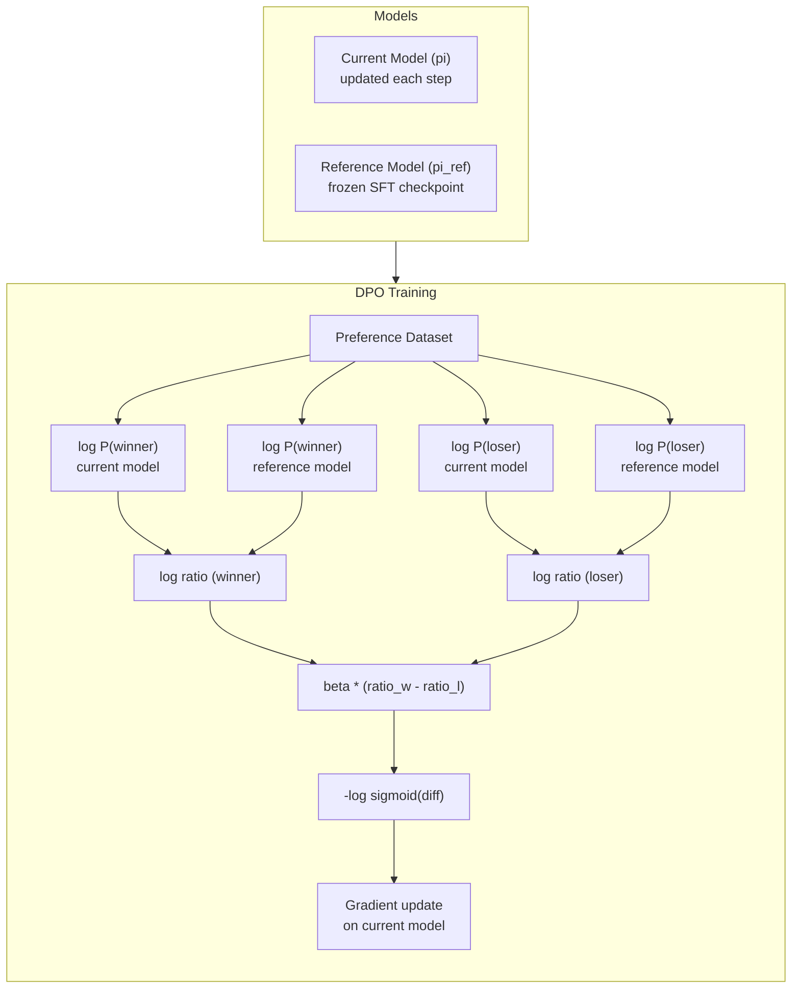

# DPO: Direct Preference Optimization

> RLHF works. It also requires training three models (SFT, reward model, policy), managing PPO's instability, and tuning a KL penalty. DPO asks: what if you could skip all of that? DPO directly optimizes the language model on preference pairs. No reward model. No PPO. One training loop. Same results.

**Type:** Build
**Languages:** Python (with numpy)
**Prerequisites:** Phase 10, Lesson 07 (RLHF)
**Time:** ~90 minutes

## Learning Objectives

- Implement DPO training that directly optimizes a language model on preference pairs without a separate reward model
- Derive the DPO loss function and explain how it implicitly represents a reward model through the policy's log probabilities
- Compare DPO vs RLHF in terms of training stability, compute cost, and number of models required
- Tune the beta parameter to control how far the trained policy diverges from the reference model

## The Problem

You built an RLHF pipeline in Lesson 07. Three stages. Three models. The SFT model, the reward model, and the policy model optimized with PPO. PPO training is notoriously unstable. Small hyperparameter changes cause divergence. The reward model is an imperfect proxy for human preferences.

In May 2023, Rafailov, Sharma, and colleagues at Stanford published "Direct Preference Optimization: Your Language Model is Secretly a Reward Model." The key insight: you don't need a separate reward model. The optimal reward function is mathematically determined by the language model's own token probabilities. You can skip the reward model entirely and optimize the language model directly on preference pairs.

Zephyr-7B, one of the first models to use DPO at scale, matched or beat models trained with full RLHF on several benchmarks. Meta used DPO as part of Llama 3's alignment pipeline.

## The Concept

### The Key Insight

RLHF optimizes this objective:

```
maximize: E[R(x, y)] - beta * KL(pi || pi_ref)
```

The DPO paper showed that this objective has a closed-form optimal solution. Rearranging:

```
R(x, y) = beta * log(pi*(y | x) / pi_ref(y | x)) + beta * log Z(x)
```

The reward is expressed entirely in terms of the policy model's probabilities and the reference model's probabilities. No separate reward model needed. The reward is *implicit* in the probability ratio.

### The DPO Loss

```
L_DPO = -log(sigmoid(beta * (log pi(y_w|x)/pi_ref(y_w|x) - log pi(y_l|x)/pi_ref(y_l|x))))
```

- **y_w** = preferred response
- **y_l** = rejected response
- **x** = prompt
- **pi** = current model
- **pi_ref** = reference model (frozen SFT checkpoint)
- **beta** = temperature parameter controlling deviation from reference

The ratio `log pi(y|x) / pi_ref(y|x)` is the log-probability ratio. When positive, the current model assigns higher probability than the reference. The DPO loss pushes the model to increase this ratio for preferred responses and decrease it for rejected responses.



### Why DPO is Simpler

| Aspect | RLHF (PPO) | DPO |
|--------|-----------|-----|
| Models to train | 3 (SFT + reward + policy) | 1 (policy only) |
| Training loops | 3 | 2 (SFT, DPO) |
| Hyperparameters | lr, KL coeff, clip ratio, RM lr | lr, beta, epochs |
| Reward model | Required | Implicit in probabilities |
| GPU memory | 3-4 models | 2 models |
| Training stability | Sensitive | Robust |

### Beyond DPO

| Method | Year | Models in Memory | Needs Pairs? | Needs Reference? | Training Loops |
|--------|------|-----------------|-------------|-----------------|----------------|
| RLHF | 2022 | 3-4 | Yes | Yes | 3 |
| DPO | 2023 | 2 | Yes | Yes | 2 |
| KTO | 2024 | 2 | No (unpaired) | Yes | 2 |
| ORPO | 2024 | 1 | Yes | No | 1 |
| SimPO | 2024 | 1 | Yes | No | 1 |

### Real DPO Deployments

**Zephyr-7B (HuggingFace, October 2023):** Mistral 7B base, SFT on UltraChat (200K examples), then DPO on UltraFeedback (60K preference pairs). Scored 6.47 on MT-Bench -- the highest 7B model at the time, within 6% of Llama 2 Chat 70B.

**Llama 3 (Meta, April 2024):** Used DPO after initial RLHF stages -- RLHF for broad alignment, DPO for targeted refinement.

## Build It

### Step 1: Preference Dataset

Same format as RLHF -- (prompt, preferred, rejected) triples.

```python
import numpy as np

PREFERENCE_DATA = [
    {
        "prompt": "What is the capital of France?",
        "preferred": "The capital of France is Paris.",
        "rejected": "France is a country in Europe. It has many cities. The capital is Paris.",
    },
    {
        "prompt": "Explain gravity in one sentence.",
        "preferred": "Gravity is the force that attracts objects with mass toward each other.",
        "rejected": "Gravity is something that makes things fall down when you drop them.",
    },
    {
        "prompt": "What is 15 times 7?",
        "preferred": "15 times 7 is 105.",
        "rejected": "Let me think about this. 15 times 7. Well, 10 times 7 is 70...",
    },
    {
        "prompt": "Name three programming languages.",
        "preferred": "Python, Rust, and TypeScript.",
        "rejected": "There are many programming languages.",
    },
    {
        "prompt": "What year did World War II end?",
        "preferred": "World War II ended in 1945.",
        "rejected": "World War II was a major global conflict. The war ended in the mid-1940s.",
    },
    {
        "prompt": "Define machine learning.",
        "preferred": "Machine learning is a field where algorithms learn patterns from data.",
        "rejected": "Machine learning is a type of AI.",
    },
]
```

### Step 2: Sequence Log-Probability

```python
def tokenize_sequence(text, vocab_size=256):
    return [min(t, vocab_size - 1) for t in list(text.encode("utf-8"))]


def compute_sequence_log_prob(model, prompt_tokens, response_tokens, max_seq_len=128):
    full_sequence = prompt_tokens + response_tokens
    if len(full_sequence) > max_seq_len:
        full_sequence = full_sequence[:max_seq_len]

    if len(full_sequence) < 2:
        return 0.0

    input_ids = np.array(full_sequence[:-1]).reshape(1, -1)
    target_ids = np.array(full_sequence[1:])

    logits = model.forward(input_ids)
    logits = logits[0]

    max_logits = logits.max(axis=-1, keepdims=True)
    log_probs = logits - max_logits - np.log(
        np.exp(logits - max_logits).sum(axis=-1, keepdims=True)
    )

    prompt_len = len(prompt_tokens)
    response_start = max(0, prompt_len - 1)
    response_end = len(target_ids)

    if response_start >= response_end:
        return 0.0

    response_log_probs = log_probs[response_start:response_end, :]
    response_targets = target_ids[response_start:response_end]

    total_log_prob = 0.0
    for i, target in enumerate(response_targets):
        total_log_prob += response_log_probs[i, target]

    return total_log_prob
```

### Step 3: The DPO Loss

```python
def sigmoid(x):
    return np.where(
        x >= 0,
        1.0 / (1.0 + np.exp(-x)),
        np.exp(x) / (1.0 + np.exp(x))
    )


def dpo_loss(policy_logprob_preferred, policy_logprob_rejected,
             ref_logprob_preferred, ref_logprob_rejected, beta=0.1):
    preferred_ratio = policy_logprob_preferred - ref_logprob_preferred
    rejected_ratio = policy_logprob_rejected - ref_logprob_rejected

    logit = beta * (preferred_ratio - rejected_ratio)

    loss = -np.log(sigmoid(logit) + 1e-8)

    preferred_reward = beta * preferred_ratio
    rejected_reward = beta * rejected_ratio

    return loss, {
        "preferred_ratio": float(preferred_ratio),
        "rejected_ratio": float(rejected_ratio),
        "logit": float(logit),
        "implicit_preferred_reward": float(preferred_reward),
        "implicit_rejected_reward": float(rejected_reward),
        "reward_margin": float(preferred_reward - rejected_reward),
    }
```

### Step 4: DPO Training Loop

```python
def copy_model_weights(source, target):
    target.embedding.token_embed = source.embedding.token_embed.copy()
    target.embedding.pos_embed = source.embedding.pos_embed.copy()
    target.ln_f.gamma = source.ln_f.gamma.copy()
    target.ln_f.beta = source.ln_f.beta.copy()
    for s_block, t_block in zip(source.blocks, target.blocks):
        t_block.attn.W_q = s_block.attn.W_q.copy()
        t_block.attn.W_k = s_block.attn.W_k.copy()
        t_block.attn.W_v = s_block.attn.W_v.copy()
        t_block.attn.W_out = s_block.attn.W_out.copy()
        t_block.ffn.W1 = s_block.ffn.W1.copy()
        t_block.ffn.W2 = s_block.ffn.W2.copy()
        t_block.ffn.b1 = s_block.ffn.b1.copy()
        t_block.ffn.b2 = s_block.ffn.b2.copy()
        t_block.ln1.gamma = s_block.ln1.gamma.copy()
        t_block.ln1.beta = s_block.ln1.beta.copy()
        t_block.ln2.gamma = s_block.ln2.gamma.copy()
        t_block.ln2.beta = s_block.ln2.beta.copy()


def dpo_train(policy_model, reference_model, preference_data,
              num_epochs=5, lr=5e-6, beta=0.1, max_seq_len=128):
    print(f"DPO Training: {len(preference_data)} pairs, {num_epochs} epochs, "
          f"lr={lr}, beta={beta}")
    print()

    losses = []
    margins = []

    for epoch in range(num_epochs):
        epoch_loss = 0.0
        epoch_margin = 0.0
        num_examples = 0

        indices = np.random.permutation(len(preference_data))

        for idx in indices:
            pair = preference_data[idx]

            prompt_tokens = tokenize_sequence(pair["prompt"])
            preferred_tokens = tokenize_sequence(pair["preferred"])
            rejected_tokens = tokenize_sequence(pair["rejected"])

            pi_logprob_w = compute_sequence_log_prob(
                policy_model, prompt_tokens, preferred_tokens, max_seq_len
            )
            pi_logprob_l = compute_sequence_log_prob(
                policy_model, prompt_tokens, rejected_tokens, max_seq_len
            )
            ref_logprob_w = compute_sequence_log_prob(
                reference_model, prompt_tokens, preferred_tokens, max_seq_len
            )
            ref_logprob_l = compute_sequence_log_prob(
                reference_model, prompt_tokens, rejected_tokens, max_seq_len
            )

            loss, metrics = dpo_loss(
                pi_logprob_w, pi_logprob_l,
                ref_logprob_w, ref_logprob_l, beta
            )

            update_direction = 1.0 if metrics["logit"] < 0 else -0.1
            for block in policy_model.blocks:
                block.ffn.W1 += lr * update_direction * np.random.randn(*block.ffn.W1.shape) * 0.01
                block.ffn.W2 += lr * update_direction * np.random.randn(*block.ffn.W2.shape) * 0.01

            epoch_loss += loss
            epoch_margin += metrics["reward_margin"]
            num_examples += 1
            losses.append(float(loss))
            margins.append(metrics["reward_margin"])

        avg_loss = epoch_loss / max(num_examples, 1)
        avg_margin = epoch_margin / max(num_examples, 1)

        print(f"  Epoch {epoch + 1}/{num_epochs} | Loss: {avg_loss:.4f} | "
              f"Avg Margin: {avg_margin:.4f}")

    return policy_model, losses, margins
```

### Step 5: Evaluate and Analyze

```python
def evaluate_preference_accuracy(model, reference_model, preference_data, beta=0.1, max_seq_len=128):
    correct = 0
    total = 0

    for pair in preference_data:
        prompt_tokens = tokenize_sequence(pair["prompt"])
        preferred_tokens = tokenize_sequence(pair["preferred"])
        rejected_tokens = tokenize_sequence(pair["rejected"])

        pi_w = compute_sequence_log_prob(model, prompt_tokens, preferred_tokens, max_seq_len)
        pi_l = compute_sequence_log_prob(model, prompt_tokens, rejected_tokens, max_seq_len)
        ref_w = compute_sequence_log_prob(reference_model, prompt_tokens, preferred_tokens, max_seq_len)
        ref_l = compute_sequence_log_prob(reference_model, prompt_tokens, rejected_tokens, max_seq_len)

        preferred_reward = beta * (pi_w - ref_w)
        rejected_reward = beta * (pi_l - ref_l)

        if preferred_reward > rejected_reward:
            correct += 1
        total += 1

    return correct / max(total, 1)


def analyze_implicit_rewards(model, reference_model, preference_data, beta=0.1, max_seq_len=128):
    print("Implicit Reward Analysis:")
    for pair in preference_data:
        prompt_tokens = tokenize_sequence(pair["prompt"])
        preferred_tokens = tokenize_sequence(pair["preferred"])
        rejected_tokens = tokenize_sequence(pair["rejected"])

        pi_w = compute_sequence_log_prob(model, prompt_tokens, preferred_tokens, max_seq_len)
        pi_l = compute_sequence_log_prob(model, prompt_tokens, rejected_tokens, max_seq_len)
        ref_w = compute_sequence_log_prob(reference_model, prompt_tokens, preferred_tokens, max_seq_len)
        ref_l = compute_sequence_log_prob(reference_model, prompt_tokens, rejected_tokens, max_seq_len)

        pref_reward = beta * (pi_w - ref_w)
        rej_reward = beta * (pi_l - ref_l)
        margin = pref_reward - rej_reward

        print(f"  {pair['prompt'][:30]:<30} Pref: {pref_reward:+8.4f}  Rej: {rej_reward:+8.4f}  Margin: {margin:+8.4f}")
```

## Use It

```python
if __name__ == "__main__":
    np.random.seed(42)

    sft_model = MiniGPT(
        vocab_size=256, embed_dim=128, num_heads=4,
        num_layers=4, max_seq_len=128, ff_dim=512
    )

    policy_model = MiniGPT(
        vocab_size=256, embed_dim=128, num_heads=4,
        num_layers=4, max_seq_len=128, ff_dim=512
    )
    reference_model = MiniGPT(
        vocab_size=256, embed_dim=128, num_heads=4,
        num_layers=4, max_seq_len=128, ff_dim=512
    )
    copy_model_weights(sft_model, policy_model)
    copy_model_weights(sft_model, reference_model)

    policy_model, losses, margins = dpo_train(
        policy_model, reference_model, PREFERENCE_DATA,
        num_epochs=5, lr=5e-6, beta=0.1
    )

    pre_accuracy = evaluate_preference_accuracy(
        sft_model, reference_model, PREFERENCE_DATA, beta=0.1
    )
    post_accuracy = evaluate_preference_accuracy(
        policy_model, reference_model, PREFERENCE_DATA, beta=0.1
    )

    print(f"Preference accuracy (pre-DPO):  {pre_accuracy:.1%}")
    print(f"Preference accuracy (post-DPO): {post_accuracy:.1%}")

    analyze_implicit_rewards(policy_model, reference_model, PREFERENCE_DATA, beta=0.1)
```

## Ship It

This lesson produces `outputs/prompt-alignment-method-selector.md` -- a prompt that helps you choose the right alignment method for your use case.

## Exercises

1. Implement KTO (Kahneman-Tversky Optimization). KTO doesn't need pairs -- just label each response as "good" or "bad."
2. Implement length-normalized DPO. Divide log-probabilities by the number of response tokens.
3. Build an ORPO-style combined loss: `L = L_sft(preferred) + alpha * L_dpo`.
4. Implement iterative DPO. Run DPO, generate new responses, create new preference pairs, run DPO again.
5. Compare DPO with different reference models: base model (pre-SFT), epoch-1 checkpoint, EMA of the policy.

## Key Terms

| Term | What people say | What it actually means |
|------|----------------|----------------------|
| DPO | "RLHF without RL" | Direct Preference Optimization: supervised learning on preference pairs, bypassing reward model and PPO |
| Implicit reward | "The reward is in the model" | Reward function determined by log-probability ratio between policy and reference |
| Beta (DPO) | "The temperature" | Controls how far the policy can deviate from the reference model |
| Log-probability ratio | "How much the model changed" | log pi(y|x) - log pi_ref(y|x) |
| Reference model | "The frozen checkpoint" | Anchor for computing probability ratios |
| KTO | "DPO without pairs" | Works with unpaired "good" / "bad" labels |
| ORPO | "One-step alignment" | Combines SFT and alignment in one training loop |
| SimPO | "No reference needed" | Uses length-normalized average log-probability as implicit reward |

## Further Reading

- [Rafailov et al., 2023 -- "Direct Preference Optimization"](https://arxiv.org/abs/2305.18290)
- [Tunstall et al., 2023 -- "Zephyr: Direct Distillation of LM Alignment"](https://arxiv.org/abs/2310.16944)
- [Ethayarajh et al., 2024 -- "KTO"](https://arxiv.org/abs/2402.01306)
- [Hong et al., 2024 -- "ORPO"](https://arxiv.org/abs/2403.07691)
- [Meng et al., 2024 -- "SimPO"](https://arxiv.org/abs/2405.14734)
