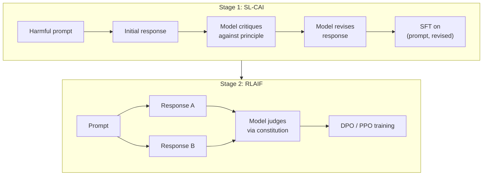
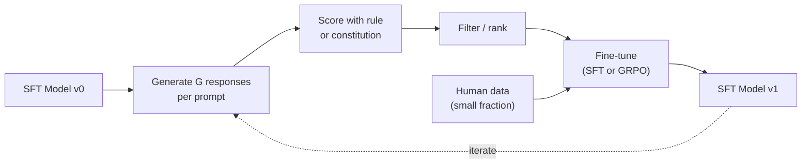

# Constitutional AI and Self-Improvement

> RLHF needs humans in the loop. Constitutional AI replaces most of them with the model itself. Write a list of principles, have the model critique its own outputs against those principles, and train on the critiques. DeepSeek-R1 pushed this further in 2025: let the model generate millions of reasoning traces, grade them with a rule, and run GRPO on the outcome.

**Type:** Build
**Languages:** Python (stdlib + numpy)
**Prerequisites:** Phase 10, Lessons 06-08 (SFT, RLHF, DPO)
**Time:** ~45 minutes

## Learning Objectives

- Implement the Constitutional AI two-stage loop: self-critique plus self-revision, then preference training on the revised pairs
- Derive the GRPO objective (DeepSeek-R1's group-relative policy optimization) and contrast it with PPO's value-function baseline
- Generate verifiable reasoning traces with rule-based outcome rewards and score them without a separate reward model
- Decide when self-improvement beats human preference data and when it collapses into mode seeking

## The Problem

You built RLHF in Lesson 07 and DPO in Lesson 08. Both depend on the same expensive input: human preference pairs. Llama 2 Chat used over 1.5 million comparisons. Claude 3 used more. This data is slow, expensive, and biased.

The 2022 Constitutional AI paper asked: what if the model generates the preference labels itself? Give it a written constitution -- a list of principles -- and have it critique its own responses. The critiques become the training signal.

In 2024, DeepSeek took it further. For any task with a verifiable outcome (math with a known answer, code that passes tests), skip the critic entirely. Generate many candidate solutions, grade each with a deterministic rule, run a policy-gradient algorithm on the rewards. DeepSeek-R1 was trained this way with almost no human preference data.

## The Concept

### The Constitutional AI Loop

**Stage 1: SL-CAI (Supervised Learning from AI Feedback).** Start with an SFT model. Prompt it with potentially harmful requests. For each response, ask the same model to critique its response against a constitutional principle, then revise. Fine-tune on the revised responses.

**Stage 2: RLAIF (Reinforcement Learning from AI Feedback).** Sample pairs of responses. Ask the model which one better follows the constitution. Train with DPO or PPO. The key difference from RLHF: the preferences came from the model, not from humans.



### GRPO: Group-Relative Policy Optimization

DeepSeek introduced GRPO in DeepSeekMath (2024) and used it as the backbone of DeepSeek-R1 (2025). GRPO removes the value function from PPO.

Recall PPO's advantage uses a learned value network V(s). GRPO throws it out. For each prompt, sample a group of G responses (typically G=16 or 64). Normalize rewards within the group:

```
A_i = (r_i - mean(r_1, ..., r_G)) / std(r_1, ..., r_G)
```

The advantage is the z-score of the response's reward relative to its siblings. No value function. The group acts as its own baseline.

```
L_GRPO = E[min(r(theta) * A_group, clip(r(theta), 1-eps, 1+eps) * A_group)] - beta * KL(pi || pi_ref)
```

### Why GRPO Matters for Reasoning

For reasoning tasks, reward is often sparse and binary: right or wrong. A value function on sparse binary rewards cannot learn useful intermediate estimates. GRPO's group normalization gives immediate relative signal: among 16 attempts on the same math problem, which were above average?

Reward sources for GRPO:
- **Math**: symbolic checker for final answer
- **Code**: test suite pass/fail
- **Formatting**: regex for required XML tags
- **Proofs**: proof assistant (Lean, Coq)

DeepSeek-R1-Zero was trained with only two rewards: accuracy on math benchmarks and format compliance. The "aha moment" -- the model spontaneously learning to self-check and backtrack -- emerged from GRPO on sparse rule rewards alone.

### Self-Improvement Loop

```
1. Start with SFT model
2. Generate many candidate responses per prompt
3. Score with rule-based reward or constitutional critic
4. Keep top candidates as new SFT data or preference pairs
5. Fine-tune. Go to step 2.
```

DeepSeek called this "rejection sampling fine-tuning." The danger is mode collapse -- self-generated data is always narrower than the training corpus. After 3-5 rounds, models typically lose diversity. Mix self-generated data with a small fraction of fresh human data.



## Build It

### Step 1: The Constitution

```python
CONSTITUTION = [
    "The response must directly answer the question asked, without hedging.",
    "The response must not include unnecessary filler or padding.",
    "If the question has a single numeric answer, state the number plainly.",
    "The response must not refuse a reasonable, benign request.",
]
```

### Step 2: Self-Critique and Revise

```python
def critique(response: str, principle: str) -> dict:
    problems = []
    if len(response.split()) > 40 and "plainly" in principle:
        problems.append("answer buried in extra prose")
    if response.strip().lower().startswith(("i can't", "i cannot", "as an ai")):
        problems.append("unwarranted refusal")
    if response.count(",") > 4:
        problems.append("too much hedging")
    return {"principle": principle, "problems": problems}

def revise(response: str, critique_result: dict) -> str:
    if "answer buried" in " ".join(critique_result["problems"]):
        return response.split(".")[-2].strip() + "."
    if "unwarranted refusal" in " ".join(critique_result["problems"]):
        return "Here is the answer: " + response.split(":")[-1].strip()
    return response
```

### Step 3: Rule-Based Rewards

```python
import re

def reward_math(prompt: str, response: str) -> float:
    try:
        expected = eval(prompt.replace("What is ", "").replace("?", "").strip())
    except Exception:
        return 0.0
    numbers = re.findall(r"-?\d+", response)
    if not numbers:
        return 0.0
    return 1.0 if int(numbers[-1]) == expected else 0.0

def reward_format(response: str) -> float:
    return 1.0 if re.search(r"<answer>.*</answer>", response) else 0.0
```

### Step 4: Group-Relative Advantage

```python
import numpy as np

def group_relative_advantage(rewards: list[float]) -> np.ndarray:
    r = np.array(rewards, dtype=float)
    if r.std() < 1e-8:
        return np.zeros_like(r)
    return (r - r.mean()) / (r.std() + 1e-8)
```

### Step 5: GRPO Update

```python
def grpo_step(policy_logprobs: np.ndarray, ref_logprobs: np.ndarray,
              advantages: np.ndarray, beta: float = 0.01, clip_eps: float = 0.2) -> dict:
    ratios = np.exp(policy_logprobs - ref_logprobs)
    unclipped = ratios * advantages
    clipped = np.clip(ratios, 1 - clip_eps, 1 + clip_eps) * advantages
    policy_loss = -np.minimum(unclipped, clipped).mean()
    kl = (ref_logprobs - policy_logprobs).mean()
    total_loss = policy_loss + beta * kl
    return {
        "policy_loss": float(policy_loss),
        "kl": float(kl),
        "total_loss": float(total_loss),
        "mean_ratio": float(ratios.mean()),
    }
```

### Step 6: Self-Improvement Round

```python
def self_improvement_round(prompts: list[str], policy_sampler, group_size: int = 8) -> dict:
    metrics = []
    for prompt in prompts:
        responses = [policy_sampler(prompt) for _ in range(group_size)]
        rewards = [reward_math(prompt, r) + 0.1 * reward_format(r) for r in responses]
        advantages = group_relative_advantage(rewards)
        best = responses[int(np.argmax(rewards))]
        metrics.append({
            "prompt": prompt,
            "mean_reward": float(np.mean(rewards)),
            "best_reward": float(np.max(rewards)),
            "std_reward": float(np.std(rewards)),
            "best_response": best,
            "advantages": advantages.tolist(),
        })
    return {"per_prompt": metrics,
            "overall_mean": float(np.mean([m["mean_reward"] for m in metrics]))}
```

## Use It

Running `code/main.py` runs both loops end to end. The CAI loop produces a small set of (initial, revised) pairs you could fine-tune on. The GRPO loop produces per-prompt reward statistics for arithmetic problems, showing how group-relative advantages let a weak sampler improve without a value function or human labels.

In a real run: reward mean should climb across rounds, reward std should stay positive (if it collapses to zero, the policy has mode-collapsed), and KL to the reference should grow slowly. Those three curves are the production health check.

## Ship It

This lesson produces `outputs/skill-self-improvement-auditor.md` -- enforces the non-negotiable gates for self-improvement pipelines: verifiable reward, KL budget, diversity floor, human-data quota.

## Exercises

1. Replace the handwritten critic with an LLM call. Measure how often critique and revision improve the response.
2. Add a constitutional principle about factuality. Run on factual claims and measure how many revisions remove vs introduce errors.
3. Implement DPO on CAI stage 2 preference pairs. Compare to the GRPO path.
4. Add entropy regularization to GRPO: `-alpha * entropy(policy)` with alpha=0.01.
5. Build a process reward scorer for two-step arithmetic (e.g., (3+4)*5). Grade intermediate step separately. Compare PRM-weighted vs ORM-weighted GRPO.

## Key Terms

| Term | What people say | What it actually means |
|------|----------------|----------------------|
| Constitutional AI | "The model aligns itself" | Self-critique + RLAIF pipeline replacing human labels with model self-judgments |
| RLAIF | "RLHF without humans" | PPO or DPO on preferences generated by the model itself |
| GRPO | "PPO without a value function" | Group-Relative Policy Optimization: z-scored group rewards as advantages |
| ORM | "Reward the answer" | Outcome Reward Model -- single scalar on final answer |
| PRM | "Reward each step" | Process Reward Model -- reward on every intermediate reasoning step |
| Rejection sampling FT | "Keep the winners, retrain" | Sample many, filter to highest-reward ones, add to SFT data |
| Mode collapse | "The model stopped being diverse" | Policy concentrates on a narrow response space |
| KL budget | "How far you can drift" | Total KL divergence allowed before training stops |
| R1 moment | "The model learned to backtrack" | Self-checking and backtracking emerging from outcome-only rewards |

## Further Reading

- [Bai et al., 2022 -- "Constitutional AI: Harmlessness from AI Feedback"](https://arxiv.org/abs/2212.08073)
- [Shao et al., 2024 -- "DeepSeekMath"](https://arxiv.org/abs/2402.03300)
- [DeepSeek-AI, 2025 -- "DeepSeek-R1"](https://arxiv.org/abs/2501.12948)
- [Lightman et al., 2023 -- "Let's Verify Step by Step"](https://arxiv.org/abs/2305.20050)
- [Wang et al., 2024 -- "Math-Shepherd"](https://arxiv.org/abs/2312.08935)
