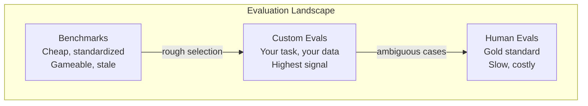
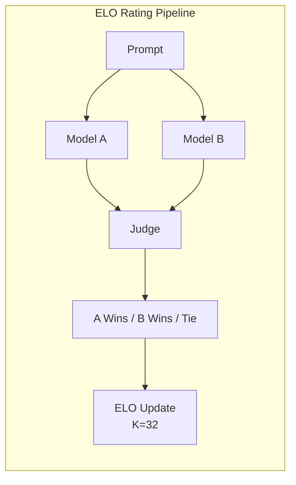

# Evaluation: Benchmarks, Evals, LM Harness

> Goodhart's Law: when a measure becomes a target, it ceases to be a good measure. Every frontier lab games benchmarks. MMLU scores go up while models still can't reliably count the number of R's in "strawberry." The only eval that matters is YOUR eval -- on YOUR task, with YOUR data.

**Type:** Build
**Languages:** Python
**Prerequisites:** Phase 10, Lessons 01-05 (LLMs from Scratch)
**Time:** ~90 minutes

## Learning Objectives

- Build a custom evaluation harness that runs multiple-choice and open-ended benchmarks against a language model
- Explain why standard benchmarks (MMLU, HumanEval) saturate and fail to differentiate frontier models
- Implement task-specific evals with proper metrics: exact match, F1, BLEU, and LLM-as-judge scoring
- Design a custom evaluation suite targeting your specific use case rather than relying solely on public leaderboards

## The Problem

MMLU was published in 2020 with 15,908 questions across 57 subjects. Within three years, frontier models saturated it. GPT-4 scored 86.4%. Claude 3 Opus scored 86.8%. Llama 3 405B scored 88.6%. The leaderboard compressed into a 3-point range where differences are statistical noise.

Meanwhile, Claude 3.5 Sonnet, scoring 88.7% on MMLU, initially could not count the letters in "strawberry" -- a task requiring zero world knowledge, just character-level iteration.

The gap between benchmark performance and real-world reliability is the central problem of LLM evaluation. You need custom evals -- not because benchmarks are useless, but because the final evaluation must match your deployment conditions exactly.

## The Concept

### The Eval Landscape

| Category | Cost | Signal | Best for |
|----------|------|--------|----------|
| Benchmarks | Cheap | Low (gameable) | Rough model selection |
| Custom evals | Expensive to build | High | Production prediction |
| Human evals | $0.10-$2.00/judgment | Gold standard | Ambiguous, high-stakes tasks |



### Why Benchmarks Break

1. **Data contamination.** Training corpora include benchmark questions. Models see answers during training.
2. **Teaching to the test.** Labs optimize training mixtures for benchmark performance.
3. **Saturation.** When every model scores 85-90%, the remaining variance is noise.

### Perplexity

```
PPL = exp(-1/N * sum(log P(token_i | context)))
```

Lower is better. GPT-2: ~30 on WikiText-103. GPT-3: ~20. Llama 3 8B: ~7.

Useful for comparing models on the same test set, but has blind spots: low perplexity doesn't mean good instruction following, reasoning, or factual accuracy.

### LLM-as-Judge

Ask GPT-4o or Claude to rate a response on a 1-5 scale. Costs ~$0.01/judgment with GPT-4o-mini. ~80% agreement with humans.

| Scorer Type | Cost | Human Agreement | Best for |
|-------------|------|----------------|----------|
| Exact match | ~$0 | 100% | Structured output |
| BLEU/ROUGE | ~$0 | ~60% | Translation, summarization |
| LLM-as-judge | ~$0.01 | ~80% | Open-ended generation |
| Human eval | $0.10-$2.00 | N/A (ground truth) | High-stakes tasks |

### ELO Ratings

Chatbot Arena's approach. Pairwise comparisons between models. Same system as chess. Ratings converge with fewer comparisons than scoring every output independently.



### Custom Evals: The Process

1. **Define the task.** Be precise.
2. **Create test cases.** 50+ for prototype, 200+ for production. Include edge cases.
3. **Define scoring.** Exact match, F1, LLM-as-judge, or combined.
4. **Automate.** One command to run. No manual steps.
5. **Track over time.** Version your eval alongside your prompts.

## Build It

### Step 1: A Minimal Eval Framework

```python
import json
from collections import Counter

class EvalCase:
    def __init__(self, input_text, expected, metadata=None):
        self.input_text = input_text
        self.expected = expected
        self.metadata = metadata or {}

class EvalSuite:
    def __init__(self, name, cases, scorers):
        self.name = name
        self.cases = cases
        self.scorers = scorers

    def run(self, model_fn):
        results = []
        for case in self.cases:
            prediction = model_fn(case.input_text)
            scores = {}
            for scorer_name, scorer_fn in self.scorers.items():
                scores[scorer_name] = scorer_fn(prediction, case.expected)
            results.append({
                "input": case.input_text,
                "expected": case.expected,
                "prediction": prediction,
                "scores": scores,
            })
        return results
```

### Step 2: Scoring Functions

```python
def exact_match(prediction, expected):
    return 1.0 if prediction.strip().lower() == expected.strip().lower() else 0.0

def token_f1(prediction, expected):
    pred_tokens = set(prediction.lower().split())
    exp_tokens = set(expected.lower().split())
    if not pred_tokens or not exp_tokens:
        return 0.0
    common = pred_tokens & exp_tokens
    precision = len(common) / len(pred_tokens)
    recall = len(common) / len(exp_tokens)
    if precision + recall == 0:
        return 0.0
    return 2 * (precision * recall) / (precision + recall)

def llm_judge_simulated(prediction, expected):
    pred_words = set(prediction.lower().split())
    exp_words = set(expected.lower().split())
    if not exp_words:
        return 0.0
    overlap = len(pred_words & exp_words) / len(exp_words)
    length_penalty = min(1.0, len(prediction) / max(len(expected), 1))
    return round(overlap * 0.7 + length_penalty * 0.3, 3)
```

### Step 3: ELO Rating System

```python
class ELOTracker:
    def __init__(self, k=32, initial_rating=1500):
        self.ratings = {}
        self.k = k
        self.initial_rating = initial_rating
        self.history = []

    def _ensure_player(self, name):
        if name not in self.ratings:
            self.ratings[name] = self.initial_rating

    def expected_score(self, rating_a, rating_b):
        return 1 / (1 + 10 ** ((rating_b - rating_a) / 400))

    def record_match(self, player_a, player_b, outcome):
        self._ensure_player(player_a)
        self._ensure_player(player_b)

        ea = self.expected_score(self.ratings[player_a], self.ratings[player_b])
        eb = 1 - ea

        if outcome == "a":
            sa, sb = 1.0, 0.0
        elif outcome == "b":
            sa, sb = 0.0, 1.0
        else:
            sa, sb = 0.5, 0.5

        self.ratings[player_a] += self.k * (sa - ea)
        self.ratings[player_b] += self.k * (sb - eb)

        self.history.append({
            "a": player_a, "b": player_b,
            "outcome": outcome,
            "rating_a": round(self.ratings[player_a], 1),
            "rating_b": round(self.ratings[player_b], 1),
        })

    def leaderboard(self):
        return sorted(self.ratings.items(), key=lambda x: -x[1])
```

### Step 4: Perplexity Calculation

```python
import numpy as np

def perplexity(log_probs):
    if not log_probs:
        return float("inf")
    avg_neg_log_prob = -np.mean(log_probs)
    return float(np.exp(avg_neg_log_prob))

def token_log_probs_simulated(text, model_quality=0.8):
    np.random.seed(hash(text) % 2**31)
    tokens = text.split()
    log_probs = []
    for i, token in enumerate(tokens):
        base_prob = model_quality
        if len(token) > 8:
            base_prob *= 0.6
        if i == 0:
            base_prob *= 0.7
        prob = np.clip(base_prob + np.random.normal(0, 0.1), 0.01, 0.99)
        log_probs.append(float(np.log(prob)))
    return log_probs
```

### Step 5: Aggregate Results

```python
def summarize_results(results, threshold=0.8):
    all_scores = {}
    for r in results:
        for metric, score in r["scores"].items():
            all_scores.setdefault(metric, []).append(score)

    summary = {}
    for metric, scores in all_scores.items():
        arr = np.array(scores)
        summary[metric] = {
            "mean": round(float(np.mean(arr)), 3),
            "median": round(float(np.median(arr)), 3),
            "std": round(float(np.std(arr)), 3),
            "min": round(float(np.min(arr)), 3),
            "max": round(float(np.max(arr)), 3),
            "pass_rate": round(float(np.mean(arr >= threshold)), 3),
            "n": len(scores),
        }
    return summary

def print_summary(summary, suite_name="Eval"):
    print(f"\n{'=' * 60}")
    print(f"  {suite_name} Summary")
    print(f"{'=' * 60}")
    for metric, stats in summary.items():
        print(f"\n  {metric}:")
        print(f"    Mean:      {stats['mean']:.3f}")
        print(f"    Median:    {stats['median']:.3f}")
        print(f"    Std:       {stats['std']:.3f}")
        print(f"    Pass rate: {stats['pass_rate']:.1%}")
```

### Step 6: Run the Full Pipeline

```python
def demo_model_good(prompt):
    responses = {
        "What is the capital of France?": "Paris",
        "What is 2 + 2?": "4",
        "Who wrote Hamlet?": "William Shakespeare",
        "What language is PyTorch written in?": "Python and C++",
        "What is the boiling point of water?": "100 degrees Celsius",
    }
    return responses.get(prompt, "I don't know")

def demo_model_bad(prompt):
    responses = {
        "What is the capital of France?": "Paris is the capital city of France",
        "What is 2 + 2?": "The answer is four",
        "Who wrote Hamlet?": "Shakespeare",
        "What language is PyTorch written in?": "Python",
        "What is the boiling point of water?": "212 Fahrenheit",
    }
    return responses.get(prompt, "Unknown")

cases = [
    EvalCase("What is the capital of France?", "Paris"),
    EvalCase("What is 2 + 2?", "4"),
    EvalCase("Who wrote Hamlet?", "William Shakespeare"),
    EvalCase("What language is PyTorch written in?", "Python and C++"),
    EvalCase("What is the boiling point of water?", "100 degrees Celsius"),
]

suite = EvalSuite(
    name="General Knowledge",
    cases=cases,
    scorers={
        "exact_match": exact_match,
        "token_f1": token_f1,
        "llm_judge": llm_judge_simulated,
    },
)

results_good = suite.run(demo_model_good)
results_bad = suite.run(demo_model_bad)

print_summary(summarize_results(results_good), "Model A (concise)")
print_summary(summarize_results(results_bad), "Model B (verbose)")
```

### Step 7: ELO Tournament

```python
elo = ELOTracker(k=32)

for case in cases:
    pred_a = demo_model_good(case.input_text)
    pred_b = demo_model_bad(case.input_text)

    score_a = token_f1(pred_a, case.expected)
    score_b = token_f1(pred_b, case.expected)

    if score_a > score_b:
        outcome = "a"
    elif score_b > score_a:
        outcome = "b"
    else:
        outcome = "tie"

    elo.record_match("model_a_concise", "model_b_verbose", outcome)

print("\nELO Leaderboard:")
for name, rating in elo.leaderboard():
    print(f"  {name}: {rating:.0f}")
```

### Step 8: Perplexity Comparison

```python
test_text = "The quick brown fox jumps over the lazy dog in the garden"

for quality, label in [(0.9, "Strong model"), (0.7, "Medium model"), (0.4, "Weak model")]:
    log_probs = token_log_probs_simulated(test_text, model_quality=quality)
    ppl = perplexity(log_probs)
    print(f"  {label} (quality={quality}): perplexity = {ppl:.2f}")
```

## Use It

### lm-evaluation-harness

```bash
# pip install lm-eval
# lm_eval --model hf --model_args pretrained=meta-llama/Llama-3.1-8B --tasks mmlu --batch_size 8
```

### promptfoo

```yaml
# promptfoo.yaml
providers:
  - openai:gpt-4o-mini
  - anthropic:claude-3-haiku

prompts:
  - "Answer in one word: {{question}}"

tests:
  - vars:
      question: "What is the capital of France?"
    assert:
      - type: contains
        value: "Paris"
```

## Ship It

This lesson produces `outputs/prompt-eval-designer.md` and `outputs/skill-llm-evaluation.md`.

## Exercises

1. Add a "consistency" scorer that runs the same input 5 times and measures output match percentage.
2. Extend ELO tracker to support multiple judge functions with weights. Compare leaderboards.
3. Build an eval suite for email classification into 5 categories with 100 test cases.
4. Implement contamination detection: check what percentage of eval questions appear in the training corpus.
5. Build a "model diff" tool highlighting which test cases improved, regressed, or stayed the same between versions.

## Key Terms

| Term | What people say | What it actually means |
|------|----------------|----------------------|
| MMLU | "The benchmark" | 15,908 multiple choice questions across 57 subjects |
| HumanEval | "Code eval" | 164 Python function-completion problems |
| SWE-bench | "Real coding eval" | 2,294 GitHub issues from 12 Python repos |
| Perplexity | "How confused the model is" | exp(-avg(log P(token))) |
| ELO rating | "Chess ranking for models" | Relative skill from pairwise comparisons |
| LLM-as-judge | "Using AI to grade AI" | Strong model scores weaker model against rubric |
| Data contamination | "The model saw the test" | Training data includes benchmark questions |
| Eval suite | "A bunch of tests" | Versioned collection of (input, expected, scorer) triples |

## Further Reading

- [Hendrycks et al., 2021 -- "Measuring Massive Multitask Language Understanding"](https://arxiv.org/abs/2009.03300)
- [Chen et al., 2021 -- "Evaluating Large Language Models Trained on Code"](https://arxiv.org/abs/2107.03374)
- [Zheng et al., 2023 -- "Judging LLM-as-a-Judge"](https://arxiv.org/abs/2306.05685)
- [LMSYS Chatbot Arena](https://chat.lmsys.org/)
