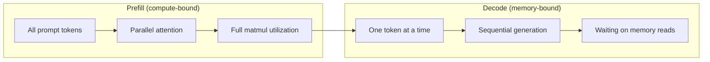
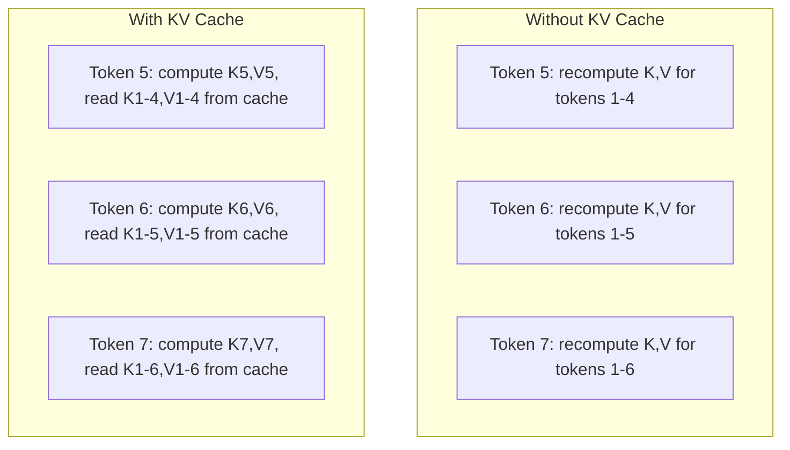
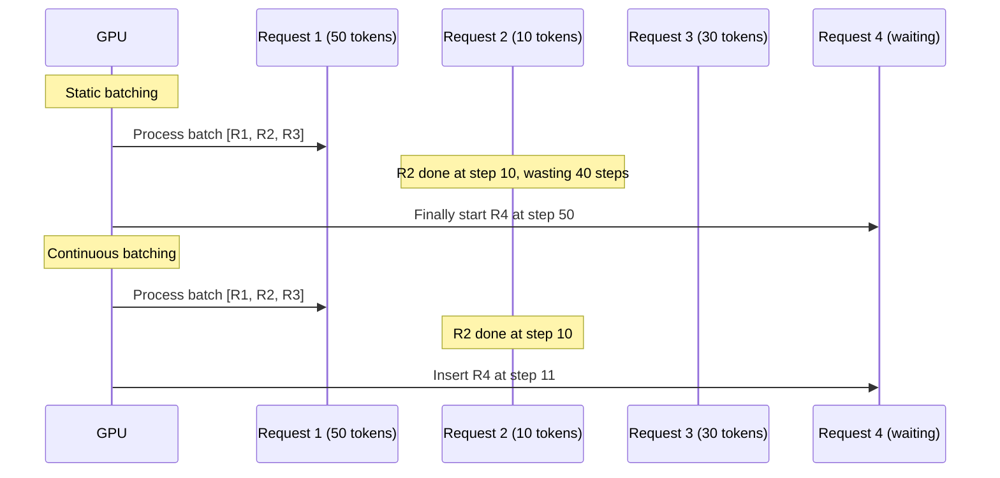
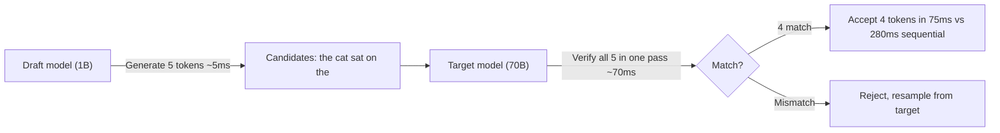

# Inference Optimization

> Two phases define LLM inference. Prefill processes your prompt in parallel -- compute-bound. Decode generates tokens one at a time -- memory-bound. Every optimization targets one or both.

**Type:** Build
**Languages:** Python (stdlib, numpy)
**Prerequisites:** Phase 10, Lessons 01-08 (Transformer architecture, attention)
**Time:** ~120 minutes

## Learning Objectives

- Implement KV cache to eliminate redundant computation during autoregressive token generation
- Explain the prefill vs decode phases and why each has different bottlenecks (compute-bound vs memory-bound)
- Implement continuous batching and PagedAttention concepts to maximize GPU utilization
- Compare inference optimization techniques and their throughput/latency tradeoffs

## The Problem

You deploy Llama 3 70B on 4xA100 GPUs. A single user gets ~50 tokens/sec. Then 100 users hit the endpoint simultaneously. Throughput drops to 3 tokens/sec/user. Your $25k/month GPU bill serves responses slower than a human types.

The model does not change between 1 user and 100. Same weights, same math. What changes is how you schedule the work. Naive inference wastes 90%+ of available GPU compute. A user waiting for token 47 holds an entire batch slot open while the GPU memory bus sits idle between matmuls.

This is a scheduling problem. KV caching, continuous batching, PagedAttention, speculative decoding, and prefix caching are what separate a $25k/month inference bill from a $5k/month one.

## The Concept

### Prefill vs Decode

Every LLM inference request has two distinct phases.

**Prefill** processes the entire input prompt. All tokens are known, so attention is parallel across the full sequence. This is a large matrix multiplication -- GPU cores stay busy. The bottleneck is compute. An A100 does 312 TFLOPS (BF16). Prefill for 4,096 tokens on a 70B model takes ~400ms.

**Decode** generates output tokens one at a time. Each new token attends to all previous tokens, but only one token is produced per forward pass. Weight matrices are the same size, but you multiply them by a single vector. GPU cores finish in microseconds, then wait for weights to arrive from memory. The bottleneck is memory bandwidth. An A100 has 2 TB/s bandwidth. A 70B model in FP16 is 140 GB -- reading the full model once takes 70ms.



The **ops:byte ratio** captures this: operations per byte loaded from memory. Prefill at batch 4096: ~4096 ops per byte, compute-bound. Decode at batch 1: ~1 op per byte, memory-bound.

### KV Cache

During attention, each token's query attends to every previous token's key and value vectors. Without caching, generating token N recomputes K and V for all N-1 preceding tokens. Token 1 gets projected when generating token 2, then again for token 3, then again for token 1000 -- 999 redundant projections.

The KV cache stores K and V from all previous tokens. At token N, you compute K,V for token N only, then concatenate with cached K,V from tokens 1 through N-1.



**Memory formula:** `2 * num_layers * num_kv_heads * head_dim * seq_len * bytes_per_param`

For Llama 3 70B (80 layers, 8 KV heads, head_dim=128, BF16): per token = 320 KB. At 4K tokens = 1.28 GB. At 128K tokens = 40 GB. A single 128K conversation consumes half an A100's memory for KV cache alone.

### Continuous Batching

Static batching waits for N requests, processes them together, and waits until all finish. A request needing 10 tokens sits idle while the batch finishes at step 500.

Continuous batching (iteration-level) inserts new requests into the batch as soon as any request finishes. The batch is reevaluated at every decode step.



With variable output lengths (the common case), continuous batching delivers 2-5x higher throughput.

### PagedAttention

The KV cache for each request is typically a contiguous block. As requests arrive and depart, memory fragments. A 4K-token request needs 1.28 GB contiguous. Even with 2 GB free, you might not have 1.28 GB contiguous.

PagedAttention applies OS-style virtual memory. It allocates fixed-size pages (16 tokens each) that can be anywhere in physical memory. A page table maps logical positions to physical pages. Near-zero memory waste (~4% vs 60-80%) and enables copy-on-write for shared prefixes.

### Speculative Decoding

Decode is sequential: one token, feed it back, generate the next. Speculative decoding uses a small draft model to guess K candidate tokens, then the large target model verifies all K in one forward pass (like prefill -- parallel and efficient).



| Method | Draft source | Acceptance rate | Overhead |
|--------|-------------|-----------------|----------|
| Draft-target | Separate small model | 70-85% | Draft model memory |
| EAGLE | Lightweight head on target | 75-90% | ~1% extra params |
| N-gram lookup | Token n-gram table | 40-60% | Negligible |

Speculative decoding is mathematically exact -- the output distribution is identical to the target.

### Ops:Byte Framework

| Scenario | ops:byte | Bound | Optimize with |
|----------|----------|-------|---------------|
| Prefill, batch=1 | ~4,096 | Compute | Kernel fusion, FP8 |
| Decode, batch=1 | ~1 | Memory | Quantization, KV compression |
| Decode, batch=256 | ~256 | Transitioning | Both matter |
| Decode, batch=1024 | ~1,024 | Compute | Kernel fusion, TP |

Crossover on A100: ops:byte = 156 (312 TFLOPS / 2 TB/s). Below that: memory-bound. Above: compute-bound.

## Build It

### Step 1: KV Cache from Scratch

```python
import numpy as np

class KVCache:
    def __init__(self, num_layers, num_heads, head_dim, max_seq_len, dtype=np.float16):
        self.num_layers = num_layers
        self.num_heads = num_heads
        self.head_dim = head_dim
        self.max_seq_len = max_seq_len
        self.dtype = dtype
        self.k_cache = np.zeros((num_layers, num_heads, max_seq_len, head_dim), dtype=dtype)
        self.v_cache = np.zeros((num_layers, num_heads, max_seq_len, head_dim), dtype=dtype)
        self.seq_len = 0

    def update(self, layer_idx, new_keys, new_values):
        num_new = new_keys.shape[1]
        end = self.seq_len + num_new
        self.k_cache[layer_idx, :, self.seq_len:end, :] = new_keys
        self.v_cache[layer_idx, :, self.seq_len:end, :] = new_values
        return self.k_cache[layer_idx, :, :end, :], self.v_cache[layer_idx, :, :end, :]

    def advance(self, num_tokens):
        self.seq_len += num_tokens

    def memory_bytes(self):
        return self.k_cache.nbytes + self.v_cache.nbytes

    def used_bytes(self):
        per_token = 2 * self.num_layers * self.num_heads * self.head_dim * np.dtype(self.dtype).itemsize
        return per_token * self.seq_len
```

### Step 2: Attention with KV Cache

```python
def scaled_dot_product_attention(query, keys, values):
    head_dim = query.shape[-1]
    scores = np.matmul(query, keys.transpose(0, 1, 3, 2)) / np.sqrt(head_dim)
    seq_len_q, seq_len_k = scores.shape[-2], scores.shape[-1]
    if seq_len_q > 1:
        mask = np.triu(np.ones((seq_len_q, seq_len_k)), k=seq_len_k - seq_len_q + 1)
        scores = scores + mask * (-1e9)
    max_scores = np.max(scores, axis=-1, keepdims=True)
    exp_scores = np.exp(scores - max_scores)
    attn_weights = exp_scores / np.sum(exp_scores, axis=-1, keepdims=True)
    return np.matmul(attn_weights, values)

class MultiHeadAttention:
    def __init__(self, d_model, num_heads):
        self.num_heads = num_heads
        self.head_dim = d_model // num_heads
        scale = np.sqrt(2.0 / d_model)
        self.W_q = np.random.randn(d_model, d_model).astype(np.float32) * scale
        self.W_k = np.random.randn(d_model, d_model).astype(np.float32) * scale
        self.W_v = np.random.randn(d_model, d_model).astype(np.float32) * scale
        self.W_o = np.random.randn(d_model, d_model).astype(np.float32) * scale

    def forward(self, x, kv_cache=None, layer_idx=0):
        batch, seq_len, d_model = x.shape
        Q = np.matmul(x, self.W_q).reshape(batch, seq_len, self.num_heads, self.head_dim).transpose(0, 2, 1, 3)
        K = np.matmul(x, self.W_k).reshape(batch, seq_len, self.num_heads, self.head_dim).transpose(0, 2, 1, 3)
        V = np.matmul(x, self.W_v).reshape(batch, seq_len, self.num_heads, self.head_dim).transpose(0, 2, 1, 3)
        if kv_cache is not None:
            K_full, V_full = kv_cache.update(layer_idx, K[0], V[0])
            K, V = K_full[np.newaxis], V_full[np.newaxis]
            if seq_len == 1:
                kv_cache.advance(1)
        attn_out = scaled_dot_product_attention(Q, K, V)
        attn_out = attn_out.transpose(0, 2, 1, 3).reshape(batch, -1, d_model)
        return np.matmul(attn_out, self.W_o)
```

### Step 3: Continuous Batching Simulator

```python
class Request:
    def __init__(self, request_id, prompt_tokens, output_tokens, arrival_step):
        self.request_id = request_id
        self.prompt_tokens = prompt_tokens
        self.output_tokens = output_tokens
        self.arrival_step = arrival_step
        self.tokens_generated = 0
        self.start_step = None
        self.end_step = None
    def is_done(self):
        return self.tokens_generated >= self.output_tokens

def simulate_continuous_batching(requests, batch_size):
    step = 0; completed = []
    queue = sorted(requests, key=lambda r: r.arrival_step)
    queue_idx = 0; active = []; waiting = []
    while queue_idx < len(queue) or active or waiting:
        while queue_idx < len(queue) and queue[queue_idx].arrival_step <= step:
            waiting.append(queue[queue_idx]); queue_idx += 1
        while waiting and len(active) < batch_size:
            r = waiting.pop(0); r.start_step = step; active.append(r)
        if not active:
            step = max(step + 1, queue[queue_idx].arrival_step if queue_idx < len(queue) else step + 1)
            continue
        for r in active: r.tokens_generated += 1
        done = [r for r in active if r.is_done()]
        for r in done: r.end_step = step + 1; completed.append(r)
        active = [r for r in active if not r.is_done()]
        step += 1
    return completed
```

### Step 4: Prefix Cache (Trie)

```python
class TrieNode:
    def __init__(self):
        self.children = {}
        self.kv_data = None
        self.hit_count = 0

class PrefixCache:
    def __init__(self, max_entries=1000):
        self.root = TrieNode()
        self.max_entries = max_entries
        self.total_entries = 0; self.hits = 0; self.misses = 0

    def lookup(self, token_ids):
        node = self.root; depth = 0
        for tid in token_ids:
            if tid not in node.children: break
            node = node.children[tid]; depth += 1
        if depth > 0:
            self.hits += 1
            kv_entries = []
            current = self.root
            for tid in token_ids[:depth]:
                current = current.children[tid]; current.hit_count += 1
                if current.kv_data is not None: kv_entries.append(current.kv_data)
            return depth, kv_entries
        self.misses += 1; return 0, []

    def insert(self, token_ids, kv_per_token):
        node = self.root
        for i, tid in enumerate(token_ids):
            if tid not in node.children:
                if self.total_entries >= self.max_entries: return i
                node.children[tid] = TrieNode(); self.total_entries += 1
            node = node.children[tid]
            if i < len(kv_per_token): node.kv_data = kv_per_token[i]
        return len(token_ids)

    def hit_rate(self):
        total = self.hits + self.misses
        return self.hits / total if total > 0 else 0.0
```

### Step 5: KV Cache Memory Profiler

```python
MODEL_CONFIGS = {
    "Llama-3-8B": {"num_layers": 32, "num_kv_heads": 8, "head_dim": 128, "model_params_b": 8},
    "Llama-3-70B": {"num_layers": 80, "num_kv_heads": 8, "head_dim": 128, "model_params_b": 70},
    "Llama-3-405B": {"num_layers": 126, "num_kv_heads": 8, "head_dim": 128, "model_params_b": 405},
    "Mistral-7B": {"num_layers": 32, "num_kv_heads": 8, "head_dim": 128, "model_params_b": 7},
}

def kv_cache_memory(config, seq_len, dtype_bytes=2):
    per_token = 2 * config["num_layers"] * config["num_kv_heads"] * config["head_dim"] * dtype_bytes
    total = per_token * seq_len
    return {"per_token_bytes": per_token, "per_token_kb": per_token / 1024,
            "total_bytes": total, "total_mb": total / 1024**2, "total_gb": total / 1024**3}

def memory_budget(config, gpu_memory_gb, model_dtype_bytes=2, kv_dtype_bytes=2):
    model_memory_gb = config["model_params_b"] * 1e9 * model_dtype_bytes / 1024**3
    overhead_gb = gpu_memory_gb * 0.1
    available_for_kv = gpu_memory_gb - model_memory_gb - overhead_gb
    if available_for_kv <= 0:
        return {"error": "Model does not fit", "model_memory_gb": model_memory_gb}
    per_token = 2 * config["num_layers"] * config["num_kv_heads"] * config["head_dim"] * kv_dtype_bytes
    max_tokens = int(available_for_kv * 1024**3 / per_token)
    return {"gpu_memory_gb": gpu_memory_gb, "model_memory_gb": round(model_memory_gb, 1),
            "available_for_kv_gb": round(available_for_kv, 1), "max_total_tokens": max_tokens,
            "max_users_at_2k": max_tokens // 2048, "max_users_at_4k": max_tokens // 4096,
            "max_users_at_32k": max_tokens // 32768}
```

## Use It

```python
from vllm import LLM, SamplingParams
llm = LLM(model="meta-llama/Llama-3-70B-Instruct", tensor_parallel_size=4,
          enable_prefix_caching=True, max_model_len=8192, gpu_memory_utilization=0.9)
params = SamplingParams(temperature=0.7, max_tokens=256)
outputs = llm.generate(["Explain inference optimization."], params)
```

## Ship It

This lesson produces `outputs/skill-inference-optimization.md` -- a guide for diagnosing and optimizing LLM inference serving.

## Exercises

1. Modify the KV cache profiler to compare FP16 vs FP8 vs INT4 KV cache quantization and compute max concurrent users on 4xA100-80GB.
2. Extend the continuous batching simulator to track GPU utilization (fraction of batch slots filled per step) over time.
3. Implement grouped-query attention (GQA) KV cache where `num_kv_heads < num_query_heads` and compute memory savings.
4. Build a prefix cache with LRU eviction, set max_entries to 500, and measure hit rate with 60% prefix-shared traffic.
5. Extend the speculative decoding simulator to implement tree-based speculation (EAGLE-2 style) and compare tokens accepted per round vs linear speculation.

## Key Terms

| Term | What it actually means |
|------|----------------------|
| Prefill | Processing all input tokens in parallel -- compute-bound |
| Decode | Producing one token per forward pass -- memory-bound |
| KV cache | Storing K/V projections so they are not recomputed at every decode step |
| Continuous batching | Inserting new requests as soon as any completes |
| PagedAttention | Virtual memory for KV cache -- eliminates fragmentation |
| Speculative decoding | Draft-verify loop that is mathematically exact |
| EAGLE | Speculative decoding variant using target model's own hidden states |
| Prefix caching | Reusing KV cache for shared prefixes (system prompts) |
| Ops:byte ratio | Operations per byte loaded -- determines compute vs memory bound |

## Further Reading

- Kwon et al., "Efficient Memory Management for LLM Serving with PagedAttention" (2023)
- Leviathan et al., "Fast Inference from Transformers via Speculative Decoding" (2023)
- Li et al., "EAGLE: Speculative Sampling Requires Rethinking Feature Uncertainty" (2024)
- Zheng et al., "SGLang: Efficient Execution of Structured Language Model Programs" (2024)
