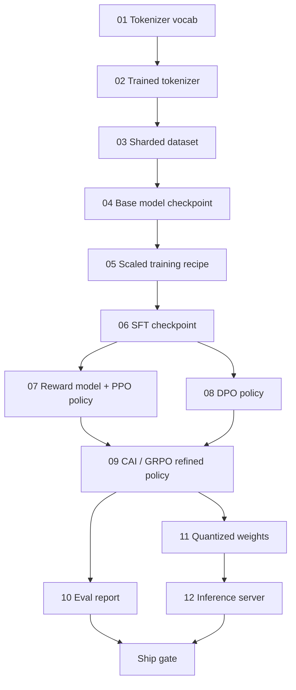

# Building a Complete LLM Pipeline

> Everything from Lessons 01 to 12 is one stage of one pipeline. This lesson is the scaffold that turns those stages into a single end-to-end run: tokenize, pre-train, scale, SFT, align, evaluate, quantize, serve.

**Type:** Build
**Languages:** Python (stdlib)
**Prerequisites:** All Phase 10 lessons 01-12
**Time:** ~120 minutes

## Learning Objectives

- Compose the eleven prior lessons into a single reproducible pipeline spec
- Define the artifact contract between stages
- Build an orchestrator that tracks experiments, hashes artifacts, and gates ship decisions on eval thresholds
- Design the rollback plan: cheap vs expensive stages

## The Problem

The previous lessons each work. Tokenizer trained. Tiny GPT pre-trained. SFT dataset assembled. Each is a notebook with its own conventions, output paths, and seeds.

A frontier training run is not a notebook. Llama 3 405B took 30 million H100 hours. DeepSeek-V3 used 2.8 million H800 hours. One corrupted checkpoint, one data contamination, one eval regression can cost a week of wall-clock and a month of GPU budget. Pipeline hygiene saves this: every stage has a deterministic input, a deterministic output, a manifest, a hash, and a gate.

You will not run the pipeline end-to-end on a laptop. You will write the orchestrator, the manifest, the verifier, and the replay plan.

## The Concept

### The Twelve Stages



### The Manifest

A single file describing a run completely enough to replay it. Nothing depends on state outside the manifest.

```
pipeline_version: 1.2.3
seed: 42
git_commit: a1b2c3d4
stages:
  01_tokenizer:
    recipe: bpe_32k
    input_hash: sha256:...
    output_hash: sha256:...
    wall_clock_sec: 3600
    cost_usd: 12
```

Output hash of stage N is the input hash of stage N+1. Any deviation halts the pipeline.

### Artifact Typing

| Stage | Artifact Type | Key Fields |
|-------|--------------|-----------|
| 01-02 | Tokenizer | vocab.json, merges.txt, hash |
| 03 | Dataset | shards[], row count, dedup stats |
| 04-05 | Checkpoint | weights.safetensors, config.json, step count |
| 06 | SFT Model | checkpoint + SFT recipe + data mix |
| 07 | Reward Model | RM checkpoint + preference data hash |
| 08-09 | Policy | checkpoint + KL budget consumed |
| 10 | Eval Report | benchmark scores + regression diffs |
| 11 | Quantized Model | quantized weights + accuracy delta vs FP16 |
| 12 | Server Spec | endpoint + model hash + observability hooks |

### The Eval Gate

```
gates:
  mmlu:      >= baseline + 0.5
  humaneval: >= baseline + 1.0
  truthfulqa: >= baseline
  safety_refusal_rate: <= 0.05
  kl_from_reference: <= 25.0
  cost_total_usd: <= 50000
```

Every gate is a numeric threshold. No subjective sign-offs.

### The Orchestrator

Resolves the DAG from the manifest, dispatches stages, tracks artifacts, halts on any contract violation. ~200 lines of Python.

1. Resolve the DAG
2. Check if output already exists at correct hash (skip)
3. Run stage, capture stdout/stderr, measure wall clock and cost
4. Verify output hash against downstream's expected input hash
5. On failure, exit nonzero with partial manifest

### Reproducibility vs Determinism

Modern LLM training is reproducible but not deterministic. GPU kernel non-determinism produces floats differing at 1e-5 between runs. If headline metrics match, the run is reproduced.

### Rollback Plan

- **Cheap** (hours): tokenizer, eval, quantization, inference server
- **Medium** (days): SFT, DPO, CAI -- keep base model, re-run alignment
- **Expensive** (weeks and millions): pre-training -- use last good checkpoint

## Build It

The code implements an orchestrator with `Manifest`, `Stage`, and `EvalGate` dataclasses. Each stage is a placeholder producing the correct artifact shape. Running end-to-end proves the plumbing before burning GPU money.

- `Manifest`: pipeline version, seed, git commit, stages, gates
- `Stage`: name, type, inputs (hashes), output (hash), wall clock, cost
- `Orchestrator.run()`: resolves DAG, dispatches stages, verifies hashes
- `EvalGate.check()`: reads thresholds, compares against eval report
- `CostTracker`: per-stage and cumulative, halts when cap exceeded

## Use It

```
python main.py plan    # validate manifest, compute cost estimate
python main.py run     # execute stages, write manifest.out.yaml
python main.py gate    # read manifest, apply eval gates, ship-or-hold
```

Running `plan` is free. Running `run` is expensive. Catch bugs on the cheap side.

## Ship It

This lesson produces `outputs/skill-llm-pipeline-reviewer.md` -- checks pipeline manifests for contract violations.

## Exercises

1. Extend the orchestrator to support parallel execution of stages 07 and 08 using `concurrent.futures`.
2. Add a contamination check gate that computes overlap between eval and training datasets (13-gram match).
3. Implement cost estimator: FLOPs = 6 x params x tokens, 40% MFU on H100 at $2.50/GPU-hour.
4. Build partial rollback: simulate failure at stage 09, re-run stages 09-12 with 01-08 cached.
5. Add OpenTelemetry spans for each stage with params, tokens, loss, and cost attributes.

## Further Reading

- Dubey et al., "The Llama 3 Herd of Models" (2024)
- DeepSeek-AI, "DeepSeek-V3 Technical Report" (2024)
- Kaplan et al., "Scaling Laws for Neural Language Models" (2020)
- Hoffmann et al., "Training Compute-Optimal LLMs (Chinchilla)" (2022)
