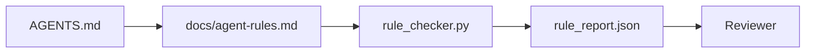

# Agent Instructions as Executable Constraints

> Instructions written as prose are wishes. Instructions written as constraints are tests. The workbench turns each rule into something an agent can check at runtime and a reviewer can verify after the fact.

**Type:** Build
**Languages:** Python (stdlib)
**Prerequisites:** Phase 14 · 32 (Minimal Workbench)
**Time:** ~50 minutes

## Learning Objectives

- Separate routing prose from operational rules.
- Express startup rules, forbidden actions, definition of done, uncertainty handling, and approval boundaries as machine-checkable constraints.
- Implement a rule checker that scores a run against the rule set.
- Make the rule set diff-friendly so review can see what changed.

## The Problem

A typical `AGENTS.md` reads like onboarding documentation. It tells the agent to "be careful" and "test thoroughly" and "ask if unsure." Three days later, the agent ships a change with no tests, writes to a forbidden directory, and never asks because it never knew where the line was.

Instructions are powerful when they are operational and weak when they are aspirational. The fix is to write rules the workbench can interpret and the reviewer can score.

## The Concept

Rules belong in `docs/agent-rules.md`, away from the short root router. Each rule has a name, a category, and a check.



### Five categories that cover most rules

| Category | Question the rule answers | Example |
|----------|---------------------------|---------|
| Startup | What must be true before work begins? | "state file exists and is fresh" |
| Forbidden | What must never happen? | "do not edit `scripts/release.sh`" |
| Definition of done | What proves the task is complete? | "pytest exits 0 and acceptance line passes" |
| Uncertainty | What does the agent do when unsure? | "open a question note instead of guessing" |
| Approval | What requires human approval? | "any new dependency, any prod write" |

### Rules are machine-readable

Each rule has a slug, a category, a one-line description, and a `check` field that names a function in `rule_checker.py`.

### Rules are diff-friendly

Rules live one per heading in a single markdown file. Renames are visible in diffs. New rules sit at the top of their category.

### Rules versus framework guardrails

Framework guardrails enforce rules at runtime. The rule set is the human-readable, reviewable contract those guardrails implement. You need both.

### Progressive disclosure: a map, not an encyclopedia

```
AGENTS.md                  # router, < 50 lines
docs/
  agent-rules.md           # the full rule set
  architecture.md          # loaded when task touches module boundaries
  testing.md               # loaded when task writes or runs tests
  deploy.md                # loaded only for release work, gated behind approval
feature_list.json          # the backlog
```

| Tier | Lives in | Read when | Size budget |
|------|----------|-----------|-------------|
| Router | `AGENTS.md` | Every session | Under ~50 lines |
| Rules | `docs/agent-rules.md` | Every session, on startup | One screen per category |
| Topic docs | `docs/<topic>.md` | Only when task touches that topic | As deep as needed |

## Build It

`code/main.py` ships:

- `agent-rules.md` parser that loads rules into a dataclass.
- `rule_checker.py` style checker functions, one per `check` reference.
- A demo agent run that violates two rules and a check pass that catches them.

```
python3 code/main.py
```

## Production patterns in the wild

**Severity tagging at write time.** Every rule carries `severity`: `block`, `warn`, or `info`. Most teams overstate severity early then quietly weaken it under deadline pressure; tagging at write time forces calibration up front.

**Rule expiry as a forcing function.** Every rule carries an `expires_at` date (default 90 days). Cloudflare's production AI Code Review data (April 2026, 131,246 review runs) showed rule sets with explicit expiry stayed under 30 rules per repo; sets without grew to 80+.

**Markdown-as-source, JSON-as-cache.** `agent-rules.md` is the authored file; `agent-rules.lock.json` is a cache the checker reads in the hot path.

## Use It

- Claude Code, Codex, Cursor read rules at session start and quote them when refusing actions.
- OpenAI Agents SDK guardrails register the same checks as input and output guardrails.
- LangGraph interrupts fire when a node violates a rule.

## Ship It

`outputs/skill-rule-set-builder.md` interviews a project owner, classifies their existing prose instructions into the five categories, and emits a versioned `agent-rules.md` plus a checker stub.

## Exercises

1. Add a sixth category if your product genuinely needs it. Defend why it does not collapse into one of the five.
2. Extend the checker so a rule can carry a severity (`block`, `warn`, `info`) and the report aggregates accordingly.
3. Wire the checker into CI: fail the build if a block-severity rule fails on the latest agent run.
4. Add an "expiry" field per rule. After 90 days without a check fail, the rule is up for review.
5. Find a real `AGENTS.md` and rewrite it as five-category rules. How many of its lines were operational? How many were aspirational?

## Key Terms

| Term | What people say | What it actually means |
|------|----------------|------------------------|
| Operational rule | "A real instruction" | A rule the workbench can check at runtime |
| Aspirational rule | "Be careful" | A rule with no check; either delete or upgrade |
| Definition of done | "Acceptance" | An objective, file-backed proof the task is complete |
| Block severity | "Hard rule" | Violation halts the run; cannot be silenced without an operator |
| Rule expiry | "Stale rule sweep" | A rule with no fails in N days is up for retirement |

## Further Reading

- [OpenAI Agents SDK guardrails](https://platform.openai.com/docs/guides/agents-sdk/guardrails)
- [LangGraph interrupts](https://langchain-ai.github.io/langgraph/how-tos/human_in_the_loop/breakpoints/)
- [Anthropic, Building Effective Agents](https://www.anthropic.com/research/building-effective-agents)
- [Rick Hightower, Agent RuleZ: A Deterministic Policy Engine](https://medium.com/@richardhightower/agent-rulez-a-deterministic-policy-engine-for-ai-coding-agents-9489e0561edf)
- [Cloudflare, Orchestrating AI Code Review at Scale](https://blog.cloudflare.com/ai-code-review/)
- [microservices.io, GenAI development platform — part 1: guardrails](https://microservices.io/post/architecture/2026/03/09/genai-development-platform-part-1-development-guardrails.html)
- [Type-Checked Compliance: Deterministic Guardrails (arXiv 2604.01483)](https://arxiv.org/pdf/2604.01483)
- [logi-cmd/agent-guardrails](https://github.com/logi-cmd/agent-guardrails)
- Phase 14 · 32 — the minimal workbench this rule set drops into
- Phase 14 · 38 — the verification gate that consumes the rule report
- Phase 14 · 39 — the reviewer agent that scores rule compliance

[Reference](https://github.com/rohitg00/ai-engineering-from-scratch/tree/main/phases/14-agent-engineering/33-instructions-as-executable-constraints)
