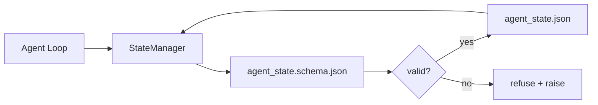

# Repo Memory and Durable State

> Chat history is volatile. The repo is durable. The workbench stores agent state in versioned files so the next session, the next agent, and the next reviewer all read from the same source of truth.

**Type:** Build
**Languages:** Python (stdlib + `jsonschema` optional)
**Prerequisites:** Phase 14 · 32 (Minimal Workbench)
**Time:** ~60 minutes

## Learning Objectives

- Define what belongs in repo memory and what belongs in chat history.
- Author JSON Schemas for `agent_state.json` and `task_board.json`.
- Build a state manager that loads, validates, mutates, and persists state atomically.
- Use the schema to refuse bad writes before they corrupt the workbench.

## The Problem

The agent finishes a session. The chat closes. The next session opens and asks where to start. The model says "let me check the files," reads stale notes, and re-does work that was already complete. Or worse, it rewrites a finished file because no one told it the file was finished.

The workbench fix is repo memory: state lives in JSON files in the repo, written under a schema, persisted atomically, diff-friendly in code review.

## The Concept



### What belongs in repo memory

| Belongs | Does not belong |
|---------|-----------------|
| Active task id | Raw chat transcripts |
| Touched files this session | Token-level reasoning traces |
| Assumptions the agent made | "The user seemed frustrated" |
| Open blockers | Sampled completions |
| Next action | Vendor-specific model ids |

### Schema-first state

JSON Schema covers required keys, allowed `status` values, forbidden values, pattern constraints, and a version field for migrations.

### Atomic writes

Write to a tempfile, fsync, rename over the target. A half-written state file is worse than no file at all.

### Migrations

The state file carries a `schema_version` field; the manager refuses to load a file from a version it cannot migrate.

## Build It

`code/main.py` implements:

- `agent_state.schema.json` and `task_board.schema.json`.
- A stdlib-only validator (subset of JSON Schema).
- `StateManager.load`, `StateManager.update`, `StateManager.commit` with atomic temp-and-rename writes.

```
python3 code/main.py
```

## Production patterns in the wild

**Atomic temp-and-rename is not optional.** A March 2026 Hive project bug report documents the failure mode cleanly: `state.json` was written via `write_text()` and exceptions were caught and silenced.

**Idempotency keys on every non-idempotent tool call.** Log every tool call ID before execution into `pending_calls.jsonl`. On retry, check for the ID; if present, skip the call and use the cached result.

**Separate large artifacts from state.** Don't store CSVs or long transcripts in `agent_state.json`. Keep only the path in state.

**Event sourcing for audit, snapshots for resume.** Append to an event log on every mutation; periodically snapshot to `state.json`.

**Schema migrations or refuse to load.** When the manager loads a file at an unknown version, it refuses to read.

## Use It

- **LangGraph checkpointers.** Same idea, different storage.
- **Letta memory blocks.** Persistent blocks with structured schemas.
- **OpenAI Agents SDK session store.** Pluggable backends, schema-aware.

## Ship It

`outputs/skill-state-schema.md` generates a project-specific JSON Schema pair, a Python `StateManager` wired to atomic writes, and a migration scaffold.

## Exercises

1. Add a `last_human_touch` timestamp. Refuse any agent write within five seconds of a human edit.
2. Extend the validator to support `oneOf` so a task can be either a build task or a review task with different required fields.
3. Add a `schema_version` field and write the migration from v1 to v2 (rename `blockers` to `risks`).
4. Move the storage backend from a local file to SQLite. Keep the `StateManager` API identical.
5. Run two agents against the same state file with a 50 ms write race. What goes wrong and how does the atomic rename save you?

## Key Terms

| Term | What people say | What it actually means |
|------|----------------|------------------------|
| Repo memory | "Notes file" | State stored in tracked files in the repo, under schema |
| Schema-first | "Validate inputs" | Define the contract before the writer, refuse drift |
| Atomic write | "Just rename" | Write to temp, fsync, rename, so partial failures cannot corrupt |
| Migration | "Schema bump" | A script that turns vN state into v(N+1) state |
| System of record | "Source of truth" | The artifact the workbench treats as authoritative |

## Further Reading

- [JSON Schema specification](https://json-schema.org/specification.html)
- [LangGraph checkpointers](https://langchain-ai.github.io/langgraph/concepts/persistence/)
- [Letta memory blocks](https://docs.letta.com/concepts/memory)
- [Fast.io, AI Agent State Checkpointing: A Practical Guide](https://fast.io/resources/ai-agent-state-checkpointing/)
- [Fast.io, AI Agent Workflow State Persistence: Best Practices 2026](https://fast.io/resources/ai-agent-workflow-state-persistence/)
- [Hive Issue #6263 — non-atomic state.json writes silently ignored](https://github.com/aden-hive/hive/issues/6263)
- [eunomia, Checkpoint/Restore Systems: Evolution, Techniques, Applications](https://eunomia.dev/blog/2025/05/11/checkpointrestore-systems-evolution-techniques-and-applications-in-ai-agents/)
- [Indium, 7 State Persistence Strategies for Long-Running AI Agents in 2026](https://www.indium.tech/blog/7-state-persistence-strategies-ai-agents-2026/)
- [Microsoft Agent Framework, Compaction](https://learn.microsoft.com/en-us/agent-framework/agents/conversations/compaction)
- Phase 14 · 08 — memory blocks and sleep-time compute
- Phase 14 · 32 — the three-file minimum this lesson schematizes
- Phase 14 · 40 — handoff packets read from the same schema

[Reference](https://github.com/rohitg00/ai-engineering-from-scratch/tree/main/phases/14-agent-engineering/34-repo-memory-and-state)
