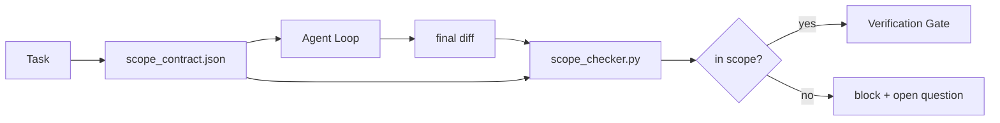

# Scope Contracts and Task Boundaries

> The model does not know where the work ends. A scope contract is a per-task file that says where the work begins, where it ends, and how to roll back if it spills. The contract turns "stay in scope" from a wish into a check.

**Type:** Build
**Languages:** Python (stdlib)
**Prerequisites:** Phase 14 · 32 (Minimal Workbench), Phase 14 · 33 (Rules as Constraints)
**Time:** ~50 minutes

## Learning Objectives

- Write a scope contract that an agent reads at task start and a verifier reads at task end.
- Specify allowed files, forbidden files, acceptance criteria, rollback plan, and approval boundaries.
- Implement a scope checker that compares a diff against the contract and flags violations.
- Make scope creep visible, automatic, and reviewable.

## The Problem

Agents creep. The task is "fix the login bug." The diff touches the login route, the email helper, the database driver, the README, and the release script. Each touch had a plausible reason in the moment. Together they are a different change than the one that was reviewed.

Scope creep is the most under-monitored failure mode in agent work. The fix is a contract on disk that says what was promised and a check that compares the result against the promise.

## The Concept



### What goes in a scope contract

| Field | Purpose |
|-------|---------|
| `task_id` | Links to the task on the board |
| `goal` | One sentence the reviewer can verify |
| `allowed_files` | Globs the agent may write |
| `forbidden_files` | Globs the agent must not touch |
| `acceptance_criteria` | Test commands or assertion lines that prove done |
| `rollback_plan` | One paragraph the operator can execute if a halt is required |
| `approvals_required` | Actions outside scope that need explicit human sign-off |

### Two altitudes of scope: the feature list and the task contract

The scope contract bounds one task. A `feature_list.json` bounds the project backlog. The agent picks exactly one feature whose `status` is `todo`, writes its `id` into the active scope contract, and is forbidden from starting a second feature in the same session.

```json
{
  "project": "knowledge-base",
  "active": "import-pdf",
  "features": [
    { "id": "import-pdf",   "status": "in_progress", "goal": "import a PDF into the library",        "done_when": "pytest tests/test_import.py && a sample PDF appears in the library view" },
    { "id": "full-text-search", "status": "todo",     "goal": "search document text and rank hits",   "done_when": "query returns ranked results with snippets" }
  ]
}
```

## Build It

`code/main.py` implements:

- `scope_contract.json` schema with glob arrays.
- A diff parser that turns touched files plus run commands into a `RunSummary`.
- A `scope_check` that returns `(violations, in_scope, off_scope)` against the contract.
- Two demo runs: one that stays in scope, one that creeps.

```
python3 code/main.py
```

## Production patterns in the wild

**Violation budgets, not binary failures.** Minor scope slips within budget are surfaced as warnings; only when the budget is exceeded does the merge gate refuse.

**Severity asymmetry by path family.** Off-scope writes to `docs/**` are usually `warn`; off-scope writes to `scripts/**`, `migrations/**`, `config/prod/**` are always `block`.

**Time and network budgets next to file budgets.** A `time_budget_minutes` field bounds wall clock. A `network_egress` allowlist prevents the agent from quietly hitting an external API.

**Multi-contract merge semantics (least privilege).** Intersect `allowed_files`, union `forbidden_files`, min `time_budget_minutes`.

## Use It

- **Claude Code slash commands.** A `/scope` command writes the contract.
- **GitHub PRs.** CI runs the scope checker against the merge diff.
- **LangGraph interrupts.** A scope violation triggers an interrupt asking the human.

## Ship It

`outputs/skill-scope-contract.md` generates a scope contract for a task description and a glob-aware checker that runs in CI.

## Exercises

1. Add a `network_egress` field listing allowed external hosts. Refuse runs that touch other hosts.
2. Extend the checker to fail soft on `docs/**` and hard on `scripts/**`. Justify the asymmetry.
3. Make the contract derive `allowed_files` from a `goal` field using a static rule set (no LLM).
4. Add a `time_budget_minutes` and refuse to continue once the wall clock exceeds it.
5. Run two contracts against the same diff. What is the right merge semantics when both apply?

## Key Terms

| Term | What people say | What it actually means |
|------|----------------|------------------------|
| Scope contract | "The task brief" | Per-task JSON listing allowed/forbidden files, acceptance, rollback |
| Scope creep | "It also touched..." | Files outside the contract changed in the same task |
| Rollback plan | "We can revert" | The one-paragraph operator runbook for halting |
| Approval boundary | "Needs sign-off" | An action listed in the contract as requiring explicit human approval |
| Diff check | "Path audit" | Comparing touched files against the contract globs |

## Further Reading

- [LangGraph human-in-the-loop interrupts](https://langchain-ai.github.io/langgraph/concepts/human_in_the_loop/)
- [OpenAI Agents SDK tool approval policies](https://platform.openai.com/docs/guides/agents-sdk)
- [logi-cmd/agent-guardrails — merge gates and scope validation](https://github.com/logi-cmd/agent-guardrails)
- [Dev|Journal, Preventing AI Agent Configuration Drift with Agent Contract Testing](https://earezki.com/ai-news/2026-05-05-i-built-a-tiny-ci-tool-to-keep-ai-agent-configs-from-drifting-in-my-repo/)
- [Agentic Coding Is Not a Trap (production logs)](https://dev.to/jtorchia/agentic-coding-is-not-a-trap-i-answered-the-viral-hn-post-with-my-own-production-logs-33d9)
- [OpenCode permission globs](https://opencode.ai/docs/agents/)
- [Knostic, AI Coding Agent Security: Threat Models and Protection Strategies](https://www.knostic.ai/blog/ai-coding-agent-security)
- [Augment Code, AI Spec Template](https://www.augmentcode.com/guides/ai-spec-template)
- Phase 14 · 27 — prompt injection defenses that pair with scope locks
- Phase 14 · 33 — the rule set this contract specializes per task
- Phase 14 · 38 — the verification gate the checker reports into

[Reference](https://github.com/rohitg00/ai-engineering-from-scratch/tree/main/phases/14-agent-engineering/36-scope-contracts)
