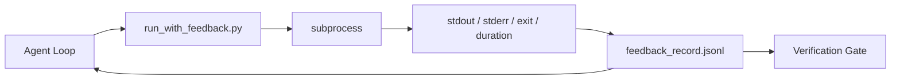

# Runtime Feedback Loops

> Agents that do not see real command output guess. A feedback runner captures stdout, stderr, exit code, and timing into a structured record the next turn can read. Then the agent reacts to facts instead of to its own prediction of facts.

**Type:** Build
**Languages:** Python (stdlib)
**Prerequisites:** Phase 14 · 32 (Minimal Workbench), Phase 14 · 35 (Init Script)
**Time:** ~50 minutes

## Learning Objectives

- Distinguish runtime feedback from observability telemetry.
- Build a feedback runner that wraps shell commands and persists structured records.
- Truncate large outputs deterministically so the loop stays within token budget.
- Refuse to advance the loop when feedback is missing.

## The Problem

The agent says "running tests now." The next message says "all tests pass." The reality is that no test ran. The agent imagined the output, or it ran the command and never read the result, or it read the result and silently truncated the failure line.

A feedback runner removes that gap. Every command goes through the runner. Every record carries the command, the captured stdout and stderr, the exit code, the wall-clock duration, and a one-line agent note.

## The Concept



### What goes in a feedback record

| Field | Why it matters |
|-------|----------------|
| `command` | Exact argv, no shell expansion surprises |
| `stdout_tail` | Last N lines, deterministic truncation |
| `stderr_tail` | Last N lines, separate from stdout |
| `exit_code` | The unambiguous success signal |
| `duration_ms` | Surfaces slow probes and runaway processes |
| `started_at` | Timestamp for replay |
| `agent_note` | One line the agent writes about what it expected |

### Feedback versus telemetry

Telemetry is for human operators reviewing runs across time. Feedback is for the next turn of this run.

### Refuse to advance without feedback

If the runner errors before capturing exit, the record carries `exit_code: null`. The agent loop must refuse to claim success on a `null` exit.

## Build It

`code/main.py` implements:

- `run_with_feedback(command, agent_note)` that wraps `subprocess.run`, captures stdout/stderr/exit/duration, truncates deterministically, appends to `feedback_record.jsonl`.
- A demo that runs three commands (success, failure, slow).

```
python3 code/main.py
```

## Production patterns in the wild

**Redact at write, not at read.** Strip lines matching `^Bearer `, `password=`, `api[_-]?key=`, `AKIA[0-9A-Z]{16}`, `xox[baprs]-`.

**Rotation policy, not a single file.** Cap `feedback_record.jsonl` at 1 MB per file; on overflow rotate to `.1`, `.2`, drop `.5`.

**Parent-command id for retry chains.** Every record gets `command_id`; retries carry `parent_command_id` pointing at the previous attempt.

## Use It

- **Claude Code Bash tool.** Already captures stdout, stderr, exit, and duration.
- **LangGraph nodes.** Wrap any shell node in the runner so the record persists outside graph state.
- **CI logs.** Pipe the JSONL into your CI artifact store.

## Ship It

`outputs/skill-feedback-runner.md` generates a project-specific `run_with_feedback.py` with the right truncation budget.

## Exercises

1. Add a `cwd` field per record so the same command run from different directories is distinguishable.
2. Add a `redaction` step that strips lines matching `^Bearer ` or `password=`. Test on a fixture record.
3. Cap total `feedback_record.jsonl` size at 1 MB by rotating to `.1`, `.2` files.
4. Add a `parent_command_id` so retry chains are visible.
5. Pipe the JSONL into a tiny TUI that highlights the latest non-zero exit.

## Key Terms

| Term | What people say | What it actually means |
|------|----------------|------------------------|
| Feedback record | "Run log" | Structured JSONL entry with command, output, exit, duration |
| Tail truncation | "Trim the log" | Deterministic head+tail capture so records fit in token budget |
| Refuse-on-null | "Block on missing data" | The loop must not advance when `exit_code` is null |
| Agent note | "Expectation tag" | The one-line prediction the agent writes before reading the result |
| Telemetry split | "Two log files" | Feedback for the next turn, telemetry for the operator |

## Further Reading

- [OpenTelemetry GenAI semantic conventions](https://opentelemetry.io/docs/specs/semconv/gen-ai/)
- [Anthropic, Effective harnesses for long-running agents](https://www.anthropic.com/engineering/effective-harnesses-for-long-running-agents)
- [Guardrails AI x MLflow — deterministic safety, PII, quality validators](https://guardrailsai.com/blog/guardrails-mlflow)
- [Aport.io, Best AI Agent Guardrails 2026: Pre-Action Authorization Compared](https://aport.io/blog/best-ai-agent-guardrails-2026-pre-action-authorization-compared/)
- [Andrii Furmanets, AI Agents in 2026: Practical Architecture for Tools, Memory, Evals, Guardrails](https://andriifurmanets.com/blogs/ai-agents-2026-practical-architecture-tools-memory-evals-guardrails)
- Phase 14 · 23 — OTel GenAI conventions for the telemetry side
- Phase 14 · 24 — agent observability platforms
- Phase 14 · 33 — the rule that demands feedback before declaring done
- Phase 14 · 38 — the verification gate that reads the JSONL

[Reference](https://github.com/rohitg00/ai-engineering-from-scratch/tree/main/phases/14-agent-engineering/37-runtime-feedback-loops)
