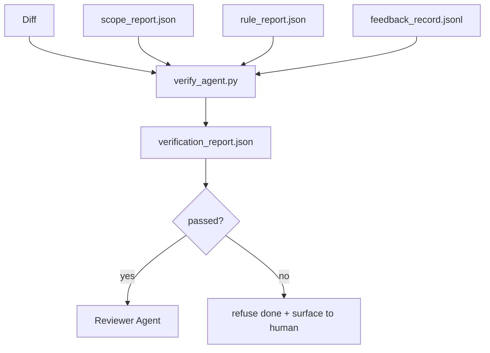

# Verification Gates

> The agent does not get to mark its own work as done. A verification gate reads the scope contract, the feedback log, the rule report, and the diff, and answers a single question: is this task actually complete? If the gate says no, the task is not done, no matter what the chat says.

**Type:** Build
**Languages:** Python (stdlib)
**Prerequisites:** Phase 14 · 33 (Rules), Phase 14 · 36 (Scope), Phase 14 · 37 (Feedback)
**Time:** ~55 minutes

## Learning Objectives

- Define a verification gate as a deterministic function over workbench artifacts.
- Combine rule report, scope report, feedback records, and diff into a single verdict.
- Emit a `verification_report.json` the reviewer agent and CI can both read.
- Refuse to advance a task on any block-severity failure, without exception.

## The Problem

Agents declare success too easily. Three failure shapes dominate:

- "Looks good." The model read its own diff and decided it was correct.
- "Tests passed." Said with confidence. No record of the test actually running.
- "Acceptance met." Acceptance criteria interpreted loosely enough to mean "anything resembling done."

The workbench fix is a single verification gate that reads the artifacts the agent has already produced and makes the call. The gate is deterministic, in version control, and wired into CI.

## The Concept



### What the gate checks

| Check | Source artifact | Severity |
|-------|-----------------|----------|
| All acceptance commands ran | `feedback_record.jsonl` | block |
| All acceptance commands exited zero | `feedback_record.jsonl` | block |
| Scope check has no forbidden writes | `scope_report.json` | block |
| No `null` exit codes in feedback | `feedback_record.jsonl` | block |

### Deterministic, not probabilistic

The gate must produce the same verdict for the same artifact set every time. No LLM judges.

### Refuse without exception

Block-severity findings cannot be overridden by the agent. Only by a human, with a recorded `override_reason` and `overridden_by` user id.

## Build It

`code/main.py` implements:

- A loader for each input artifact.
- A `verify(task_id, artifacts) -> VerdictReport` pure function.
- A demo with three task scenarios: clean pass, scope creep, missing acceptance.

```
python3 code/main.py
```

## Production patterns in the wild

**Defense-in-depth, not single gate.** Pre-commit hook → CI status check → pre-tool authz hook → pre-merge gate.

**Defense by deterministic check, model-judge only for nuance.** Verifiable rewards (unit tests, schema checks, exit codes) answer "did the code solve the problem?" — LLM rubrics answer "is the code readable, secure, on-style?"

**Signed override log, not Slack threads.** Every override emits a row in `outputs/verification/overrides.jsonl` with timestamp, finding code, reason, signing user, HEAD commit.

**Coverage floor as a first-class check.** The gate fails if measured coverage drops below 80% or below the previous merge's floor by more than 1 percentage point.

**`--strict` mode promotes warns to blocks.** For release branches, ship-blocking PRs, or post-incident triage.

## Use It

- **CI step.** Merge protection refuses without `passed: true`.
- **Pre-handoff hook.** No green verdict, no handoff.
- **Manual triage.** Operators read the report when an agent claims success and a human suspects it.

## Ship It

`outputs/skill-verification-gate.md` wires the gate into a specific project: which acceptance commands feed it, which rules are block-severity, how the override audit log is stored.

## Exercises

1. Add a `coverage_floor` check: the test command must produce a coverage report with at least 80%.
2. Support a `--strict` mode that promotes every `warn` to `block`.
3. Make the gate produce a Markdown summary in addition to JSON.
4. Add a `time_since_last_human_touch` check.
5. Run the gate on a real agent diff from your product. How many findings are real and how many are noise?

## Key Terms

| Term | What people say | What it actually means |
|------|----------------|------------------------|
| Verification gate | "The check that stops things" | Deterministic function over workbench artifacts producing a pass/fail verdict |
| Block severity | "Hard fail" | A finding that prevents `passed: true` and requires a signed override |
| Override log | "Why we let it through" | Signed entries with reason and user id, audited by review |
| Acceptance command | "The proof" | A shell command whose zero exit is what `done` means |
| One report path | "Source of truth" | `outputs/verification/<task_id>.json`, consumed by CI and humans alike |

## Further Reading

- [Anthropic, Harness design for long-running application development](https://www.anthropic.com/engineering/harness-design-long-running-apps)
- [OpenAI Agents SDK guardrails](https://platform.openai.com/docs/guides/agents-sdk/guardrails)
- [microservices.io, GenAI dev platform: guardrails](https://microservices.io/post/architecture/2026/03/09/genai-development-platform-part-1-development-guardrails.html)
- [ICMD, The 2026 Playbook for Agentic AI Ops](https://icmd.app/article/the-2026-playbook-for-agentic-ai-ops-guardrails-costs-and-reliability-at-scale-1776661990431)
- [Type-Checked Compliance: Deterministic Guardrails (arXiv 2604.01483)](https://arxiv.org/pdf/2604.01483)
- [logi-cmd/agent-guardrails — merge gate spec](https://github.com/logi-cmd/agent-guardrails)
- [Guardrails AI x MLflow](https://guardrailsai.com/blog/guardrails-mlflow)
- [Akira, Real-Time Guardrails for Agentic Systems](https://www.akira.ai/blog/real-time-guardrails-agentic-systems)
- Phase 14 · 27 — prompt injection defenses
- Phase 14 · 36 — the scope contract this gate enforces
- Phase 14 · 37 — the feedback log this gate scores
- Phase 14 · 39 — the reviewer agent the gate hands off to

[Reference](https://github.com/rohitg00/ai-engineering-from-scratch/tree/main/phases/14-agent-engineering/38-verification-gates)
