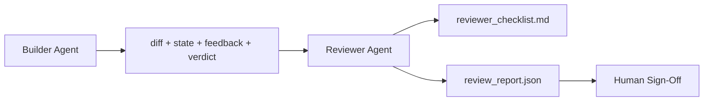

# Reviewer Agent: Separate Builder from Marker

> The agent that wrote the code cannot grade it. A reviewer is a second loop with a different system prompt, a different goal, and read-only access to everything the builder produced. The gap between builder and reviewer is where most reliability lives.

**Type:** Build
**Languages:** Python (stdlib)
**Prerequisites:** Phase 14 · 38 (Verification Gate)
**Time:** ~55 minutes

## Learning Objectives

- State why the same agent cannot reliably review its own work.
- Build a reviewer agent loop that consumes builder artifacts and emits a structured review report.
- Author a reviewer rubric that grades specific dimensions, not vibes.
- Wire the reviewer into the workbench so the human review step starts from a real artifact.

## The Problem

You ask the agent to fix a bug. It edits four files, runs the tests, and reports done. The verification gate confirms acceptance ran and scope held. The gate says `passed: true`. You merge. Two days later you find that the fix solved the wrong half of the bug.

Acceptance is necessary, not sufficient. The reviewer asks the questions acceptance cannot ask: did this solve the right problem? Did it expand scope without flagging it? Did it document assumptions that should have been questioned?

## The Concept



### Reviewer rubric

Five dimensions, each scored 0 to 2.

| Dimension | Question |
|-----------|----------|
| Problem fit | Did the change solve the task as stated, not a nearby task? |
| Scope discipline | Were edits confined to the contract or was the contract grown deliberately? |
| Assumptions | Are all hidden assumptions written down somewhere reviewable? |
| Verification quality | Does the acceptance command actually prove the goal? |
| Handoff readiness | Could the next session pick up cleanly from the current state? |

Total out of 10. A run below 7 is a soft fail; a run below 5 is a hard fail.

### The reviewer is a separate role, not a separate model

Same model, different system prompt, different inputs, no write access to the diff.

### The reviewer cannot edit the diff

If the report says "fix this," the next builder turn does the fix; the reviewer goes back to reviewing.

### Reviewer rubric versus verification gate

The gate checks deterministic facts. The reviewer makes qualitative judgments. Both are required.

## Build It

`code/main.py` implements:

- A `ReviewerInputs` dataclass bundling the artifacts.
- A rubric scorer with one function per dimension.
- A `review_report.json` writer with the five scores, total, and verdict.
- Two demo cases: a clean change and a "right tests, wrong problem" change.

```
python3 code/main.py
```

## Production patterns in the wild

Cloudflare's April 2026 AI Code Review system ran 131,246 review runs across 48,095 merge requests in 5,169 repos in 30 days. Median review completed in 3 minutes 39 seconds. Up to seven specialist reviewers ran in parallel under a Review Coordinator.

**Specialist pool, not one big reviewer.** Once the codebase has security-critical, performance-critical, and docs surfaces, split into specialists with smaller prompts.

**Bias mitigation as design requirement.** Four reliable biases: position bias, verbosity bias, self-preference, authority. Mitigations: evaluate both orderings, use 1-4 scales rewarding conciseness, rotate judges across model families, strip author names.

**Calibration set, not vibes.** A 10-20 task historical set with known correct verdicts. Run the reviewer over it on every prompt change.

**Hybrid norm with the gate.** Gate handles deterministic checks; reviewer handles semantic checks.

## Use It

- **Claude Code subagents.** A reviewer subagent runs after the builder closes a task.
- **OpenAI Agents SDK handoffs.** Builder hands off to Reviewer on task completion.
- **Two-model pairing.** Builder on a faster cheaper model. Reviewer on a stronger model.

## Ship It

`outputs/skill-reviewer-agent.md` generates a project-specific reviewer rubric, a reviewer agent stub, and an integration with the verification gate.

## Exercises

1. Add a sixth dimension specific to your product domain. Defend why it is not absorbed by the existing five.
2. Run the reviewer with two different system prompts (terse, verbose). Which produces a report a human is more likely to read?
3. Add a `confidence` field per dimension. Refuse to ship the report when confidence in the lowest dimension is below 0.6.
4. Build a calibration set: 10 historical task close-outs with known correct verdicts.
5. Add a "request more evidence" affordance: the reviewer can ask the builder for a specific test run before scoring.

## Key Terms

| Term | What people say | What it actually means |
|------|----------------|------------------------|
| Reviewer rubric | "Checklist" | Five-dimension 0-2 scoring with a written question per dimension |
| Soft fail | "Needs revisions" | Total below 7; builder gets findings to address |
| Hard fail | "Reject" | Total below 5 or any dimension at 0; halt and surface to human |
| Role separation | "Different prompt" | Same model can be both roles; the discipline is inputs and posture |
| Confidence floor | "Don't ship low-signal reports" | Refuse to emit a verdict when the rubric is uncertain |

## Further Reading

- [OpenAI Agents SDK handoffs](https://platform.openai.com/docs/guides/agents-sdk/handoffs)
- [Anthropic Claude Code subagents](https://docs.anthropic.com/en/docs/agents-and-tools/claude-code/sub-agents)
- [Cloudflare, Orchestrating AI Code Review at Scale](https://blog.cloudflare.com/ai-code-review/)
- [Agent-as-a-Judge: Evaluating Agents with Agents (OpenReview / ICLR)](https://openreview.net/forum?id=DeVm3YUnpj)
- [Adnan Masood, Rubric-Based Evaluations and LLM-as-a-Judge](https://medium.com/@adnanmasood/rubric-based-evals-llm-as-a-judge-methodologies-and-empirical-validation-in-domain-context-71936b989e80)
- [MLflow, LLM-as-a-Judge Evaluation](https://mlflow.org/llm-as-a-judge)
- [LangChain, How to Calibrate LLM-as-a-Judge with Human Corrections](https://www.langchain.com/articles/llm-as-a-judge)
- [Evidently AI, LLM-as-a-judge: a complete guide](https://www.evidentlyai.com/llm-guide/llm-as-a-judge)
- [Arize, LLM as a Judge — Primer and Pre-Built Evaluators](https://arize.com/llm-as-a-judge/)
- Phase 14 · 05 — Self-Refine and CRITIC
- Phase 14 · 30 — Eval-driven agent development
- Phase 14 · 38 — the verification gate the reviewer reads
- Phase 14 · 40 — the handoff packet the reviewer report feeds

[Reference](https://github.com/rohitg00/ai-engineering-from-scratch/tree/main/phases/14-agent-engineering/39-reviewer-agent)
