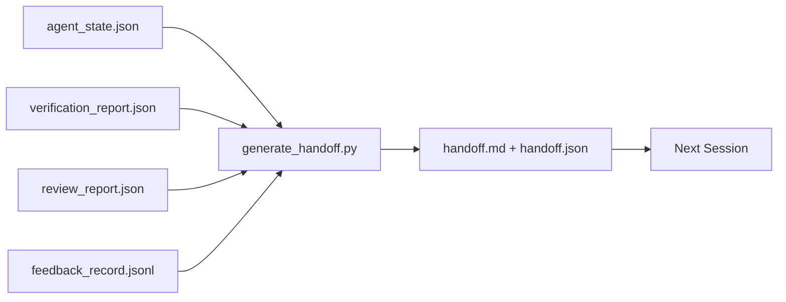

# Multi-Session Handoff

> The session is going to end. The work is not. The handoff packet is the artifact that turns "the agent worked for an hour" into "the next session is productive in the first minute." Build it on purpose, not as an afterthought.

**Type:** Build
**Languages:** Python (stdlib)
**Prerequisites:** Phase 14 · 34 (Repo Memory), Phase 14 · 38 (Verification), Phase 14 · 39 (Reviewer)
**Time:** ~50 minutes

## Learning Objectives

- Identify the seven fields every handoff packet needs.
- Generate a handoff from the workbench artifacts without hand-writing prose.
- Trim large feedback logs into a handoff-sized summary.
- Make the next session's first action deterministic.

## The Problem

The session ends. The agent says "great, we made progress." The next session opens. The next agent asks "where did we leave off?" The first agent's answer is gone. The next agent rediscovers, re-runs the same commands, re-asks the human the same questions, and burns thirty minutes recovering the last thirty seconds of the previous session.

The cost of a bad handoff is paid every session for the life of the task. The fix is a packet generated automatically at session end.

## The Concept



### Seven fields every handoff carries

| Field | Question it answers |
|-------|---------------------|
| `summary` | One paragraph of what was done |
| `changed_files` | The diff at a glance |
| `commands_run` | What was actually executed |
| `failed_attempts` | What was tried and why it did not work |
| `open_risks` | What could bite next session, with severity |
| `next_action` | The first concrete step next session takes |
| `verdict_pointer` | Path to the verification + review reports |

### Leave a clean state

A perfect `handoff.md` is worthless if the next session opens to a half-applied diff, temp files, a stray branch, and tests that error before they even run.

| Check | Clean means |
|-------|-------------|
| Working tree | Every change committed or explicitly stashed with a note |
| Temp artifacts | No `*.tmp`, scratch dirs, debug prints, or commented-out blocks |
| Tests | Green, or red with the failure named in `open_risks` |
| Feature board | `feature_list.json` status reflects reality |
| Branch | On the expected branch, no detached HEAD |

## Build It

`code/main.py` implements:

- A loader that gathers state, verdict, review, and feedback into a `WorkbenchSnapshot`.
- A `generate_handoff(snapshot) -> (markdown, payload)` function.
- A filter that picks the last K feedback entries plus all non-zero exits.

```
python3 code/main.py
```

## Production patterns in the wild

**Compaction strategies vary; the packet schema does not.** Codex CLI, Claude Code, and OpenCode each ship different compaction. The packet is the portable artifact.

**Fresh-session handoff is not compaction.** Compaction extends a session; handoff closes one cleanly and starts the next.

**One active handoff per branch and topic.** Include `branch`, `last_known_good_commit`, and a `status` of `active | superseded | archived`.

**Wrap up before 50-75% context, not at the wall.** Cheap to write while context is intact; expensive when the model is already losing its place.

## Use It

- **Session-end hook.** The runtime fires the generator when the user closes the chat.
- **PR template.** The generator's markdown is also a PR body.
- **Cross-agent handoff.** Build with one product, continue with another.

## Ship It

`outputs/skill-handoff-generator.md` produces a generator tuned to a project's artifact paths, an end-of-session hook, and a `handoff.json` schema.

## Exercises

1. Add an `assumptions_to_validate` field that surfaces every assumption the builder logged but the reviewer did not score above 1.
2. Trim the feedback summary differently for failing runs versus passing ones. Defend the asymmetry.
3. Include a "questions for the human" list.
4. Make the generator idempotent: running it twice produces the same packet.
5. Add a "next session prereqs" section listing exactly the artifacts the next session must load.

## Key Terms

| Term | What people say | What it actually means |
|------|----------------|------------------------|
| Handoff packet | "Session summary" | Generated artifact carrying the seven fields, both markdown and JSON |
| Next action | "What to do first" | The one concrete step that starts the next session |
| Feedback trim | "Log summary" | Last K records plus every non-zero exit |
| Status report | "What we did" | A document missing `next_action`; useful, but not a handoff |
| Verdict pointer | "Receipt" | Path to the verification + review reports for traceability |

## Further Reading

- [Anthropic, Effective harnesses for long-running agents](https://www.anthropic.com/engineering/effective-harnesses-for-long-running-agents)
- [OpenAI Agents SDK handoffs](https://platform.openai.com/docs/guides/agents-sdk/handoffs)
- [Codex Blog, Codex CLI Context Compaction](https://codex.danielvaughan.com/2026/03/31/codex-cli-context-compaction-architecture/)
- [Justin3go, Shedding Heavy Memories: Context Compaction in Codex, Claude Code, OpenCode](https://justin3go.com/en/posts/2026/04/09-context-compaction-in-codex-claude-code-and-opencode)
- [JD Hodges, Claude Handoff Prompt (2026)](https://www.jdhodges.com/blog/ai-session-handoffs-keep-context-across-conversations/)
- [Mervin Praison, Managing Handoffs in Multi-Agent Coding Sessions](https://mer.vin/2026/04/managing-handoffs-in-multi-agent-coding-sessions-fresh-context-without-losing-continuity/)
- [Hermes Issue #20372](https://github.com/NousResearch/hermes-agent/issues/20372)
- [Hermes Issue #499](https://github.com/NousResearch/hermes-agent/issues/499)
- [Microsoft Agent Framework, Compaction](https://learn.microsoft.com/en-us/agent-framework/agents/conversations/compaction)
- [OpenCode, Context Management and Compaction](https://deepwiki.com/sst/opencode/2.4-context-management-and-compaction)
- [LangChain, Context Engineering for Agents](https://www.langchain.com/blog/context-engineering-for-agents)
- Phase 14 · 34 — the state file the generator reads
- Phase 14 · 38 — the verification verdict the packet points at
- Phase 14 · 39 — the reviewer report bundled into the packet

[Reference](https://github.com/rohitg00/ai-engineering-from-scratch/tree/main/phases/14-agent-engineering/40-multi-session-handoff)
