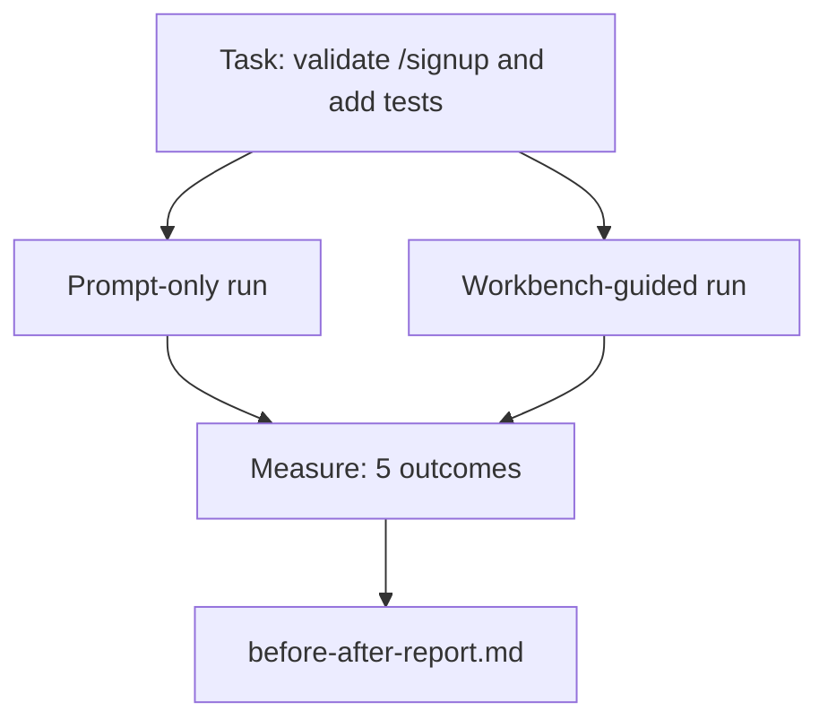

# The Workbench on a Real Repo

> Eleven lessons of surfaces are worth nothing if they do not survive contact with a real codebase. This lesson runs the same task twice on a small sample app: prompt-only versus workbench-guided. The numbers do the arguing.

**Type:** Build
**Languages:** Python (stdlib)
**Prerequisites:** Phases 14 · 32 to 14 · 40
**Time:** ~60 minutes

## Learning Objectives

- Bring the seven workbench surfaces together on a small application.
- Run the same task twice (prompt-only and workbench-guided) and measure five outcomes.
- Read the before/after report and decide which surfaces gave the most leverage.
- Defend the workbench against a "but my model is good enough" pushback.

## The Problem

A demo on a toy task convinces no one. The case for the workbench is made when a real-feeling task on a real-feeling repo lands in production with fewer failures, fewer reverts, and a packet the next session can use.

## The Concept



### The task

> Add input validation to `/signup`: reject passwords shorter than 8 characters, return 422 with a typed error envelope. Add a test that proves the new behavior.

### The two pipelines

Prompt-only: read README → read `app.py` → edit files → claim done.

Workbench-guided: run init script → read scope contract → read state → edit allowed files → run acceptance via feedback runner → run verification gate → run reviewer → generate handoff.

### The five outcomes measured

| Outcome | Why it matters |
|---------|----------------|
| `tests_actually_run` | Most "tests passed" claims are unverifiable |
| `acceptance_met` | The test that proves the goal must be the test that ran |
| `files_outside_scope` | Scope creep is the dominant silent failure |
| `handoff_quality` | The next session pays for or benefits from this |
| `reviewer_total` | Qualitative judgment on top of the gate |

## Build It

`code/main.py` orchestrates the two pipelines against the same sample app fixture. Both pipelines are scripted so the measurement is reproducible.

```
python3 code/main.py
```

## Production patterns in the wild

**Terminal Bench Top-30 to Top-5 on the same model.** A coding agent jumped from outside the top 30 to rank five on Terminal Bench 2.0 by changing only the harness. Same model. Different surfaces.

**Vercel 80% to 100% by deleting tools.** Deleting 80% of the agent's tools moved the success rate from 80% to 100%. Negative space wins.

**Harvey 2x accuracy via harness alone.** Legal agents more than doubled their accuracy through harness optimization, no model change.

**88% of enterprise AI agent projects fail to reach production.** Traced to runtime, not reasoning: stale state, brittle retries, overgrown context.

**Long-context collapse.** WebAgent baseline 40-50% success drops to under 10% in long-context conditions.

**False negatives still exist.** Single-step factual tasks, one-line lints, formatter runs — these run faster prompt-only. Enumerate them honestly.

## Use It

This lesson is the case file you cite when someone asks why every PR carries an `agent-rules.md` and a scope contract, or when a team wants to drop the verification gate "just for this sprint."

## Ship It

`outputs/skill-workbench-benchmark.md` is a portable evaluation harness that runs any agent product through both pipelines against a project's own sample app.

## Exercises

1. Add a sixth outcome: time-to-first-meaningful-edit. How do you measure it cleanly?
2. Run the comparison on a real second-day task in your codebase. Where do the workbench numbers slip?
3. Add a "false negative" pass: tasks where prompt-only would have been faster.
4. Replace the scripted "agent" with a real LLM call. Which outcomes get noisier?
5. Author a one-page summary aimed at a non-engineer. What survives the cut?

## Key Terms

| Term | What people say | What it actually means |
|------|----------------|------------------------|
| Sample app | "Toy repo" | Small but realistic enough to exercise all seven surfaces |
| Pipeline | "Workflow" | Ordered sequence of surface reads/writes the agent follows |
| Before/after report | "The receipts" | The artifact you hand to a skeptic |
| False negative | "Workbench overkill" | Tasks where prompt-only is faster |
| Workbench benchmark | "Reliability score" | Portable harness that runs the comparison on your codebase |

## Further Reading

- [LangChain, The Anatomy of an Agent Harness](https://blog.langchain.com/the-anatomy-of-an-agent-harness/)
- [MongoDB, The Agent Harness: Why the LLM Is the Smallest Part of Your Agent System](https://www.mongodb.com/company/blog/technical/agent-harness-why-llm-is-smallest-part-of-your-agent-system)
- [preprints.org, Harness Engineering for Language Agents](https://www.preprints.org/manuscript/202603.1756)
- [HN: Improving 15 LLMs at Coding in One Afternoon](https://news.ycombinator.com/item?id=46988596)
- [Cloudflare, Orchestrating AI Code Review at Scale](https://blog.cloudflare.com/ai-code-review/)
- [Anthropic, Building Effective Agents](https://www.anthropic.com/research/building-effective-agents)
- Phases 14 · 32 to 14 · 40 — the surfaces this lesson exercises end-to-end
- Phase 14 · 19 — SWE-bench, GAIA, AgentBench
- Phase 14 · 30 — eval-driven agent development

[Reference](https://github.com/rohitg00/ai-engineering-from-scratch/tree/main/phases/14-agent-engineering/41-workbench-for-real-repos)
