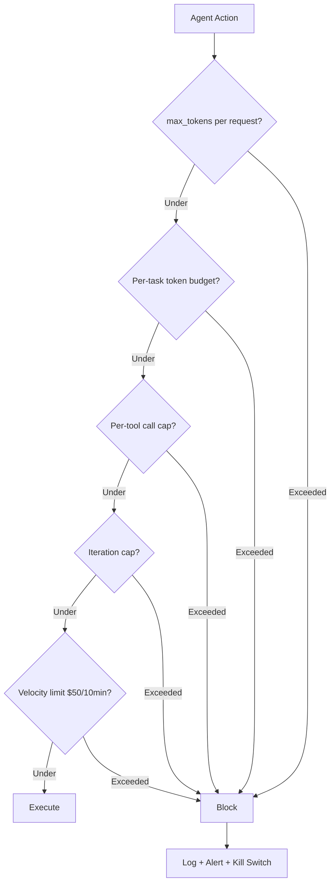

# Action Budgets, Iteration Caps, and Cost Governors

> A mid-sized e-commerce agent's monthly LLM cost jumped from $1,200 to $4,800 after its team enabled the "order-tracking" skill. That is not a pricing bug. That is an agent that found a new loop and kept spending inside it. Microsoft's Agent Governance Toolkit (April 2, 2026) codifies the defense against this class: per-request `max_tokens`, per-task token and dollar budgets, per-day/month caps, iteration caps, tiered model routing, prompt caching, context windowing, HITL checkpoints on expensive actions, kill switches on budget breach. Anthropic's Claude Code Agent SDK ships the same primitives under different names. Financial velocity limits — e.g. cut access on >$50 in 10 minutes — catch loops faster than monthly caps.

**Type:** Learn
**Languages:** Python (stdlib, layered cost-governor simulator)
**Prerequisites:** Phase 15 · 10 (Permission modes), Phase 15 · 12 (Durable execution)
**Time:** ~60 minutes

## Learning Objectives
- Design a layered cost-governor stack covering multiple time scales
- Distinguish between random loop, slow leak, bad release, and legitimate surge
- Configure Claude Code's budget surface (`max_turns`, `max_budget_usd`)
- Implement a financial velocity limit
- Map OWASP Agentic Top 10 and EU AI Act requirements to cost controls

## The Problem

Autonomous agents spend real money on every turn. A chatbot's bad output is a bad reply; an agent's bad loop is a bill. The industry-documented term for the failure mode is "Denial of Wallet" — the agent keeps reasoning, keeps tool-calling, keeps billing, and nothing stops it because nothing was designed to.

The fix is not one number. It is a stack of limits at different time scales and granularities: per-request, per-task, per-hour, per-day, per-month. A well-designed stack catches a runaway loop within minutes, a slow leak within hours, and a bad release within a day. The same stack keeps a budget at all when the agent is long-horizon and autonomous.

## The Concept

### The cost-governor stack

1. **`max_tokens` per request.** Simple. Prevents any one call from emitting an unbounded completion.
2. **Per-task token budget.** Across the whole run, do not exceed N tokens. Hard stop at the cap.
3. **Per-task dollar budget.** Same as tokens but in currency. `max_budget_usd` in Claude Code.
4. **Per-tool call cap.** No more than N `WebFetch` calls, N `shell_exec` calls, etc.
5. **Iteration cap (`max_turns`).** Total agent loop iterations; prevents infinite reasoning loops.
6. **Per-minute / per-hour / per-day / per-month cap.** Rolling windows. Catches leaks at different time scales.
7. **Financial velocity limit.** E.g., "if spend exceeds $50 in 10 minutes, cut access." Catches loop-based burn before monthly caps fire.
8. **Tiered model routing.** Default to a smaller model; escalate to a larger one only when a classifier judges the task warrants it.
9. **Prompt caching.** System prompt and stable context stored in provider cache; token cost of re-sending is near zero.
10. **Context windowing.** Compaction / summarization to keep the active context below a threshold; direct token-cost reduction.
11. **HITL checkpoints on expensive actions.** Before an action known to be expensive (long tool call, large download, a costly model upgrade), require a human tap.
12. **Kill switch on budget breach.** Session aborts when any cap fires. Cap is recorded; requires a separate re-enable path.

### Why the stack, not one cap

A single monthly cap catches a runaway agent only after the wallet is gone. A single per-request cap catches nothing at the session level. Different failure modes require different time scales:

- **Runaway loop** (agent stuck in a 5-second retry): caught by velocity limit.
- **Slow leak** (agent doing ~2x expected work per task): caught by daily cap.
- **Bad release** (new version uses 5x tokens): caught by weekly / monthly cap.
- **Legitimate surge** (real demand, not a bug): caught by hour / day cap with clear log.

### Claude Code's budget surface

The Claude Code Agent SDK exposes:

- `max_turns` — iteration cap.
- `max_budget_usd` — dollar cap; session aborts on breach.
- `allowed_tools` / `disallowed_tools` — tool allowlist and denylist.
- Hook points before tool use for custom cost-accounting.

Combine with the permission-mode ladder. An `autoMode` session without `max_budget_usd` is ungoverned autonomy.

### EU AI Act, OWASP Agentic Top 10

Microsoft's Agent Governance Toolkit covers the OWASP Agentic Top 10 and the EU AI Act Article 14 (human oversight) requirements. For production in the EU, logging and cap enforcement are not optional.

### The observed $1,200 → $4,800 case

The real case in the Microsoft docs: an e-commerce agent whose monthly cost tripled after a new tool was added. The tool allowed the agent to poll order status during every session. No loop detection. No per-tool cap. No alert on week-over-week growth. The fix was a per-tool cap plus a daily-growth alert. This is a template: every new tool surface is a new potential loop; every new tool needs its own cap and its own alert.

## Use It

`code/main.py` simulates an agent run with and without a layered cost-governor stack. The simulated agent drifts into a polling loop after some turns; the layered stack catches it within the velocity window while a single monthly cap would not fire until days later.

## Ship It

`outputs/skill-agent-budget-audit.md` audits a proposed agent deployment's cost-governor stack and flags missing layers.

## Exercises

1. Run `code/main.py`. Confirm the velocity limit fires before the iteration cap on a polling-loop trajectory. Now disable the velocity limit and measure how much the agent "spends" before the iteration cap catches it.

2. Design a per-tool cap set for a browser agent. Which tool needs the tightest cap? Which tool can run unbounded without risk?

3. Read the Microsoft Agent Governance Toolkit docs. List every cap type the toolkit names. Map each to one of the failure modes (runaway loop, slow leak, bad release, surge).

4. Price an overnight unattended run for a realistic task (e.g., "triage 50 issues in a repo"). Set `max_budget_usd` at 2x your point estimate. Justify the 2x.

5. Claude Code's `max_budget_usd` fires on session aggregate cost. Design a complementary velocity limit you would enforce externally. What triggers the cut-off, and what does re-enable look like?

## Key Terms

| Term | What people say | What it actually means |
|---|---|---|
| Denial of Wallet | "Runaway bill" | Agent loop generating spend with no cap to stop it |
| max_tokens | "Per-request cap" | Ceiling on a single completion's size |
| max_turns | "Iteration cap" | Ceiling on agent loop iterations in a session |
| max_budget_usd | "Dollar kill switch" | Session cost cap; aborts on breach |
| Velocity limit | "Rate cap" | Limit on spend per short window (e.g., $50 / 10 min) |
| Tiered routing | "Small model first" | Cheap model default; escalate only when classifier warrants |
| Prompt caching | "Cached system prompt" | Provider-side cache reduces re-send token cost to near zero |
| HITL checkpoint | "Human approval gate" | Human tap required before expensive action |

## Further Reading

- [Anthropic Claude Code Agent SDK — agent loop and budgets](https://code.claude.com/docs/en/agent-sdk/agent-loop)
- [Microsoft Agent Framework — human-in-the-loop and governance](https://learn.microsoft.com/en-us/agent-framework/workflows/human-in-the-loop)
- [Anthropic — Claude Managed Agents overview](https://platform.claude.com/docs/en/managed-agents/overview)
- [Anthropic — Prompt caching (Claude API docs)](https://platform.claude.com/docs/en/prompt-caching)
- [Anthropic — Measuring agent autonomy in practice](https://www.anthropic.com/research/measuring-agent-autonomy)

[Reference](https://github.com/rohitg00/ai-engineering-from-scratch/tree/main/phases/15-autonomous-systems/13-cost-governors)
