# Communication Protocols

> Agents that can't speak the same language aren't a team. They're strangers shouting into the void.

**Type:** Build
**Languages:** TypeScript
**Prerequisites:** Phase 14 (Agent Engineering), Lesson 16.01 (Why Multi-Agent)
**Time:** ~120 minutes

## Learning Objectives

- Implement MCP tool discovery and invocation so agents can use tools exposed by external servers
- Build an A2A agent card and task endpoint that allows one agent to delegate work to another over HTTP
- Compare MCP (tool access), A2A (agent-to-agent), ACP (enterprise audit), and ANP (decentralized trust) and explain which protocol solves which problem
- Wire multiple protocols together in a single system where agents discover tools via MCP and delegate tasks via A2A

## The Problem

You split your system into multiple agents. A researcher, a coder, a reviewer. They're great at their individual jobs. But now you need them to actually talk to each other.

Your first attempt is obvious: pass strings around. The researcher returns a blob of text, the coder parses it however it can. It works until the coder misinterprets a research summary, or two agents deadlock waiting for each other, or you need agents built by different teams to collaborate. Suddenly "just pass strings" falls apart.

The AI ecosystem has responded with four protocols, each solving a different slice of the problem:
- **MCP** for tool access
- **A2A** for agent-to-agent collaboration
- **ACP** for enterprise auditability
- **ANP** for decentralized identity and trust

## The Concept

### The Protocol Landscape

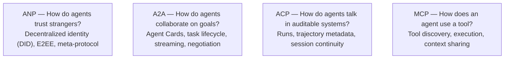

### MCP (Recap)

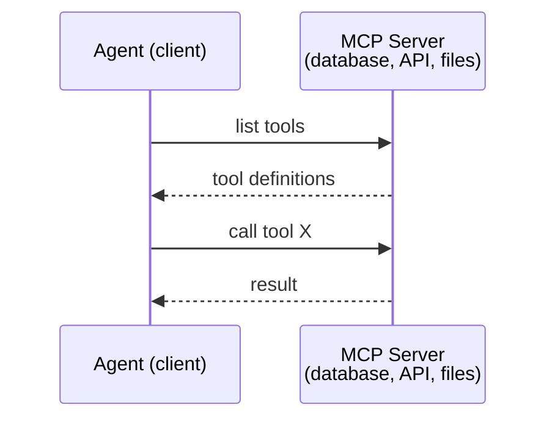

MCP is **agent-to-tool** communication. It doesn't help agents talk to each other.

### A2A (Agent2Agent Protocol)

Created by Google (now under Linux Foundation as `lf.a2a.v1`). A2A is the protocol for **peer-to-peer agent collaboration**. Each agent publishes an **Agent Card** at a well-known URL.

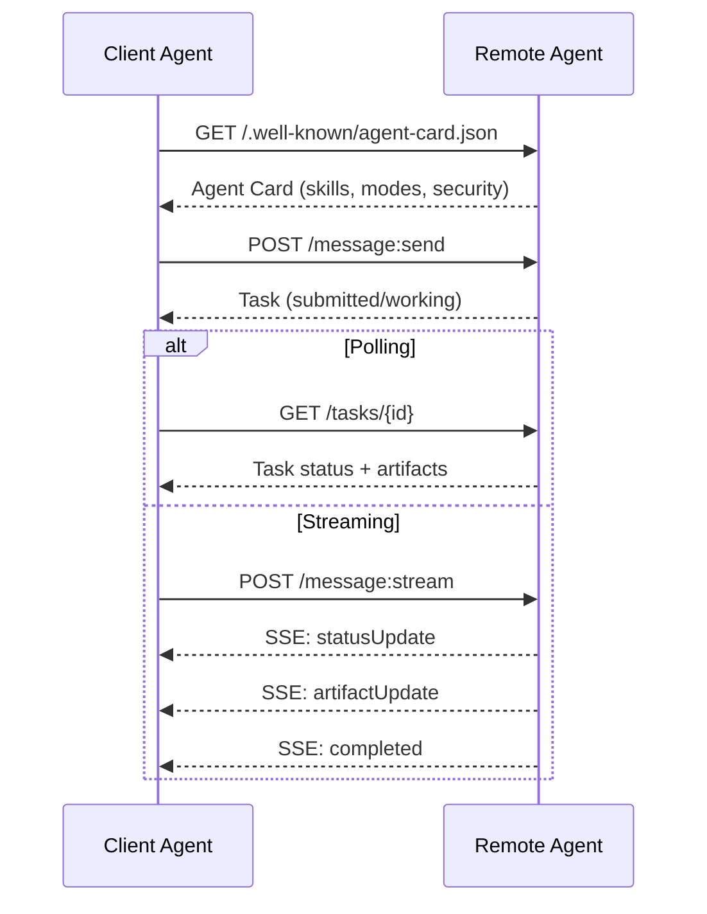

#### The Real Agent Card

```json
{
  "name": "Research Agent",
  "description": "Searches documentation and summarizes findings",
  "version": "1.0.0",
  "supportedInterfaces": [
    { "url": "https://research-agent.example.com/a2a/v1", "protocolBinding": "JSONRPC", "protocolVersion": "1.0" },
    { "url": "https://research-agent.example.com/a2a/rest", "protocolBinding": "HTTP+JSON", "protocolVersion": "1.0" }
  ],
  "capabilities": { "streaming": true, "pushNotifications": false },
  "defaultInputModes": ["text/plain", "application/json"],
  "defaultOutputModes": ["text/plain", "application/json"],
  "skills": [
    { "id": "web-research", "name": "Web Research", "description": "Searches the web and synthesizes findings", "tags": ["research", "search", "summarization"], "examples": ["Research the latest changes in React 19"] }
  ],
  "securitySchemes": { "bearer": { "httpAuthSecurityScheme": { "scheme": "Bearer", "bearerFormat": "JWT" } } },
  "security": [{ "bearer": [] }]
}
```

#### Task Lifecycle

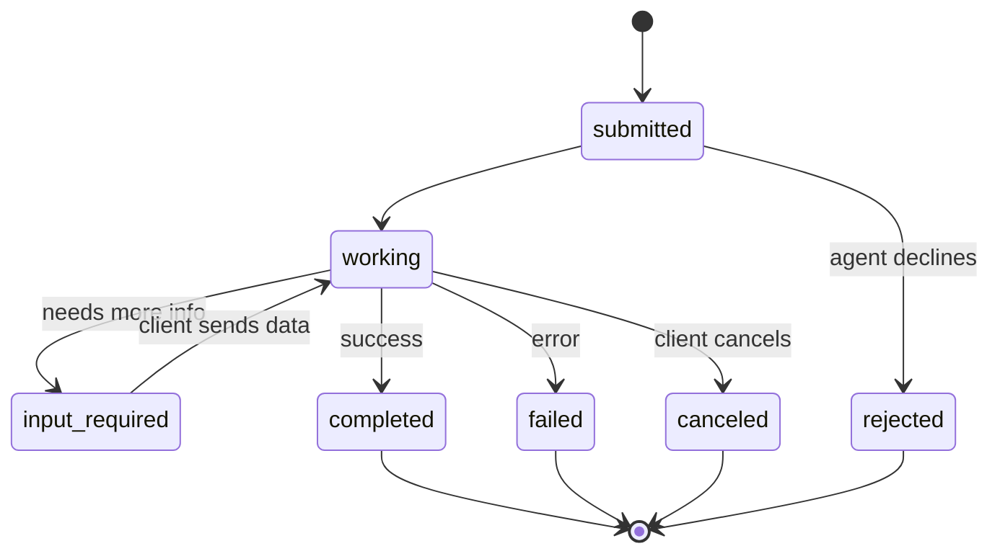

| State | Terminal? | Meaning |
|---|---|---|
| `TASK_STATE_SUBMITTED` | No | Acknowledged, not yet processing |
| `TASK_STATE_WORKING` | No | Actively being processed |
| `TASK_STATE_INPUT_REQUIRED` | No | Agent needs more info from client |
| `TASK_STATE_AUTH_REQUIRED` | No | Authentication needed |
| `TASK_STATE_COMPLETED` | Yes | Finished successfully |
| `TASK_STATE_FAILED` | Yes | Finished with error |
| `TASK_STATE_CANCELED` | Yes | Canceled before completion |
| `TASK_STATE_REJECTED` | Yes | Agent declined the task |

#### Wire Format

Client sends a task:
```json
{
  "jsonrpc": "2.0", "id": 1, "method": "SendMessage",
  "params": {
    "message": { "messageId": "msg-001", "role": "ROLE_USER", "parts": [{ "text": "Research React 19 compiler features" }] },
    "configuration": { "acceptedOutputModes": ["text/plain", "application/json"], "historyLength": 10 }
  }
}
```

Agent responds:
```json
{
  "jsonrpc": "2.0", "id": 1,
  "result": {
    "task": {
      "id": "task-abc-123", "contextId": "ctx-xyz-789",
      "status": { "state": "TASK_STATE_COMPLETED", "timestamp": "2026-03-27T10:30:00Z" },
      "artifacts": [{ "artifactId": "art-001", "name": "research-results", "parts": [{ "data": { "findings": ["React 19 compiler auto-memoizes components"] }, "mediaType": "application/json" }] }]
    }
  }
}
```

### ACP (Agent Communication Protocol)

Created by IBM / BeeAI. ACP is the **enterprise protocol** with **TrajectoryMetadata**: every agent response can carry a detailed log of the reasoning steps and tool calls.

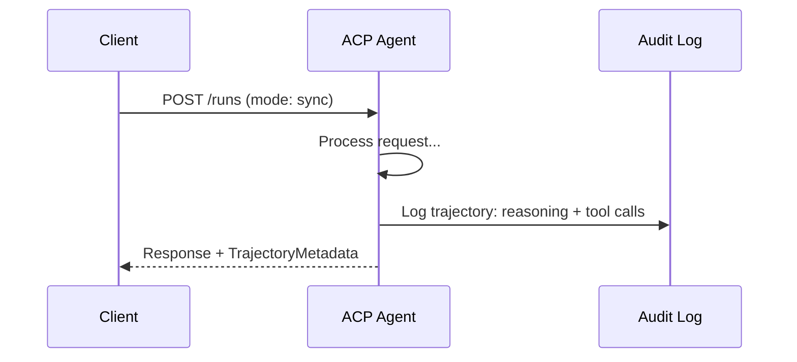

#### Run Lifecycle

| Mode | Behavior |
|---|---|
| `sync` | Blocking. Response contains the complete result. |
| `async` | Returns 202 immediately. Poll `GET /runs/{id}` for status. |
| `stream` | SSE stream. |

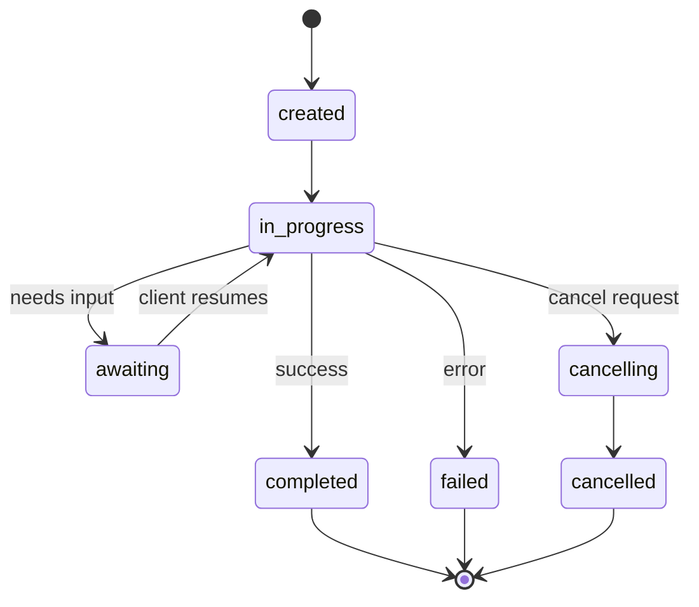

#### TrajectoryMetadata

```json
{
  "role": "agent/researcher",
  "parts": [{
    "content_type": "text/plain",
    "content": "The weather in San Francisco is 72F and sunny.",
    "metadata": {
      "kind": "trajectory",
      "message": "I need to check the weather for this location",
      "tool_name": "weather_api",
      "tool_input": { "location": "San Francisco, CA" },
      "tool_output": { "temperature": 72, "condition": "sunny" }
    }
  }]
}
```

### ANP (Agent Network Protocol)

Created by open-source community. ANP is the **decentralized identity protocol** using W3C DIDs and end-to-end encryption.

#### Three layers

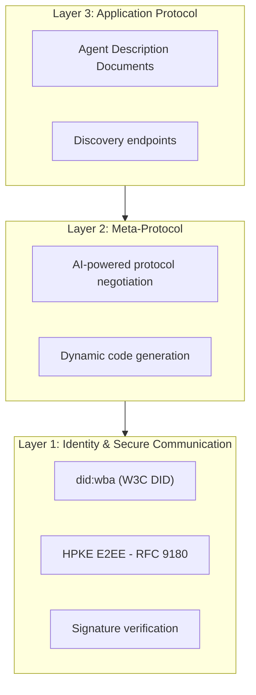

#### DID Document

```json
{
  "@context": ["https://www.w3.org/ns/did/v1", "https://w3id.org/security/suites/jws-2020/v1"],
  "id": "did:wba:example.com:user:alice",
  "verificationMethod": [
    { "id": "did:wba:example.com:user:alice#key-1", "type": "EcdsaSecp256k1VerificationKey2019", "controller": "did:wba:example.com:user:alice", "publicKeyJwk": { "crv": "secp256k1", "x": "NtngWpJUr-rlNNbs0u-Aa8e16OwSJu6UiFf0Rdo1oJ4", "y": "qN1jKupJlFsPFc1UkWinqljv4YE0mq_Ickwnjgasvmo", "kty": "EC" } }
  ],
  "authentication": ["did:wba:example.com:user:alice#key-1"],
  "keyAgreement": ["did:wba:example.com:user:alice#key-x25519-1"],
  "humanAuthorization": ["did:wba:example.com:user:alice#key-1"],
  "service": [{ "id": "did:wba:example.com:user:alice#agent-description", "type": "AgentDescription", "serviceEndpoint": "https://example.com/agents/alice/ad.json" }]
}
```

#### Meta-Protocol Negotiation

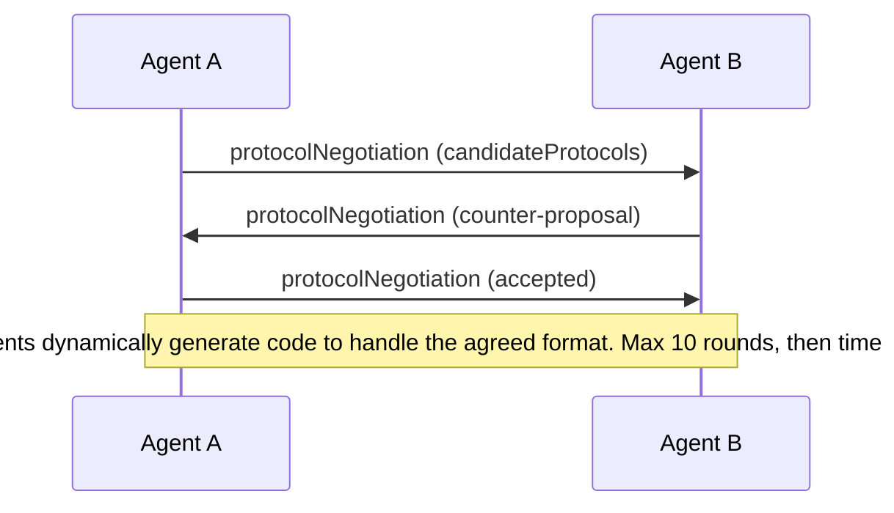

### Comparison

| | MCP | A2A | ACP | ANP |
|---|---|---|---|---|
| **Created by** | Anthropic | Google / Linux Foundation | IBM / BeeAI | Community |
| **Spec format** | JSON-RPC | JSON-RPC / REST / gRPC | OpenAPI 3.1 (REST) | JSON-RPC |
| **Primary use** | Agent to Tool | Agent to Agent | Agent to Agent | Agent to Agent |
| **Discovery** | Tool listing | `/.well-known/agent-card.json` | `GET /agents` | `/.well-known/agent-descriptions` |
| **Identity** | Implicit (local) | Security schemes (OAuth, mTLS) | Server-level | W3C DID (`did:wba`) with E2EE |
| **Audit trail** | N/A | Basic (task history) | TrajectoryMetadata | Not formally specified |
| **State machine** | N/A | 9 task states | 7 run states | N/A |
| **Streaming** | N/A | SSE | SSE | Transport-agnostic |
| **Unique feature** | Tool schemas | Agent Cards + Skills | Trajectory audit trail | Meta-protocol negotiation |

### How They Work Together

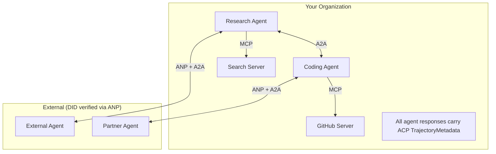

## Build It

### Step 1: Core Message Types

```typescript
import crypto from "node:crypto";

type MessageRole = "user" | "agent";

type MessagePart =
  | { kind: "text"; text: string }
  | { kind: "data"; data: unknown; mediaType: string }
  | { kind: "file"; name: string; url: string; mediaType: string };

type TrajectoryEntry = {
  reasoning: string;
  toolName?: string;
  toolInput?: unknown;
  toolOutput?: unknown;
  timestamp: number;
};

type AgentMessage = {
  id: string;
  role: MessageRole;
  parts: MessagePart[];
  trajectory?: TrajectoryEntry[];
  replyTo?: string;
  timestamp: number;
};

function createMessage(role: MessageRole, parts: MessagePart[], replyTo?: string): AgentMessage {
  return { id: crypto.randomUUID(), role, parts, replyTo, timestamp: Date.now() };
}

function textMessage(role: MessageRole, text: string): AgentMessage {
  return createMessage(role, [{ kind: "text", text }]);
}
```

### Step 2: A2A Agent Card and Registry

```typescript
type Skill = {
  id: string; name: string; description: string; tags: string[];
  inputModes: string[]; outputModes: string[];
};

type AgentCard = {
  name: string; description: string; version: string; url: string;
  capabilities: { streaming: boolean; pushNotifications: boolean };
  defaultInputModes: string[]; defaultOutputModes: string[];
  skills: Skill[];
};

class AgentRegistry {
  private cards: Map<string, AgentCard> = new Map();

  register(card: AgentCard) { this.cards.set(card.name, card); }

  discoverBySkillTag(tag: string): AgentCard[] {
    return [...this.cards.values()].filter((card) =>
      card.skills.some((skill) => skill.tags.includes(tag)));
  }

  discoverByInputMode(mimeType: string): AgentCard[] {
    return [...this.cards.values()].filter((card) =>
      card.defaultInputModes.includes(mimeType) ||
      card.skills.some((skill) => skill.inputModes.includes(mimeType)));
  }

  resolve(name: string): AgentCard | undefined { return this.cards.get(name); }
  listAll(): AgentCard[] { return [...this.cards.values()]; }
}
```

### Step 3: A2A Task Lifecycle

```typescript
type TaskState = "submitted" | "working" | "input-required" | "auth-required" | "completed" | "failed" | "canceled" | "rejected";

const TERMINAL_STATES: TaskState[] = ["completed", "failed", "canceled", "rejected"];

type TaskStatus = { state: TaskState; message?: AgentMessage; timestamp: number; };
type Artifact = { id: string; name: string; parts: MessagePart[]; };

type Task = { id: string; contextId: string; status: TaskStatus; artifacts: Artifact[]; history: AgentMessage[]; };

type TaskEvent =
  | { kind: "statusUpdate"; taskId: string; status: TaskStatus }
  | { kind: "artifactUpdate"; taskId: string; artifact: Artifact; append: boolean; lastChunk: boolean; };

type TaskHandler = (task: Task, message: AgentMessage) => AsyncGenerator<TaskEvent>;

class TaskManager {
  private tasks: Map<string, Task> = new Map();
  private handlers: Map<string, TaskHandler> = new Map();
  private listeners: Map<string, ((event: TaskEvent) => void)[]> = new Map();

  registerHandler(agentName: string, handler: TaskHandler) { this.handlers.set(agentName, handler); }

  subscribe(taskId: string, listener: (event: TaskEvent) => void) {
    const existing = this.listeners.get(taskId) ?? [];
    existing.push(listener);
    this.listeners.set(taskId, existing);
  }

  async sendMessage(agentName: string, message: AgentMessage, contextId?: string): Promise<Task> {
    const handler = this.handlers.get(agentName);
    if (!handler) {
      const task = this.createTask(contextId);
      task.status = { state: "rejected", timestamp: Date.now(), message: textMessage("agent", `No handler for ${agentName}`) };
      return task;
    }
    const task = this.createTask(contextId);
    task.history.push(message);
    task.status = { state: "submitted", timestamp: Date.now() };
    this.processTask(task, handler, message).catch((err) => {
      task.status = { state: "failed", timestamp: Date.now(), message: textMessage("agent", String(err)) };
    });
    return task;
  }

  getTask(taskId: string): Task | undefined { return this.tasks.get(taskId); }

  cancelTask(taskId: string): boolean {
    const task = this.tasks.get(taskId);
    if (!task || TERMINAL_STATES.includes(task.status.state)) return false;
    task.status = { state: "canceled", timestamp: Date.now() };
    this.emit(taskId, { kind: "statusUpdate", taskId, status: task.status });
    return true;
  }

  private createTask(contextId?: string): Task {
    const task: Task = { id: crypto.randomUUID(), contextId: contextId ?? crypto.randomUUID(), status: { state: "submitted", timestamp: Date.now() }, artifacts: [], history: [] };
    this.tasks.set(task.id, task);
    return task;
  }

  private async processTask(task: Task, handler: TaskHandler, message: AgentMessage) {
    task.status = { state: "working", timestamp: Date.now() };
    this.emit(task.id, { kind: "statusUpdate", taskId: task.id, status: task.status });
    try {
      for await (const event of handler(task, message)) {
        if (TERMINAL_STATES.includes(task.status.state)) break;
        if (event.kind === "statusUpdate") task.status = event.status;
        if (event.kind === "artifactUpdate") {
          const existing = task.artifacts.find((a) => a.id === event.artifact.id);
          if (existing && event.append) existing.parts.push(...event.artifact.parts);
          else task.artifacts.push(event.artifact);
        }
        this.emit(task.id, event);
      }
    } catch (err) {
      task.status = { state: "failed", timestamp: Date.now(), message: textMessage("agent", String(err)) };
      this.emit(task.id, { kind: "statusUpdate", taskId: task.id, status: task.status });
    }
  }

  private emit(taskId: string, event: TaskEvent) {
    for (const listener of this.listeners.get(taskId) ?? []) listener(event);
  }
}
```

### Step 4: ACP-Style Audit Trail

```typescript
type AuditEntry = {
  runId: string; agentName: string; input: AgentMessage[]; output: AgentMessage[];
  trajectory: TrajectoryEntry[];
  status: "created" | "in-progress" | "completed" | "failed" | "awaiting";
  startedAt: number; completedAt?: number; sessionId?: string;
};

class AuditableRunner {
  private log: AuditEntry[] = [];
  private handlers: Map<string, (input: AgentMessage[]) => Promise<{ output: AgentMessage[]; trajectory: TrajectoryEntry[] }>> = new Map();

  registerAgent(name: string, handler: (input: AgentMessage[]) => Promise<{ output: AgentMessage[]; trajectory: TrajectoryEntry[] }>) {
    this.handlers.set(name, handler);
  }

  async run(agentName: string, input: AgentMessage[], sessionId?: string): Promise<AuditEntry> {
    const entry: AuditEntry = { runId: crypto.randomUUID(), agentName, input: structuredClone(input), output: [], trajectory: [], status: "created", startedAt: Date.now(), sessionId };
    this.log.push(entry);
    const handler = this.handlers.get(agentName);
    if (!handler) { entry.status = "failed"; return entry; }
    entry.status = "in-progress";
    try {
      const result = await handler(input);
      entry.output = structuredClone(result.output);
      entry.trajectory = structuredClone(result.trajectory);
      entry.status = "completed";
      entry.completedAt = Date.now();
    } catch (err) {
      entry.status = "failed";
      entry.trajectory.push({ reasoning: `Error: ${String(err)}`, timestamp: Date.now() });
      entry.completedAt = Date.now();
    }
    return entry;
  }

  getFullAuditLog(): AuditEntry[] { return structuredClone(this.log); }
  getAuditLogForAgent(agentName: string): AuditEntry[] { return structuredClone(this.log.filter((e) => e.agentName === agentName)); }
  getAuditLogForSession(sessionId: string): AuditEntry[] { return structuredClone(this.log.filter((e) => e.sessionId === sessionId)); }
  getTrajectoryForRun(runId: string): TrajectoryEntry[] { const entry = this.log.find((e) => e.runId === runId); return entry ? structuredClone(entry.trajectory) : []; }
}
```

### Step 5: ANP-Style Identity Verification

```typescript
type VerificationMethod = { id: string; type: string; controller: string; publicKeyDer: string; };
type DIDDocument = { id: string; verificationMethod: VerificationMethod[]; authentication: string[]; keyAgreement: string[]; humanAuthorization: string[]; service: { id: string; type: string; serviceEndpoint: string }[]; };
type AgentIdentity = { did: string; document: DIDDocument; privateKey: crypto.KeyObject; publicKey: crypto.KeyObject; };

class IdentityRegistry {
  private documents: Map<string, DIDDocument> = new Map();

  publish(doc: DIDDocument) { this.documents.set(doc.id, doc); }
  resolve(did: string): DIDDocument | undefined { return this.documents.get(did); }

  verify(did: string, signature: string, payload: string): boolean {
    const doc = this.documents.get(did);
    if (!doc) return false;
    const authKeys = doc.verificationMethod.filter((vm) => doc.authentication.includes(vm.id));
    for (const key of authKeys) {
      const publicKey = crypto.createPublicKey({ key: Buffer.from(key.publicKeyDer, "base64"), format: "der", type: "spki" });
      if (crypto.verify(null, Buffer.from(payload), publicKey, Buffer.from(signature, "hex"))) return true;
    }
    return false;
  }

  requiresHumanAuth(did: string, operationKeyId: string): boolean {
    const doc = this.documents.get(did);
    if (!doc) return false;
    return doc.humanAuthorization.includes(operationKeyId);
  }
}

function createIdentity(domain: string, agentName: string): AgentIdentity {
  const did = `did:wba:${domain}:agent:${agentName}`;
  const { publicKey, privateKey } = crypto.generateKeyPairSync("ed25519");
  const publicKeyDer = publicKey.export({ format: "der", type: "spki" }).toString("base64");
  const keyId = `${did}#key-1`;
  const encKeyId = `${did}#key-x25519-1`;
  const document: DIDDocument = {
    id: did,
    verificationMethod: [{ id: keyId, type: "Ed25519VerificationKey2020", controller: did, publicKeyDer }, { id: encKeyId, type: "X25519KeyAgreementKey2019", controller: did, publicKeyDer }],
    authentication: [keyId], keyAgreement: [encKeyId], humanAuthorization: [],
    service: [{ id: `${did}#agent-description`, type: "AgentDescription", serviceEndpoint: `https://${domain}/agents/${agentName}/ad.json` }],
  };
  return { did, document, privateKey, publicKey };
}

function signPayload(identity: AgentIdentity, payload: string): string {
  return crypto.sign(null, Buffer.from(payload), identity.privateKey).toString("hex");
}
```

### Step 6: Protocol Gateway

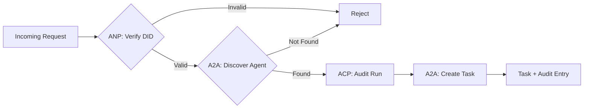

```typescript
class ProtocolGateway {
  private registry: AgentRegistry;
  private taskManager: TaskManager;
  private auditRunner: AuditableRunner;
  private identityRegistry: IdentityRegistry;

  constructor(registry: AgentRegistry, taskManager: TaskManager, auditRunner: AuditableRunner, identityRegistry: IdentityRegistry) {
    this.registry = registry; this.taskManager = taskManager; this.auditRunner = auditRunner; this.identityRegistry = identityRegistry;
  }

  async delegateTask(fromDid: string, signature: string, targetAgent: string, message: AgentMessage, sessionId?: string): Promise<{ task: Task; audit: AuditEntry } | { error: string }> {
    if (!this.identityRegistry.verify(fromDid, signature, message.id)) return { error: "Identity verification failed" };
    const card = this.registry.resolve(targetAgent);
    if (!card) return { error: `Agent ${targetAgent} not found in registry` };
    const audit = await this.auditRunner.run(targetAgent, [message], sessionId);
    const task = await this.taskManager.sendMessage(targetAgent, message);
    return { task, audit };
  }

  async discoverAndDelegate(fromDid: string, signature: string, skillTag: string, message: AgentMessage): Promise<{ task: Task; audit: AuditEntry } | { error: string }> {
    const candidates = this.registry.discoverBySkillTag(skillTag);
    if (candidates.length === 0) return { error: `No agents found with skill tag: ${skillTag}` };
    return this.delegateTask(fromDid, signature, candidates[0].name, message);
  }
}
```

### Step 7: Wire It All Together

```typescript
async function protocolDemo() {
  const registry = new AgentRegistry();
  registry.register({ name: "researcher", description: "Searches and summarizes findings", version: "1.0.0", url: "https://researcher.local/a2a/v1", capabilities: { streaming: true, pushNotifications: false }, defaultInputModes: ["text/plain"], defaultOutputModes: ["text/plain", "application/json"], skills: [{ id: "web-research", name: "Web Research", description: "Searches the web", tags: ["research", "search", "summarization"], inputModes: ["text/plain"], outputModes: ["application/json"] }] });
  registry.register({ name: "coder", description: "Writes code from specs", version: "1.0.0", url: "https://coder.local/a2a/v1", capabilities: { streaming: false, pushNotifications: false }, defaultInputModes: ["text/plain", "application/json"], defaultOutputModes: ["text/plain"], skills: [{ id: "code-gen", name: "Code Generation", description: "Generates code", tags: ["coding", "generation"], inputModes: ["text/plain", "application/json"], outputModes: ["text/plain"] }] });

  const taskManager = new TaskManager();
  const auditRunner = new AuditableRunner();
  const researchTrajectory: TrajectoryEntry[] = [];

  taskManager.registerHandler("researcher", async function* (task, message) {
    yield { kind: "statusUpdate" as const, taskId: task.id, status: { state: "working" as const, timestamp: Date.now() } };
    researchTrajectory.push({ reasoning: "Searching for React 19 documentation", toolName: "web_search", toolInput: { query: "React 19 compiler features" }, toolOutput: { results: ["react.dev/blog/react-19", "github.com/react/react"] }, timestamp: Date.now() });
    yield { kind: "artifactUpdate" as const, taskId: task.id, artifact: { id: crypto.randomUUID(), name: "research-results", parts: [{ kind: "data" as const, data: { findings: ["React 19 compiler auto-memoizes components"], sources: ["react.dev/blog/react-19"] }, mediaType: "application/json" }] }, append: false, lastChunk: true };
    yield { kind: "statusUpdate" as const, taskId: task.id, status: { state: "completed" as const, timestamp: Date.now() } };
  });

  auditRunner.registerAgent("researcher", async () => ({ output: [textMessage("agent", "React 19 compiler auto-memoizes components")], trajectory: researchTrajectory }));

  const identityRegistry = new IdentityRegistry();
  const coderIdentity = createIdentity("coder.local", "coder");
  const researcherIdentity = createIdentity("researcher.local", "researcher");
  identityRegistry.publish(coderIdentity.document);
  identityRegistry.publish(researcherIdentity.document);

  const gateway = new ProtocolGateway(registry, taskManager, auditRunner, identityRegistry);

  console.log("=== Protocol Demo ===\n");
  console.log("1. Agent Discovery (A2A)");
  const researchAgents = registry.discoverBySkillTag("research");
  console.log("   Found", researchAgents.length, "agent(s):", researchAgents.map((a) => a.name));

  console.log("\n2. Identity Verification (ANP)");
  const message = textMessage("user", "Research React 19 compiler features");
  const signature = signPayload(coderIdentity, message.id);
  const verified = identityRegistry.verify(coderIdentity.did, signature, message.id);
  console.log("   Coder DID:", coderIdentity.did);
  console.log("   Signature verified:", verified);

  console.log("\n3. Task Delegation (A2A + ACP + ANP)");
  const result = await gateway.delegateTask(coderIdentity.did, signature, "researcher", message, "session-001");
  if ("error" in result) { console.log("   Error:", result.error); return; }
  console.log("   Task ID:", result.task.id);
  console.log("   Task state:", result.task.status.state);

  console.log("\n4. Audit Trail (ACP)");
  console.log("   Run ID:", result.audit.runId);
  console.log("   Status:", result.audit.status);
  console.log("   Trajectory steps:", result.audit.trajectory.length);
  for (const step of result.audit.trajectory) {
    console.log("     -", step.reasoning);
    if (step.toolName) console.log("       Tool:", step.toolName);
  }
}

protocolDemo().catch((err) => { console.error("Protocol demo failed:", err); process.exitCode = 1; });
```

## What Goes Wrong

**Schema drift.** Agent A publishes an Agent Card advertising `application/json` output but the JSON schema changes between versions. Fix: version your skills and output schemas.

**State machine violations.** An agent handler yields a `completed` event then tries to yield more artifacts. Fix: check terminal state before yielding.

**Trust resolution failures.** Agent A tries to verify Agent B's DID but Agent B's domain is down. ANP recommends fail closed with the principle of least trust.

**Trajectory bloat.** ACP trajectory logging is powerful but expensive. A complex agent that makes 200 tool calls per run produces massive audit entries. Fix: log trajectory at configurable verbosity levels.

**Discovery thundering herd.** 50 agents all query `GET /agents` simultaneously on startup. Fix: cache Agent Cards with TTL.

## Picking the Right Protocol

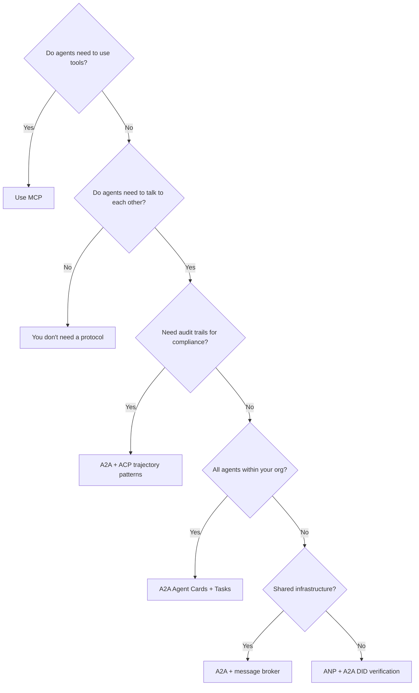

## Exercises

1. **Multi-hop task delegation.** Extend the `TaskManager` so an agent handler can delegate subtasks to other agents.
2. **Streaming audit trail.** Modify the `AuditableRunner` to support streaming mode using async generators.
3. **DID rotation.** Add key rotation to the `IdentityRegistry` with a grace period.
4. **Protocol negotiation.** Implement ANP's meta-protocol concept.
5. **Rate-limited discovery.** Add a `RateLimitedRegistry` wrapper that caches Agent Card lookups.

## Key Terms

| Term | What people say | What it actually means |
|------|----------------|----------------------|
| MCP | "The protocol for AI tools" | A client-server protocol for agents to discover and use tools. |
| A2A | "Google's agent protocol" | A peer-to-peer protocol for agent collaboration under the Linux Foundation. |
| ACP | "Enterprise agent messaging" | IBM/BeeAI's REST API for agent runs with TrajectoryMetadata. |
| ANP | "Decentralized agent identity" | A community protocol using `did:wba` for cryptographic identity. |
| Agent Card | "An agent's business card" | A JSON document at `/.well-known/agent-card.json`. |
| DID | "Decentralized ID" | W3C standard for cryptographically verifiable identities. |
| TrajectoryMetadata | "The audit receipt" | ACP's mechanism for attaching reasoning steps and tool calls. |
| Meta-protocol | "Agents negotiating how to talk" | ANP's approach where agents use natural language to agree on formats. |

## Further Reading

- [Google A2A specification](https://github.com/google/A2A)
- [IBM/BeeAI ACP specification](https://github.com/i-am-bee/acp)
- [Agent Network Protocol](https://github.com/agent-network-protocol/AgentNetworkProtocol)
- [Model Context Protocol docs](https://modelcontextprotocol.io/)
- [W3C Decentralized Identifiers](https://www.w3.org/TR/did-core/)
- [RFC 9180 (HPKE)](https://www.rfc-editor.org/rfc/rfc9180)

[Reference](https://github.com/rohitg00/ai-engineering-from-scratch/tree/main/phases/16-multi-agent-and-swarms/03-communication-protocols)
