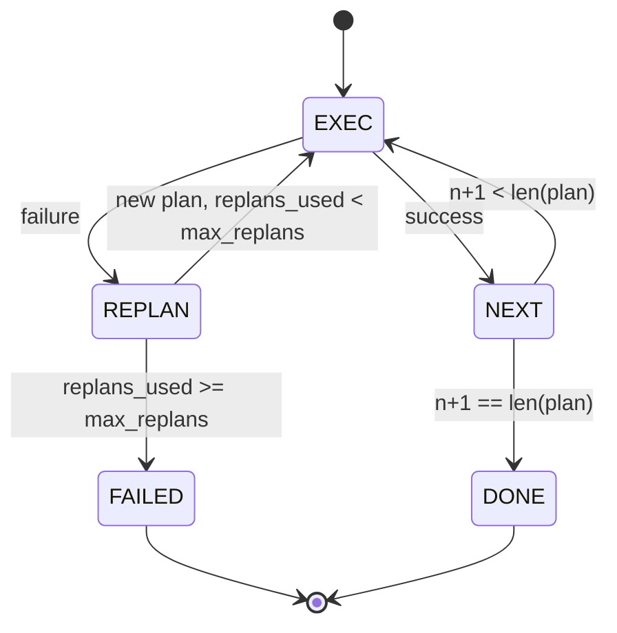

# Plan-Execute Control Flow

> A plan that cannot survive a failure is a script. A script that can replan is an agent. Build the replanner first.

**Type:** Build
**Languages:** Python
**Prerequisites:** Phase 13 lessons 01-07, Phase 14 lesson 01
**Time:** ~90 minutes

## Learning Objectives

- Represent a plan as an ordered list of typed steps so the executor can reason about progress and outcome.
- Execute steps sequentially with a controlled failure handoff back to the planner.
- Replan from the current cursor with the prior error in the context so the next plan is informed.
- Emit a plan diff on each revision so a downstream tracer or UI can show why the plan changed.
- Enforce two budgets: a hard step ceiling and a hard replan ceiling.

## Plan and execute, not chain-of-thought

A chain-of-thought agent emits tokens and lets the loop guess where the tool call ends. A plan-and-execute agent emits a structured plan first, then executes each step deterministically. The plan is data the harness can introspect. The execution is the harness running that data through a dispatcher.

Two pieces: a planner that produces a plan and an executor that runs the plan. Three options when the executor hits a failure:

```text
1. Abort         (return failed, surface the error)
2. Skip          (mark step failed, continue with the rest)
3. Replan        (hand the error to the planner, get a new plan from the cursor)
```

Replan is the one that turns a script into an agent.

## The Step shape

```text
Step
  id              : int           (monotonic within a plan revision)
  tool_name       : str
  args            : dict
  expected_outcome: str           (planner's stated success condition)
  result          : Any | None
  error           : str | None
```

`expected_outcome` is a short sentence the planner emits alongside the step. It is not enforced by the executor. It is for the replanner and the event stream.

## The executor

The executor is a small state machine. Each step runs through the dispatcher. The outcome is success, failure-replannable, or failure-fatal.



## Plan diffs on revision

When the planner returns a new plan after a failure, the executor emits a `plan.diff` event:

```text
removed: list of step ids that were in the old plan and are not in the new
added  : list of step ids in the new plan that were not in the old
revised: list of step ids whose tool_name or args changed
```

## Two budgets, both hard

`max_steps` caps total step executions across the whole session, including replans. Default is twelve. `max_replans` caps the number of times the planner is called after the first plan. Default is five. A planner that returns the same broken plan five times in a row would otherwise loop until the step budget catches it.

## Result shape

```text
SessionResult
  status      : "completed" | "failed"
  reason      : str     ("goal_met" | "step_budget" | "replan_budget" | "no_plan")
  history     : list[Step]
  revisions   : list[PlanDiff]
  events      : list[Event]
```

## How to read the code

`code/main.py` defines `PlanExecuteAgent`, `Step`, `PlanDiff`, `SessionResult`, and the deterministic planner. The executor is a single `run(goal)` method that returns a `SessionResult`.

## Going further

Two extensions: partial-plan caching (you do not want to re-run the first three of six steps when they already succeeded) and parallel branches (a planner that emits `gather_step` instead of `next_step`).

[Reference](https://github.com/rohitg00/ai-engineering-from-scratch/tree/main/phases/19-capstone-projects/24-plan-execute-control-flow)
