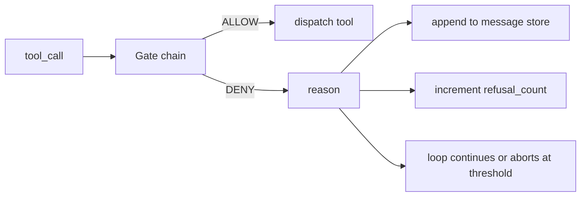
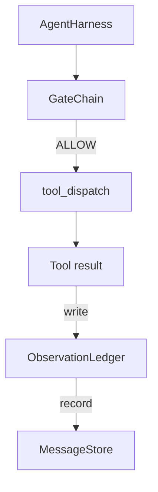

# Verification Gates and the Observation Budget

> An agent harness without a verification layer is a wish in a trenchcoat. This lesson builds the deterministic gate chain that decides whether a tool call is allowed to fire, how much of its output the agent is allowed to see, and when the loop has to stop because the agent has read too much.

**Type:** Build
**Languages:** Python (stdlib)
**Prerequisites:** Phase 19 · 20-24, Phase 14 · 33, Phase 14 · 36, Phase 14 · 38
**Time:** ~90 minutes

## Learning Objectives

- Build a `VerificationGate` protocol with a deterministic `evaluate(call)` method.
- Compose budget, recency, whitelist, and regex gates into a chain with short-circuit semantics.
- Track every observation through an `ObservationLedger` keyed by tool and turn.
- Refuse a tool call when the cumulative observation budget would be exceeded.
- Surface a structured `GateDecision` record that downstream observability can ingest.

## The Problem

When an agent harness lets the model call tools freely, three classes of bug appear: unbounded observation (a grep across 200K lines dumps half a million tokens), stale recency (the model rereads old observations as if they were live), and privilege creep (the model invents a tool name and the harness defaults to permissive).

A verification gate is the harness component that says no. It is a deterministic function of `(call, history, ledger)` that returns either ALLOW or DENY with a reason.

## The Concept

Four gates: `WhitelistGate` (allowed tool names), `RegexGate` (tool arguments matched against a regex), `RecencyGate` (only last N turns visible), `BudgetGate` (cumulative tokens ceiling).

## Architecture

## How to read the code

The implementation is a single `main.py` plus tests. `Observation` and `ToolCall` dataclasses define the wire shapes. `ObservationLedger` records `(turn, tool, tokens)` rows. `GateDecision` carries `(allow, reason, gate_name)`. `VerificationGate` is the protocol. `GateChain` wraps an ordered list.

## How this composes with Track A

Previous lessons gave the loop, tool registry, message store, prompt builder, and model router. This lesson adds the layer between the model and the tools. Lesson 26 ships the sandbox. Lesson 27 ships the eval harness. Lesson 28 wires gate decisions into OpenTelemetry spans. Lesson 29 stitches everything into a working coding agent.

[Reference](https://github.com/rohitg00/ai-engineering-from-scratch/tree/main/phases/19-capstone-projects/25-verification-gates-observation-budget)
