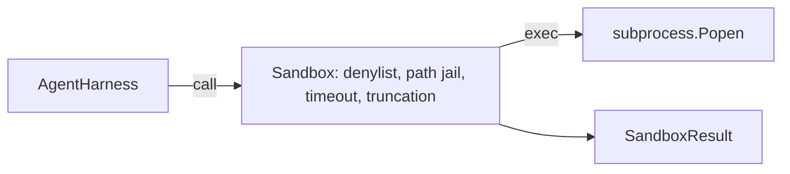

# Sandbox Runner with Denylist and Path Jail

> The verification gate decides whether a tool call should run. The sandbox decides what happens when it does. This lesson ships a subprocess runner that refuses dangerous executables, refuses dangerous argv shapes, jails every file path to a project root, truncates oversized output, and kills runaway processes on a wall-clock timeout.

**Type:** Build
**Languages:** Python (stdlib)
**Prerequisites:** Phase 19 · 25, Phase 14 · 33, Phase 14 · 38
**Time:** ~90 minutes

## Learning Objectives

- Build a `Sandbox` class wrapping `subprocess.run` with timeout, capture, and truncation.
- Refuse a command by name against a denylist and by structure against an argv inspector.
- Refuse any path argument that resolves outside a declared project root.
- Refuse shell metacharacters when shell mode is off.
- Return a structured `SandboxResult` that downstream observability and the eval harness can ingest.

## The Problem

Three classes of failure recur in agent traces. Dangerous executables (`sudo`, `chmod -R 777`, `rm -rf`). Argv tricks (`python3 -c "import os; os.system('rm -rf /')"`). Path escape (`../../etc/passwd`).

The sandbox is a development-time guardrail: it makes common failure modes loud and stops the agent from doing damage out of sheer ineptitude.

## The Concept

```mermaid
flowchart TD
    Call[ToolCall] --> Run[Sandbox.run()]
    Run --> S1[1. resolve executable against denylist]
    S1 --> S2[2. inspect argv: interpreter -c, shell metachars]
    S2 --> S3[3. resolve path-like arguments against project_root]
    S3 --> S4[4. spawn subprocess with timeout]
    S4 --> S5[5. truncate stdout/stderr]
    S5 --> Result[SandboxResult]
```

## Architecture



The denylist is a frozenset of executable basenames. The argv inspector knows the interpreter shape. The path jail normalizes through `os.path.realpath` then checks against the project root. Symlink escape attempts are blocked by checking realpath, not the literal path.

## What you will build

`SandboxResult` dataclass, `SandboxConfig` dataclass, `Sandbox` class with `run(argv, *, shell=False, cwd=None)`, refusal helpers (`_check_executable_denylist`, `_check_argv_interpreter`, `_check_shell_metachars`, `_check_path_jail`), output truncation with a `truncated` flag, and a demo.

## Why this is not a real sandbox

This sandbox does not use namespaces, cgroups, seccomp, gVisor, or Firecracker. For production agents you layer on top: run inside an unprivileged Docker container, drop capabilities, mount the project root read-only, scrub the environment.

[Reference](https://github.com/rohitg00/ai-engineering-from-scratch/tree/main/phases/19-capstone-projects/26-sandbox-runner-denylist)
