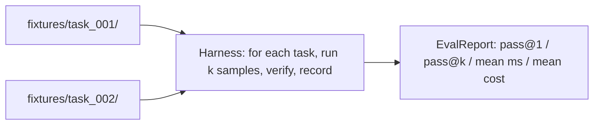
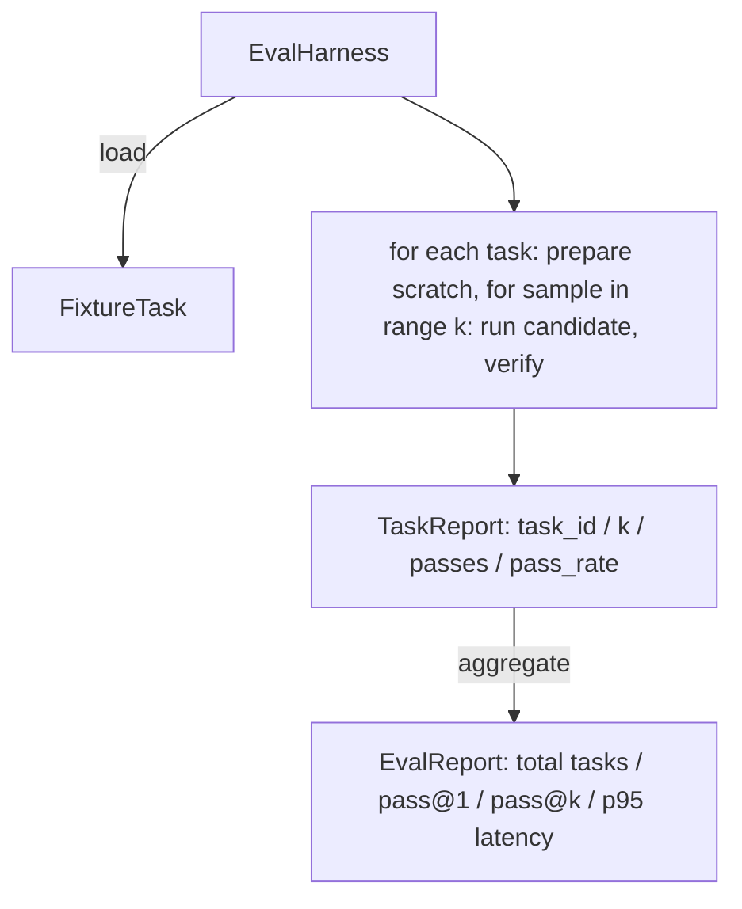

# Eval Harness with Fixture Tasks

> A coding agent is only as good as the suite of tasks you measure it against. This lesson builds an evaluation harness that takes a folder of fixture tasks, runs each through a candidate agent, scores pass or fail through a deterministic verifier, and aggregates the results into pass@1, pass@k, mean latency, and mean cost.

**Type:** Build
**Languages:** Python (stdlib)
**Prerequisites:** Phase 19 · 25, Phase 19 · 26, Phase 14 · 30, Phase 14 · 19
**Time:** ~90 minutes

## Learning Objectives

- Define a fixture task as a triple of goal, setup, and verifier.
- Score multiple sample runs per task and compute pass@1 and pass@k.
- Aggregate latency and cost into mean and 95th-percentile metrics.
- Wire deterministic verifiers (file diff, exit code, regex match) into reusable functions.
- Emit a structured JSON report a regression-tracking script can ingest.

## The Problem

Three failure modes plague agent benchmarks: unverified pass (agent claims it fixed the bug but didn't), undetected regression (a prompt change makes the agent 14% worse on a quiet task), and per-task drift (fixtures are renamed and the pass rate looks like a 5% improvement).

## The Concept

Three verifier shapes: `file_equals` (compare file content), `regex_match` (match file against regex), `shell_exit_zero` (shell command exits zero).

## Architecture

## What you will build

`FixtureTask`, `SampleResult`, `TaskReport`, `EvalReport` dataclasses. `VerifierRegistry` with built-in verifiers. `EvalHarness` class. Five fixture tasks bundled in `tasks/`. A deterministic reference candidate.

## Why pass@k and not just pass@1

Real LLM agents are stochastic. A pass@1 of 0.6 looks like a failure. A pass@5 of 0.95 says the agent gets the right answer most of the time but is choosing wrong on early samples.

[Reference](https://github.com/rohitg00/ai-engineering-from-scratch/tree/main/phases/19-capstone-projects/27-eval-harness-fixture-tasks)
