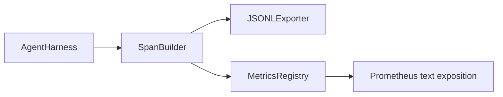

# Observability with OTel GenAI Spans and Prometheus Metrics

> An agent harness without observability is a black box that costs money. This lesson hand-rolls a span builder that emits records compliant with the OpenTelemetry GenAI semantic conventions, writes them to a JSON-Lines file, and exposes counters and histograms in Prometheus text format.

**Type:** Build
**Languages:** Python (stdlib)
**Prerequisites:** Phase 19 · 25, Phase 19 · 26, Phase 19 · 27, Phase 13 · 20, Phase 14 · 23
**Time:** ~90 minutes

## Learning Objectives

- Build a span data class shaped to the OpenTelemetry GenAI semantic conventions.
- Implement a JSONL exporter that writes one self-contained span per line.
- Build counters and histograms with labels and Prometheus text-format exposition.
- Wrap any callable in a span context manager that records duration, status, and exceptions.
- Verify that the emitted spans roundtrip through `json.loads` and match the spec shape.

## The Problem

A coding agent in production produces three classes of artifact every turn: a model call, a tool execution, and a verification gate decision. None are useful without structured telemetry. The GenAI semantic conventions define a small set of standard attributes that span emitters across LLM frameworks share.

## The Concept

```mermaid
flowchart TD
    Call[tool / model / gate] --> Span[SpanBuilder.span() context manager]
    Span --> GenAI[GenAISpan: trace_id, span_id, name, gen_ai attributes]
    GenAI --> Writer[JSONLWriter -> traces.jsonl]
    GenAI --> Metrics[MetricsRegistry -> /metrics text/]
```

## Architecture



## What you will build

`GenAISpan` dataclass (trace_id, span_id, parent_span_id, name, attributes, timing, status). `SpanBuilder` with `span(name, attrs)` context manager. `JSONLExporter` with `export(span)`. `Counter` and `Histogram` classes plus `MetricsRegistry`. `prometheus_exposition(registry)` producing text-format output. `wrap_tool_call(name)` decorator.

## Why hand-rolled instead of opentelemetry-sdk

The OTel Python SDK is a real dependency. The hand-rolled version teaches the wire format. In production you wire the same attributes into the real SDK and get the full OTLP exporter.

[Reference](https://github.com/rohitg00/ai-engineering-from-scratch/tree/main/phases/19-capstone-projects/28-observability-otel-traces)
