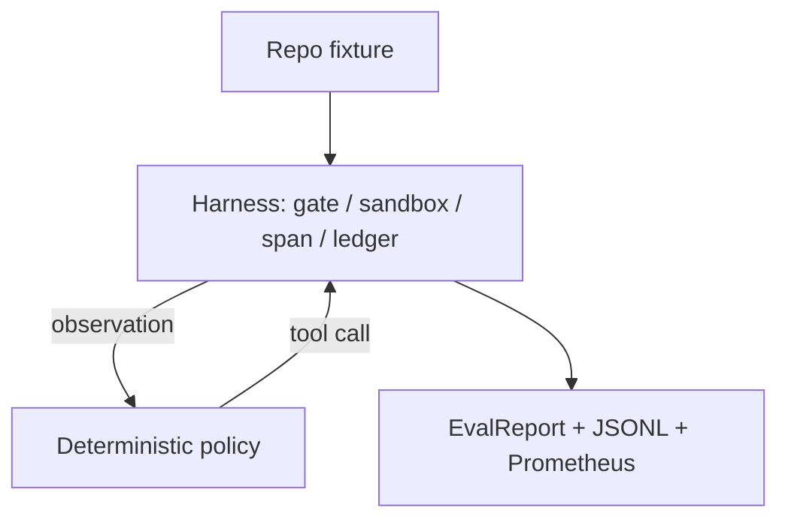
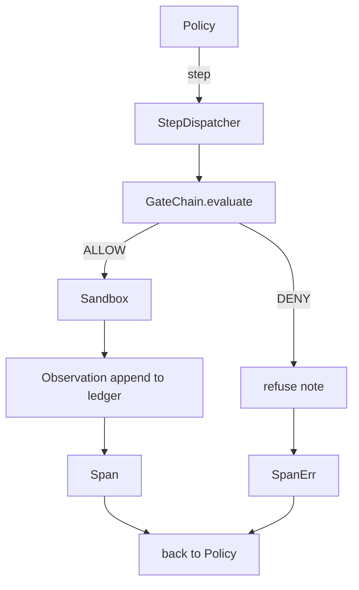

# End-to-End Coding Agent on the Harness

> Track A's payoff. This lesson stitches the gate chain, the sandbox, the eval harness, and the OTel spans into one working coding agent that fixes a real (small, fixture-scale) bug in a multi-file Python project.

**Type:** Build
**Languages:** Python (stdlib)
**Prerequisites:** Phase 19 · 25, Phase 19 · 26, Phase 19 · 27, Phase 19 · 28
**Time:** ~90 minutes

## Learning Objectives

- Compose the gate chain, sandbox, eval harness, and span builder into a single agent loop.
- Implement a deterministic policy that uses read_file, run_tests, and write_file to fix a fixture bug.
- Enforce a global step budget plus an observation token budget across an end-to-end run.
- Emit complete OTel GenAI traces and Prometheus metrics for the full run.
- Verify the agent solves the fixture in fewer than 12 steps with zero gate trips on legal tools.

## The Problem

Most agent demos work in isolation. Compose them and the seams show. The gate chain says ALLOW but the sandbox refuses for a reason the chain did not anticipate. The eval harness records a pass but the OTel spans say the gate refused a tool. This lesson is the integration test for the whole track.

## The Concept

Five states: SURVEY, RUN_TESTS, INSPECT, FIX, VERIFY.

## What you will build

Minimal harness primitives (GateChain, Sandbox, ObservationLedger, SpanBuilder, MetricsRegistry). `CodingAgentPolicy` with five-state state machine. `Repo` helper. `AgentRun` class. A bundled fixture with a buggy Python file and tests.

## Why the policy is not an LLM

A real LLM requires an API key, a network call, and unverifiable stochasticity. Subbing in a deterministic policy lets the lesson run on any developer laptop with zero external dependencies.

## What the demo asserts

Policy solved the fixture in fewer than 12 steps. Observation budget never exceeded. Zero gate denials on legal tools. Every step has a corresponding span. Prometheus exposition contains `tools_called_total` and `tool_latency_ms`.

[Reference](https://github.com/rohitg00/ai-engineering-from-scratch/tree/main/phases/19-capstone-projects/29-end-to-end-coding-task-demo)
