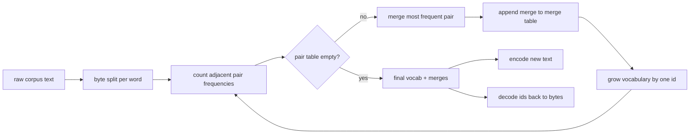

# BPE Tokenizer From Scratch

> Bytes in, ids out, ids back to the same bytes. Build the tokenizer that every modern text model still starts from.

**Type:** Build
**Languages:** Python
**Prerequisites:** Phase 04 lessons, Phase 07 transformer lessons
**Time:** ~90 minutes

## Learning Objectives

- Train a Byte-Pair Encoding vocabulary from a raw text corpus by repeatedly merging the most frequent adjacent symbol pair.
- Implement a deterministic merge table and apply it to fresh text to produce a stream of subword ids.
- Round-trip arbitrary UTF-8 input to ids and back without information loss.
- Reserve and protect special tokens (`<|endoftext|>`, `<|pad|>`) so they survive training and decoding.
- Reason about why a byte-level alphabet is the right floor for a general-purpose tokenizer.

## The frame

A language model never sees text. It sees integers. The dominant family of subword tokenizers is Byte-Pair Encoding. Start from a known alphabet. Find the adjacent symbol pair that appears most often. Merge it into a new symbol. Repeat until the vocabulary reaches the target size.

We build the byte-level variant. The alphabet is the 256 raw bytes, not Unicode code points.

## The pipeline

## The byte alphabet

The first 256 ids are reserved for raw bytes 0x00 through 0xFF. After the byte block we reserve a small range for special tokens. The pretokenizer splits the corpus on whitespace and punctuation boundaries before training.

## Encoding fresh text

Inference applies the merge table in the same order it was learned. For a fresh word the encoder starts from the byte split, scans for the lowest-ranked merge that applies, performs it, and repeats until no merge applies.

## Round-trip guarantee

Encoding then decoding must return the input bytes exactly. The decoder concatenates the byte expansion of every id in order. Since every id is either a raw byte or the concatenation of two previously known ids, the recursive expansion always terminates in raw bytes.

## How to read the code

`main.py` defines `BPETokenizer` (vocabulary, merge table, special-token table), `train` (training loop), `encode` (inference), and `decode` (byte concatenation).

[Reference](https://github.com/rohitg00/ai-engineering-from-scratch/tree/main/phases/19-capstone-projects/30-bpe-tokenizer-from-scratch)
