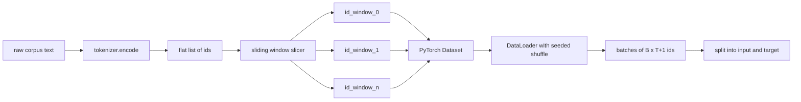
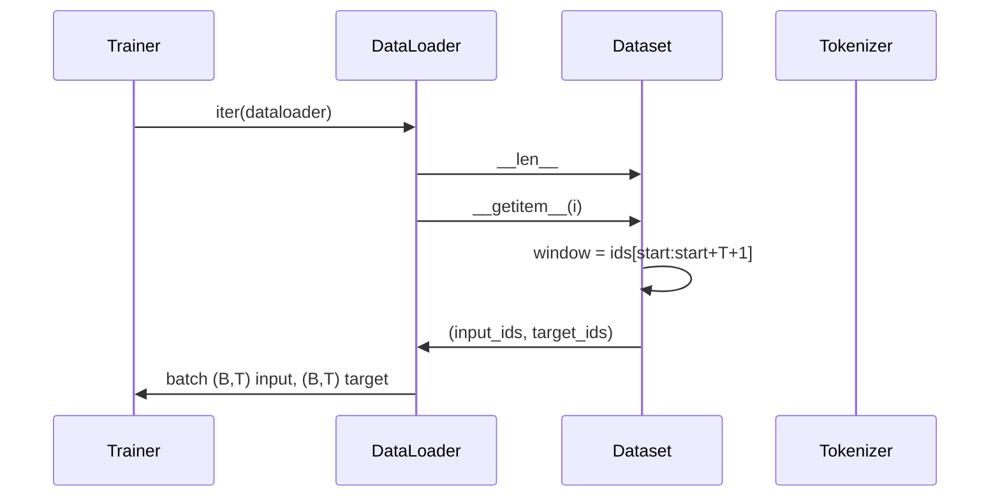

# Tokenized Dataset with Sliding Window

> A pretraining run is a function from token ids to gradients. This lesson builds the conveyor that feeds the ids in.

**Type:** Build
**Languages:** Python
**Prerequisites:** Phase 04 lessons, Phase 07 transformer lessons, Lesson 30 of this phase
**Time:** ~90 minutes

## Learning Objectives

- Convert a raw corpus into a stream of token ids by calling the tokenizer once.
- Slice the id stream into fixed-length windows with a configurable overlap stride.
- Build a PyTorch Dataset that returns input and target tensors for next-token prediction.
- Wrap the dataset in a DataLoader with a deterministic shuffle seeded per epoch.
- Reason about the trade-off between stride, redundancy, and effective dataset size.

## The frame

A pretraining run reads one batch of token ids at a time and updates the model. For a causal language model, the batch holds `(B, T)` input ids and `(B, T)` target ids where the target is the input shifted left by one.

The tokenizer from the previous lesson turns text into a long flat list of ids. A sliding window slices that list into training examples.

## The shape contract

A causal LM consumes ids of shape `(B, T)`. The target at position `t` is the input at position `t+1`. Every training example covers `T+1` raw ids.

## Why a sliding window

A stride of `T` produces non-overlapping windows. A stride of `T // 2` produces fifty-percent overlap and doubles the effective dataset. A stride of `1` produces maximum overlap.

## The Dataset class

## Counting examples

For an id stream of length `N`, context length `T`, and stride `S`: `max(0, 1 + (N - (T + 1)) // S)`.

## How to read the code

`main.py` defines `SlidingWindowDataset` (PyTorch Dataset), `make_dataloader` (configured DataLoader), and `_encode_corpus_to_ids` (one-shot tokenizer call).

[Reference](https://github.com/rohitg00/ai-engineering-from-scratch/tree/main/phases/19-capstone-projects/31-tokenized-dataset-sliding-window)
