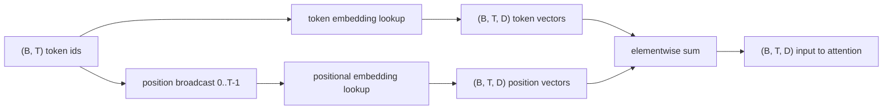

# Token and Positional Embeddings

> Ids are integers. The model wants vectors. Two lookup tables sit between them, and the choice of the positional one shapes what the model can learn.

**Type:** Build
**Languages:** Python
**Prerequisites:** Phase 04 lessons, Phase 07 transformer lessons, Lessons 30 and 31 of this phase
**Time:** ~90 minutes

## Learning Objectives

- Build a token-embedding lookup table that maps vocabulary ids to dense vectors.
- Build a learned positional-embedding lookup table indexed by position.
- Build a fixed sinusoidal positional embedding indexed by position with no parameters.
- Compose token and positional embeddings into a single input for a transformer block.
- Contrast learned and sinusoidal embeddings on length generalization and parameter count.

## The frame

The model's first contact with a token id is a row lookup in the token-embedding matrix. The matrix has one row per vocabulary id and one column per model dimension.

Token ids alone have no order. The two dominant choices for positional signal are a learned positional embedding (a second lookup table) and a fixed sinusoidal positional embedding (a math formula with no parameters).

## The shape contract

Input: `(B, T)` token ids. Output: `(B, T, D)` where `D` is the model dimension.



The composition is a sum, not a concatenation.

## The learned positional embedding

`nn.Embedding(max_context_length, D)`. The downside: it cannot be queried at position `T` if the model was only trained up to position `T-1`.

## The sinusoidal positional embedding

Position `p` and feature `i`:

```python
angle = p / (10000 ** (2 * (i // 2) / D))
emb[p, 2k]     = sin(angle)
emb[p, 2k + 1] = cos(angle)
```

No parameters. The vector at position `p + k` is a linear function of the vector at position `p`, giving the attention layer an easy path to learning relative-position offsets.

## Contrastive analysis

The learned variant adds `max_context_length * D` parameters. The sinusoidal variant adds zero. The sinusoidal variant has smooth and predictable cosine similarity decay.

## How to read the code

`main.py` defines `TokenEmbedding`, `LearnedPositionalEmbedding`, `SinusoidalPositionalEmbedding`, and `EmbeddingComposer`.

[Reference](https://github.com/rohitg00/ai-engineering-from-scratch/tree/main/phases/19-capstone-projects/32-token-positional-embeddings)
