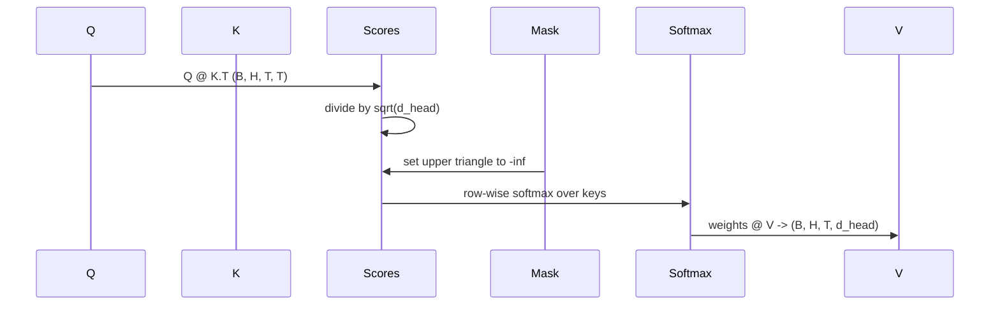

# Multi-Head Self-Attention

> One linear projection, three views, H parallel heads, one mask. The attention block as the model actually uses it.

**Type:** Build
**Languages:** Python
**Prerequisites:** Phase 04 lessons, Phase 07 transformer lessons, Lessons 30 through 32 of this phase
**Time:** ~90 minutes

## Learning Objectives

- Implement a batched Query/Key/Value projection as a single linear layer split into H heads.
- Compute scaled dot-product attention with the correct normalization and dtype handling.
- Apply a causal mask that prevents a position from attending to future positions.
- Inspect per-head attention weights for a fixed input and reason about what each head looks at.
- Train a small attention block on a toy task and watch the loss fall as the heads specialize.

## The frame

Attention lets a token's representation pull information from other tokens. Self-attention means Q, K, V are derived from the same input. Multi-head means the projection is split into H parallel attention problems whose outputs are concatenated and projected back.

The efficient implementation: one linear layer projects from `D` to `3 * D`, gets sliced into three views, reshaped into H heads of size `D // H` each.

## The shape contract

Input: `(B, T, D)`. Output: `(B, T, D)`. Mask: `(T, T)`. Intermediate: `(B, H, T, d_head)` where `d_head = D // H`. Constraint: `D % H == 0`.

```mermaid
flowchart LR
    A["(B, T, D) input"] --> B[Linear D -> 3D]
    B --> C["split into Q, K, V"]
    C --> D["reshape to (B, H, T, d_head)"]
    D --> E["scores = Q @ K.T / sqrt(d_head)"]
    E --> F[apply causal mask]
    F --> G[softmax over keys]
    G --> H["context = weights @ V"]
    H --> I["reshape to (B, T, D)"]
    I --> J[output Linear D -> D]
    J --> K["(B, T, D) output"]
```

## The causal mask

A decoder-only language model can only condition on the past. The mask enforces that: every entry above the diagonal of the `(T, T)` score matrix gets negative infinity. After softmax those positions get weight zero.

## Attention weight inspection

The block exposes a `return_weights=True` flag. The demo prints a heatmap of one head's weights to show the causal-triangle structure.

## How to read the code

`main.py` defines `MultiHeadSelfAttention` with two linear layers and a registered mask buffer. The demo builds a small model wrapping the attention with embeddings and an LM head, trains it on a copy task, and prints a loss curve and per-head attention heatmap.

[Reference](https://github.com/rohitg00/ai-engineering-from-scratch/tree/main/phases/19-capstone-projects/33-multihead-self-attention)
