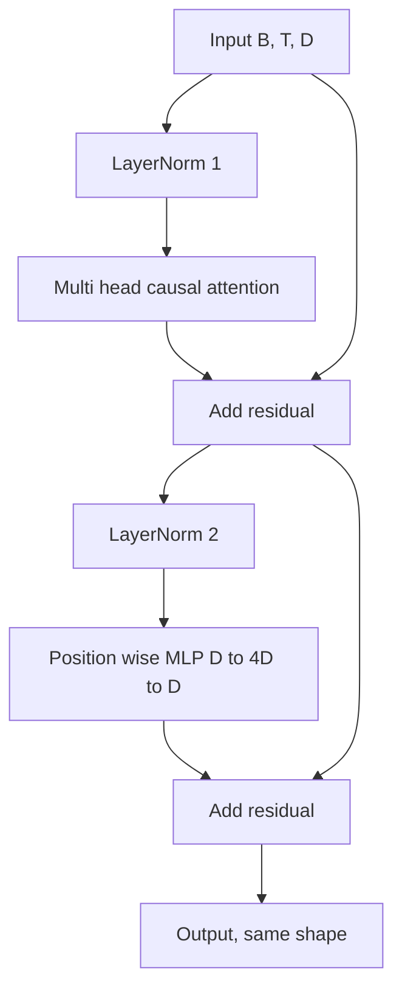
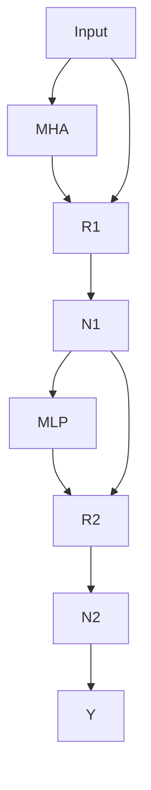

# Transformer Block from Scratch

> One block is the unit of every modern decoder LLM. Layer norm, multi head attention, residual, MLP, residual. The pre-LN variant trains stably without warmup. The post-LN variant is what the original paper shipped. This lesson builds both, side by side, and shows which one survives a 12 layer stack at common learning rates.

**Type:** Build
**Languages:** Python
**Prerequisites:** Phase 19 lessons 30 to 33
**Time:** ~90 minutes

## Learning Objectives

- Build a transformer block in PyTorch from the four moving pieces: LayerNorm, multi head causal attention, residual connections, position wise MLP.
- Place the LayerNorms in two configurations (pre-LN and post-LN) and explain why one trains stably without warmup.
- Implement causal masking inside the multi head attention so token `i` cannot see tokens `j > i`.
- Track gradient flow through both variants on a 12 layer stack and read the result.
- Reuse the block as a drop-in unit when the next lesson assembles a 124M GPT.

## The Problem

A transformer is one block repeated. Get the block wrong once, repeat it twelve times, and you ship a model that diverges in the first epoch. Two failure modes: the attention layer attending to the future, and the LayerNorm placed where it cannot tame the residual signal at depth.

## The Concept

Pre-LN variant — LayerNorm inside the residual branch, before each sublayer:

Post-LN variant — LayerNorm after the residual add:

Pre-LN leaves the residual path unnormalized, so gradients propagate cleanly to the embedding layer. Pre-LN is the configuration GPT-2 onward ships with.

## Build It

`code/main.py` implements `LayerNorm`, `MultiHeadAttention`, `FeedForward`, and `TransformerBlock` with a `pre_ln` flag. The demo builds a 6 layer pre-LN stack and a 6 layer post-LN stack with identical inputs and prints output shape and gradient norm at the embedding after one backward pass.

## Key Terms

| Term | What people say | What it actually means |
|------|-----------------|------------------------|
| Pre-LN | "Pre norm" | LayerNorm inside the residual branch, before each sublayer |
| Post-LN | "Post norm" | LayerNorm after the residual add; needs warmup |
| Causal mask | "Triangle mask" | Upper triangle of attention logits set to -inf |
| Fused QKV | "Combined projection" | One linear of width 3D instead of three |
| Residual stream | "Skip connection" | Unnormalized tensor flowing top to bottom |

[Reference](https://github.com/rohitg00/ai-engineering-from-scratch/tree/main/phases/19-capstone-projects/34-transformer-block)
