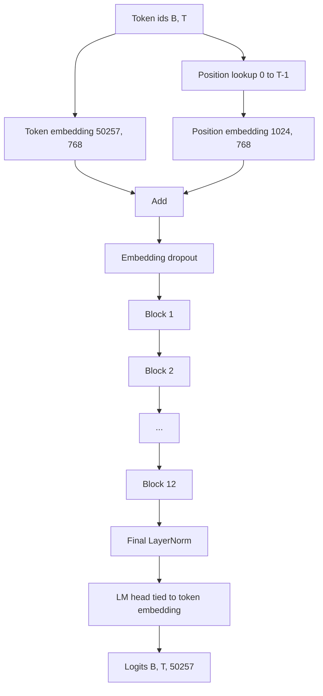
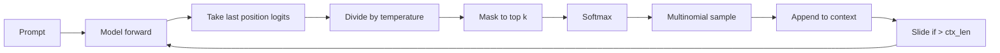

# GPT Model Assembly

> Twelve blocks stacked, a token embedding, a learned position embedding, a final LayerNorm, and a tied language model head. That is the entire 124 million parameter GPT model.

**Type:** Build
**Languages:** Python
**Prerequisites:** Phase 19 lessons 30 to 34
**Time:** ~90 minutes

## Learning Objectives

- Assemble the transformer block into a full GPT model: token embedding, position embedding, N blocks, final LayerNorm, language model head.
- Reproduce the 124 million parameter configuration: vocab 50257, context 1024, embedding 768, twelve heads, twelve layers.
- Tie the language model head weights to the token embedding and explain why that saves ~38M parameters.
- Generate text with multinomial sampling, temperature scaling, and top-k truncation.
- Measure parameter count and forward pass cost against the 124M target.

## The Concept

### Weight tying

The token embedding has shape `(vocab, d_model)`. The LM head projects from `d_model` to `vocab`. Tying means the same parameter tensor is used twice, saving ~38M parameters.

### Generation loop

## Build It

`code/main.py` implements `GPTConfig`, `GPTModel`, `count_parameters`, and `generate`. The demo builds the model, prints the parameter count next to the 124M reference, and generates a short sequence.

## Key Terms

| Term | What people say | What it actually means |
|------|-----------------|------------------------|
| Weight tying | "Tied embeddings" | LM head and token embedding share the same parameter tensor |
| Position embedding | "Learned positions" | Separate table of shape (context length, d_model) |
| Sliding window | "Context cap" | Drop oldest tokens when prompt + generated exceeds context length |
| Top-k sampling | "K truncation" | Keep K highest logits, mask rest to -inf |
| Temperature | "Sampling temperature" | Divide logits by T before softmax |

[Reference](https://github.com/rohitg00/ai-engineering-from-scratch/tree/main/phases/19-capstone-projects/35-gpt-model-assembly)
