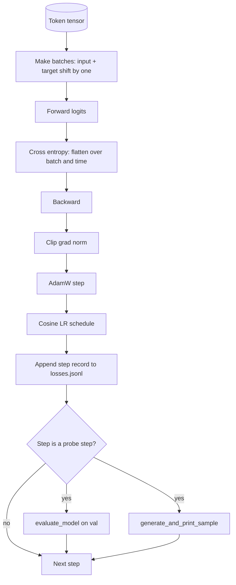

# Training Loop and Evaluation

> A loop that does not measure is a loop that lies. This lesson builds the training loop that drives the GPT model: AdamW with weight decay split, a warmup plus cosine LR schedule, held out evaluation, qualitative sample generation, and a JSONL log.

**Type:** Build
**Languages:** Python
**Prerequisites:** Phase 19 lessons 30 to 35
**Time:** ~90 minutes

## Learning Objectives

- Build a training loop that computes cross entropy loss for next token prediction.
- Configure AdamW with weight decay applied to weight tensors and not to LayerNorm or bias tensors.
- Implement a learning rate schedule with linear warmup and cosine decay.
- Evaluate on a held out split with `evaluate_model`.
- Generate a qualitative sample every K steps.
- Persist per step loss to JSONL.

## The Concept

### Loss alignment

Input `[t0, t1, t2, t3]` → target `[t1, t2, t3, t4]`. Cross entropy on flat shape `(batch * seq, vocab)` against flat target `(batch * seq,)`.

### AdamW decay split

Matrix-shaped tensors (linear weights, embedding tables) get decay. Scale/shift tensors do not.

### Warmup plus cosine

Warmup ramps LR from zero to target over a few hundred steps. Cosine decay drops LR toward zero over remaining steps.

## Build It

`code/main.py` implements `make_batches`, `calc_loss_batch`, `evaluate_model`, `generate_and_print_sample`, `build_param_groups`, `cosine_with_warmup`, and `train`. The demo trains a tiny model on synthetic data, writes JSONL, and prints eval loss and samples at probe points.

## Key Terms

| Term | What people say | What it actually means |
|------|-----------------|------------------------|
| Loss alignment | "Shift by one" | Input positions 0..T-1, target positions 1..T |
| Decay split | "Two groups" | AdamW: matrix tensors with decay, scale/bias without |
| Warmup | "Ramp" | LR climbs from zero to target over fixed steps |
| Qualitative probe | "Sample print" | Short generation from fixed prompt every K steps |

[Reference](https://github.com/rohitg00/ai-engineering-from-scratch/tree/main/phases/19-capstone-projects/36-training-loop-eval)
