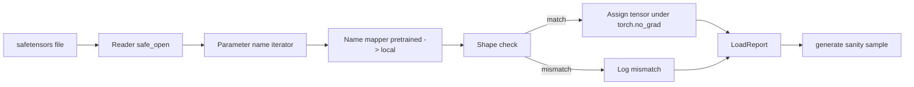

# Loading Pretrained Weights

> Training a 124M parameter model from scratch is a budget decision; loading a published checkpoint is a Tuesday. This lesson loads pretrained GPT-2 style weights from a safetensors file into the exact architecture from lesson 35, walks the parameter name mapping, and sanity generates a continuation to prove the load worked.

**Type:** Build
**Languages:** Python
**Prerequisites:** Phase 19 lessons 30 to 36
**Time:** ~90 minutes

## Learning Objectives

- Read a safetensors file with the `safetensors` Python library.
- Map each pretrained parameter name onto a parameter inside the lesson 35 GPT model.
- Handle name conventions that differ between published GPT-2 weights and the local model.
- Detect and refuse a shape mismatch before any weight assignment.
- Generate a continuation with loaded weights and confirm the tokens come from the loaded distribution.

## The Problem

Published weights carry the names the original implementation used. `transformer.h.0.attn.c_attn.weight` of shape `(2304, 768)` vs `blocks.0.attn.qkv.weight`. The same parameter with three subtly different identities (name, shape, byte layout).

## The Concept

The `c_attn`/`c_proj`/`c_fc` linears are stored with the matrix transposed relative to `nn.Linear.weight`. The loader transposes during assignment.

## Build It

`code/main.py` implements a small replica of `GPTModel`, a `NAME_MAP` dictionary, `load_safetensors` returning a `LoadReport`, `make_stub_safetensors`, and a demo that shows pre-load and post-load continuations.

## Key Terms

| Term | What people say | What it actually means |
|------|-----------------|------------------------|
| Name map | "Key remapping" | Function from pretrained tensor names to local parameter names |
| Shape mismatch | "Bad shape" | Tensor exists under mapped name but dimensions disagree |
| Transpose-on-load | "Conv1d layout" | Published GPT-2 stores projections transposed |
| Weight tying alias | "Shared LM head" | `model.lm_head.weight = model.tok_embed.weight` |
| Load report | "Coverage summary" | Tracks loaded, missing, unexpected, shape_mismatch lists |

[Reference](https://github.com/rohitg00/ai-engineering-from-scratch/tree/main/phases/19-capstone-projects/37-loading-pretrained-weights)
