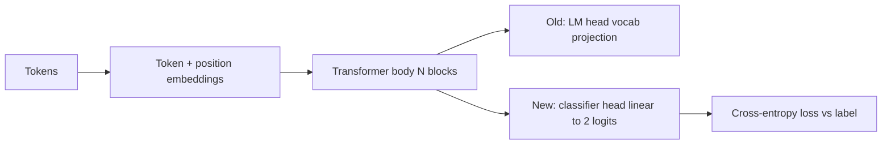
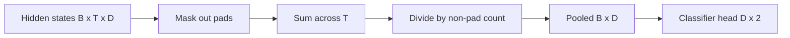

# Classifier Fine-Tuning by Head Swap

> Track B's first capstone. A pretrained language model is a stack of self-attention blocks ending in a token-prediction head. This lesson rips the head off, glues a two-class linear layer onto the pooled representation, and trains the classifier two different ways: final-layer only and full fine-tuning.

**Type:** Build
**Languages:** Python (torch, numpy)
**Prerequisites:** Phase 19 lessons 30-37
**Time:** ~90 minutes

## Learning Objectives

- Replace a language-model head with a classification head without re-initialising the body.
- Implement two training regimes: frozen body (head-only) and full fine-tuning, sharing one training loop.
- Build a tokeniser-aware data pipeline that pads, masks padding, and pools attention output.
- Compute precision, recall, F1, and a confusion matrix from raw logits.
- Reason about the trade-off between parameter count, training time, and head-room.

## The Concept

Head-only training: set `requires_grad=False` on body parameters. Full fine-tuning: let gradients flow through the whole stack.

## The Pooling Question

Mean pool: average hidden states across the sequence, weighted by the attention mask. CLS pool: use only the first token's output. Last-token pool: use the last non-padding token.

## What you will build

`ByteTokenizer`, `Block`, `LMBody`, `MeanPool`, `Classifier`, `freeze_body`/`unfreeze_body`, `train_classifier`, `evaluate`. The demo pretrains briefly, then trains and evaluates head-only then full, prints both reports.

[Reference](https://github.com/rohitg00/ai-engineering-from-scratch/tree/main/phases/19-capstone-projects/38-classifier-finetuning)
