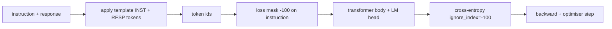
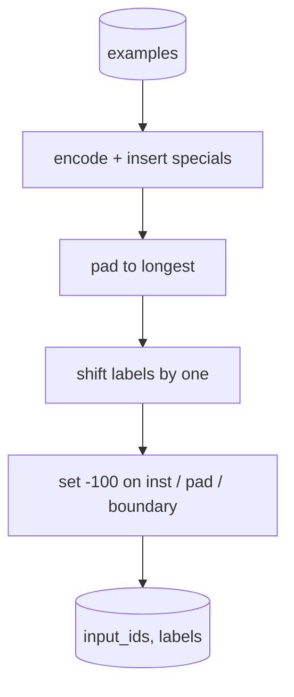

# Instruction Tuning by Supervised Fine-Tuning

> A pretrained base model can extend a sequence but cannot follow an instruction. Supervised fine-tuning is the smallest change that fixes this: feed the model paired examples of an instruction and a desired response, and train the body to predict the response tokens. The trick is that you only want the loss to count the response, not the instruction.

**Type:** Build
**Languages:** Python (torch, numpy)
**Prerequisites:** Phase 19 lessons 30-37
**Time:** ~90 minutes

## Learning Objectives

- Format paired instruction-response data into a single causal sequence with explicit boundary tokens.
- Build a collate function that masks instruction tokens so cross-entropy only counts response tokens.
- Train a tiny transformer body under the SFT objective.
- Implement greedy and temperature-sampled generation that respects the response-start boundary.
- Compute held-out exact-match on generated completions.

## The Concept

Every training example becomes: `<INST> What is the capital of France? <RESP> The capital of France is Paris.`

`ignore_index=-100` in `torch.nn.functional.cross_entropy`. Instruction positions contribute zero loss and zero gradient.

## Tokenisation and Padding

## What you will build

`InstructionTokenizer`, `make_dataset` (200 pairs across 6 task types), `SFTDataset`, `sft_collate`, `TinyGPT`, `train_sft`, `generate`, `exact_match`, `run_demo`.

[Reference](https://github.com/rohitg00/ai-engineering-from-scratch/tree/main/phases/19-capstone-projects/39-instruction-tuning-sft)
