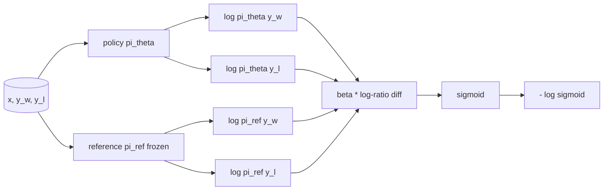

# Direct Preference Optimization from Scratch

> Reward models and PPO are the classical RLHF stack. DPO collapses that stack into a single supervised loss that fits a policy directly against preference pairs.

**Type:** Build
**Languages:** Python (torch, numpy)
**Prerequisites:** Phase 19 lessons 30-37
**Time:** ~90 minutes

## Learning Objectives

- Derive the DPO loss as a sigmoid over a scaled log-ratio difference and connect it to the implicit reward.
- Build a reference model + policy model pair with a frozen reference and a trainable policy.
- Compute sequence-level log-probabilities under both models, masking prompt tokens.
- Train the policy on `(prompt, chosen, rejected)` triples and watch the chosen log-prob rise relative to rejected.
- Pin behaviour with tests on the loss math, the gradient sign, and the reference invariance.

## The Concept

DPO replaces the two-stage RLHF pipeline (reward model + PPO) with a single supervised loss.

From Bradley-Terry: `P(y_w > y_l | x) = sigmoid( r(x, y_w) - r(x, y_l) )`

The DPO loss:

```text
L_DPO(theta) = - E_{(x, y_w, y_l)} [
  log sigmoid( beta * ( log pi_theta(y_w|x) - log pi_ref(y_w|x)
                       - log pi_theta(y_l|x) + log pi_ref(y_l|x) ) )
]
```



## Reference Invariance

Reference is frozen with `torch.no_grad()` and `requires_grad=False`. Policy starts from same weights as reference.

## What you will build

`InstructionTokenizer`, `TinyGPT`, `make_preferences` (12 triples), `sequence_log_prob`, `dpo_loss`, `train_dpo`, `evaluate_margins`, `run_demo`.

[Reference](https://github.com/rohitg00/ai-engineering-from-scratch/tree/main/phases/19-capstone-projects/40-dpo-from-scratch)
