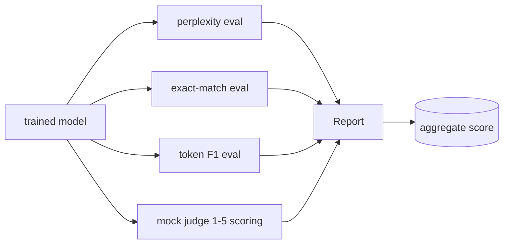
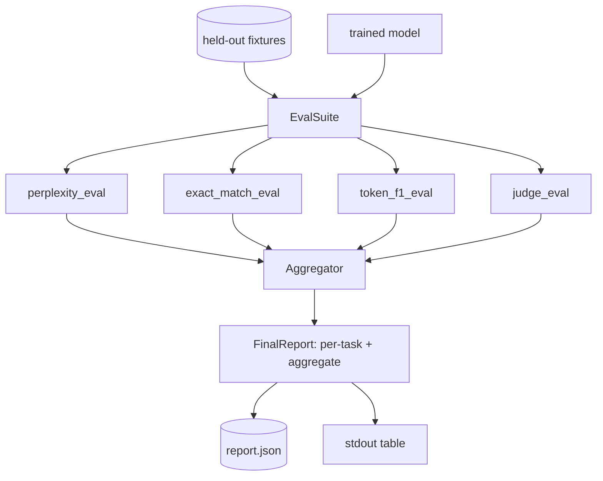

# Full Evaluation Pipeline

> Training is the part you can monitor with loss curves. Evaluation is the part you have to design. This lesson builds a unified eval pipeline that takes any trained language model, runs four heterogeneous evals, aggregates the results into a per-task report, and ships a local mock LLM-as-judge.

**Type:** Build
**Languages:** Python (torch, numpy)
**Prerequisites:** Phase 19 lessons 30-37
**Time:** ~90 minutes

## Learning Objectives

- Compute held-out perplexity with masked-token accounting on a tiny transformer.
- Run an exact-match eval on short-form factual prompts.
- Compute token-level F1 between predicted and reference strings with normalisation.
- Build a local mock LLM-as-judge that scores model outputs on a 1-5 scale.
- Aggregate the four evals into a single weighted report with per-task breakdown.

## The Concept

## The Four Evals

**Perplexity**: `exp(mean negative log-likelihood per token)`, excluding padding positions.

**Exact-match**: normalised (lowercase, strip, collapse whitespace, drop trailing punctuation) string comparison.

**Token F1**: precision = intersection / len(pred), recall = intersection / len(ref), F1 = harmonic mean.

**Mock Judge**: deterministic scorer. 5 if normalised prediction equals reference; 4 if token F1 >= 0.8; 3 if F1 in [0.5, 0.8); 2 if F1 in [0.2, 0.5); 1 otherwise.

## Architecture

## What you will build

`TinyGPT`, `InstructionTokenizer`, four fixtures (20 examples each), `perplexity_eval`, `exact_match_eval`, `token_f1_eval`, `mock_judge`/`judge_eval`, `Aggregator`, `run_demo`.

[Reference](https://github.com/rohitg00/ai-engineering-from-scratch/tree/main/phases/19-capstone-projects/41-eval-pipeline)
