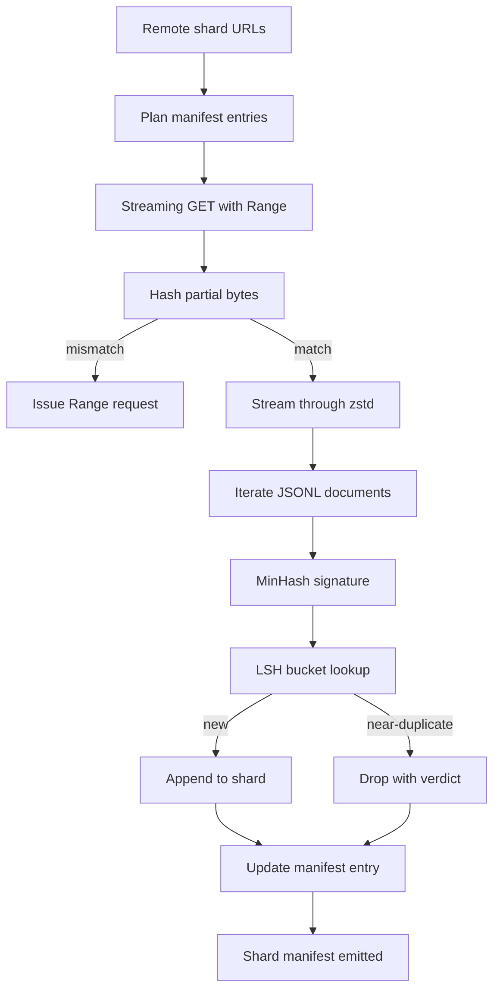

# Large Corpus Downloader

> Training a language model begins long before the first forward pass. The corpus has to land on disk, decompressed, deduplicated, and addressable, with the resume story already worked out before the network drops at 4 percent.

**Type:** Build
**Languages:** Python
**Prerequisites:** Phase 19 lessons 30-37
**Time:** ~90 minutes

## Learning Objectives

- Stream remote shards with `urllib` and decompress with `zstandard` without buffering the whole file in memory.
- Resume partial downloads by issuing HTTP `Range` requests against a verified byte offset.
- Build a MinHash signature per document and bucket it with LSH so near-duplicates collide.
- Emit a shard manifest with content hash, byte size, document count, and dedup verdict.

## The Concept

### Resume with `Range`

The downloader writes two files per shard: the shard and a `.partial.json` checkpoint with `verified_bytes`, `expected_size`, `sha256_prefix`. On resume, recompute the hash and only proceed if it matches.

### MinHash plus LSH

MinHash estimates Jaccard similarity with `k` minimum hash values. LSH groups into `b` bands of `r` rows. Threshold tuned by `(k, b, r)`. Typical: `k=128`, `b=32`, `r=4`, threshold `s=0.8`.

## Build It

`code/main.py` implements `ShardPlanner`, `StreamingDownloader`, `ZstdDocIterator`, `MinHasher`, `LSHIndex`, `Dedup`, `ManifestWriter`.

## Key Terms

| Term | What people say | What it actually means |
|------|-----------------|------------------------|
| Shard | "A file" | Self-contained slice of the corpus with its own sha256 |
| MinHash signature | "Fingerprint" | k-component sketch of a set |
| LSH band | "Bucket" | Group of r signature components used as a bucket key |
| Verified bytes | "Resume offset" | Bytes on disk whose sha256 prefix matches the checkpoint |
| Manifest | "The index" | Single durable record of what the downloader produced |

[Reference](https://github.com/rohitg00/ai-engineering-from-scratch/tree/main/phases/19-capstone-projects/42-large-corpus-downloader)
