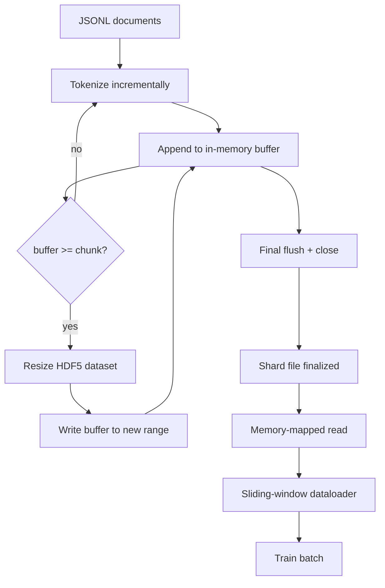

# HDF5 Tokenized Corpus

> The downloaded corpus has to land in a layout the trainer can stream from at line speed. JSONL on disk does not survive 16 dataloader workers. HDF5 with a resizable, chunked integer dataset does.

**Type:** Build
**Languages:** Python
**Prerequisites:** Phase 19 lessons 30-37
**Time:** ~90 minutes

## Learning Objectives

- Stream documents into a resizable HDF5 integer dataset with deterministic chunking.
- Shard the write across multiple HDF5 files so failure is bounded and parallelism is possible.
- Read tokens back through HDF5's page-cache-backed chunked layout.
- Implement a sliding-window dataloader that emits fixed-length training sequences with explicit packing rules.

## The Problem

A modern language-model training run reads tokens at hundreds of thousands of samples per second across dozens of workers. JSONL on disk dies at the first cold-cache page fault. Even Parquet is a poor fit because the trainer does not want columns; it wants a flat token stream with O(1) random access.

HDF5 fits because it offers a chunked, resizable, integer-only dataset whose chunks are page-cache friendly at read time. The trainer asks for a slice of `tokens[3,200,000 : 3,200,8192]` and HDF5 copies the requested hyperslab from the page cache into a freshly allocated NumPy array.

The build problem is making the write side honest. Resizable datasets are easy to misuse: write one document at a time and the HDF5 file is fragmented. Write all documents in one resize and a process death loses the whole shard. The right discipline is buffer-then-extend, with a buffer size that matches the chunk size.

## The Concept



### Resizable HDF5 done right

The token dataset is created with `maxshape=(None,)` and a fixed `chunks=(chunk_size,)`. Writing proceeds by buffering tokens in a NumPy array of length `chunk_size`. When the buffer fills, the dataset is resized by exactly `chunk_size` and the buffer is written into the new range.

### Sharded write

Each input shard from lesson 42 produces one HDF5 output shard. A `shards.json` index records, per shard, the file path, the token count, the document count, and a sha256 over the tokens.

### Memory-mapped read

At training time each worker opens its share of HDF5 files in `swmr=True` mode and asks for `tokens[start:stop]`. HDF5's chunk layout makes this a page-cache-backed read. The slice is copied into the dataloader's batch buffer, which is then copied into a pinned-memory training tensor.

### Sliding-window dataloader

Picks a random start index in the global token stream, reads `window_size + 1` tokens, and returns `(input, target) = (tokens[:-1], tokens[1:])`. Document boundaries are not enforced: a window may straddle two documents, with an explicit `boundary_token_id` between them.

## Build It

`code/main.py` implements: `Tokenizer`, `HDF5ShardWriter`, `ShardedTokenizationPipeline`, `MmapTokenStore`, `SlidingWindowDataloader`.

Run it:
```bash
python3 code/main.py
```

## Production Patterns

- Chunk size equals the typical read.
- Token count in attributes, not in the dataset.
- Sharded sha256 with parallel verification.
- `swmr=True` on both sides with `libver="latest"` on the writer.

## Exercises

1. Add a `--compression gzip` flag and measure the throughput cost.
2. Add a deterministic seed to the sliding-window dataloader.
3. Add a `--validate` mode that recomputes sha256 and compares against `shards.json`.
4. Compare dataloader throughput at different chunk sizes.
5. Add a `--max-document-tokens` truncation flag.

## Key Terms

| Term | What it actually means |
|------|------------------------|
| Resizable dataset | An HDF5 dataset with `maxshape=(None,)` that grows via `resize` calls in chunk-sized strides |
| Chunked layout | Fixed-size on-disk pages that the kernel can memory-map |
| `swmr` mode | Single-Writer-Multiple-Reader mode for safe file sharing |
| Shard index | The durable index of all token shards with offsets and content hashes |
| Sliding window | A fixed-length slice of the global token stream paired with its shift-by-one target |

[Reference](https://github.com/rohitg00/ai-engineering-from-scratch/tree/main/phases/19-capstone-projects/43-hdf5-tokenized-corpus)
