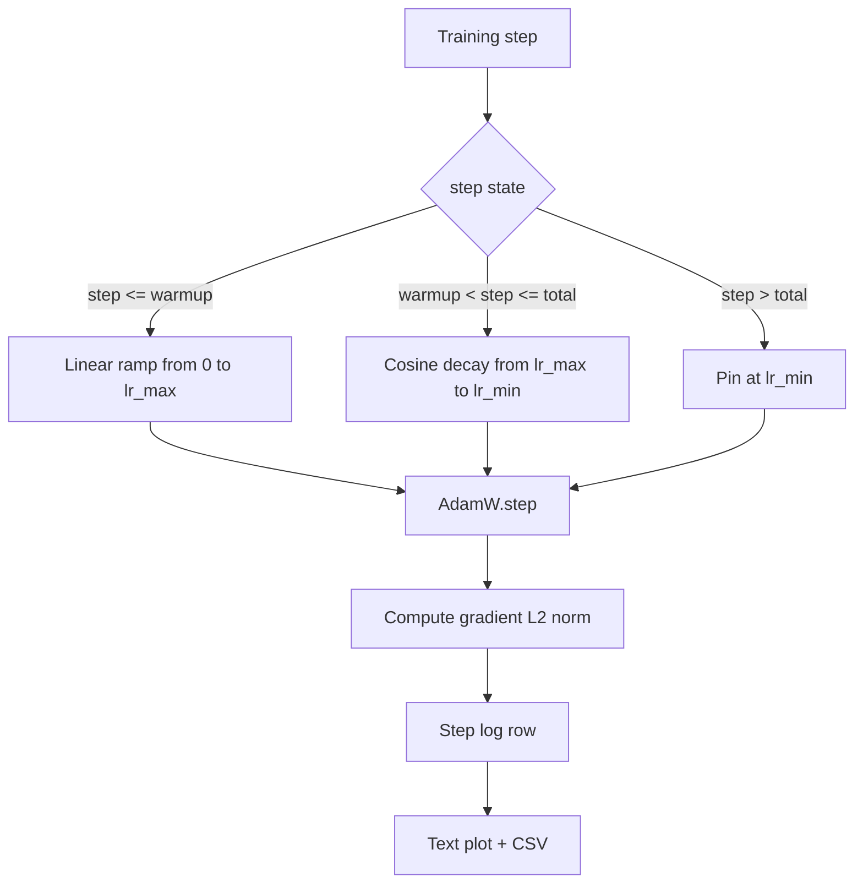

# Cosine LR with Linear Warmup

> The learning-rate schedule is the second most important decision after the loss function. AdamW with a cosine decay and a linear warmup is the modern default for language-model training.

**Type:** Build
**Languages:** Python
**Prerequisites:** Phase 19 lessons 30-37
**Time:** ~90 minutes

## Learning Objectives

- Implement an AdamW optimizer wired to a cosine learning-rate schedule with linear warmup.
- Compute the schedule's exact value at any step without floating-point drift.
- Log gradient L2 norm side by side with the learning rate so training health is observable.
- Render the schedule to a text plot and a CSV.

## The Problem

The first thousand training updates are the loudest. If the learning rate is at its peak during these updates the model either diverges outright or settles into a loss plateau it never escapes. The cosine-with-warmup schedule has three regions: linear ramp from zero to `lr_max`, cosine decay from `lr_max` to `lr_min`, and a floor pinned at `lr_min` past `total_steps`.

## The Concept



### Warmup formula

For `step` in `[0, warmup_steps]`: `lr = lr_max * step / warmup_steps`. `warmup_steps = 0` means no warmup.

### Cosine formula

For `step` in `(warmup_steps, total_steps]`: `lr = lr_min + 0.5 * (lr_max - lr_min) * (1 + cos(pi * progress))` where `progress = (step - warmup_steps) / max(1, total_steps - warmup_steps)`.

### Floor after total steps

For `step > total_steps`: pinned at `lr_min`.

## Build It

`code/main.py` implements: `CosineWithWarmup`, `TrainState`, `plot_schedule_ascii`, `write_schedule_csv`.

Run it:
```bash
python3 code/main.py
```

## Production Patterns

- Schedule lives in a config, not in code.
- Step counter is monotonic and decoupled from epochs.
- Schedule plot in the run directory.
- Log row schema is fixed.

## Exercises

1. Add an inverse-square-root variant and compare.
2. Add a `--restart` flag with warm restarts.
3. Add a continuity test for the schedule.
4. Wire the schedule into `LambdaLR`.
5. Add a `--plot-png` flag via matplotlib.

## Key Terms

| Term | What it actually means |
|------|------------------------|
| Warmup | Linear ramp from zero to `lr_max` over the first `warmup_steps` updates |
| Cosine decay | Upper-half cosine curve from `lr_max` to `lr_min` |
| Floor | Fixed `lr_min` past `total_steps` |
| Gradient norm | L2 of concatenated gradient vector |
| Global step | Monotonic step counter that survives restarts |

[Reference](https://github.com/rohitg00/ai-engineering-from-scratch/tree/main/phases/19-capstone-projects/44-cosine-lr-warmup)
