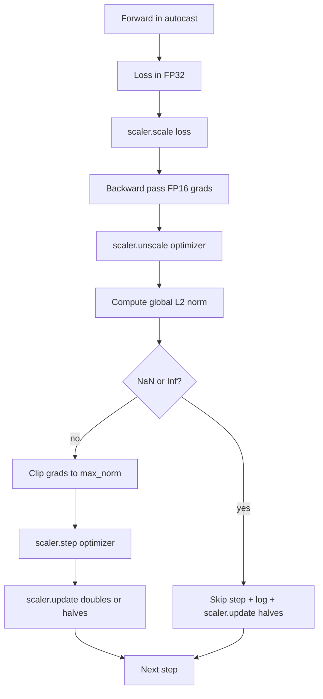

# Gradient Clipping and Mixed Precision

> The optimizer and schedule assume gradients are sane. They usually are not. A single bad batch can spike the gradient norm by three orders of magnitude. Mixed-precision training amplifies this with FP16 overflow.

**Type:** Build
**Languages:** Python
**Prerequisites:** Phase 19 lessons 30-37
**Time:** ~90 minutes

## Learning Objectives

- Compute the global L2 norm over all parameter gradients and clip in place.
- Wrap a training step in autocast plus a GradScaler.
- Detect NaN and Inf, skip the optimizer step, and log the skip.
- Report the GradScaler's scaling factor every step.

## The Problem

Without clipping, a single batch whose gradient norm is 20x the previous peak resets every learning the model had done in the previous hour. Mixed-precision pushes throughput 2-3x but FP16 has a narrow exponent range. GradScaler multiplies the loss before backward and divides gradients before the step. The right order is: `scaler.scale(loss).backward()`, `scaler.unscale_(optimizer)`, `clip_grad_norm_`, `scaler.step(optimizer)`, `scaler.update()`.

## The Concept



## Build It

`code/main.py` implements: `clip_global_l2_norm`, `has_non_finite_grad`, `AmpTrainState`, `StepLog`, `SkipLog`.

Run it:
```bash
python3 code/main.py
```

## Production Patterns

- Skip counter as an alert, not a log line.
- Clip threshold lives in the config.
- Norm log goes to a CSV with the schedule.
- `scaler.update()` runs every step, even on skip.

## Exercises

1. Replace synthetic Inf injection with a real loss spike.
2. Add a `--bf16` mode.
3. Add a unit test for gradient-clip wrapper.
4. Add a rolling-window skip-rate check.
5. Wire the loop to write the canonical CSV.

## Key Terms

| Term | What it actually means |
|------|------------------------|
| Global L2 norm | Euclidean norm of concatenated gradient vector across all trainable parameters |
| autocast | Selective FP16/BF16 execution of eligible operations |
| GradScaler | Helper that scales the loss before backward and inverse-scales before step |
| Skip | Optimizer step refused due to non-finite gradient or loss |
| Scaling factor | GradScaler's current multiplier |

[Reference](https://github.com/rohitg00/ai-engineering-from-scratch/tree/main/phases/19-capstone-projects/45-gradient-clipping-amp)
