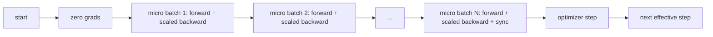

# Gradient Accumulation

> Train at an effective batch you cannot afford, one micro-batch at a time. Scale the loss, hold the optimizer step, and let the gradients pile up.

**Type:** Build
**Languages:** Python
**Prerequisites:** Phase 19 lessons 42 to 45
**Time:** ~90 minutes

## Learning Objectives

- Derive the effective batch identity: `effective_batch = micro_batch * accum_steps`.
- Implement loss-per-micro-batch scaling so the accumulated gradient matches a single full-batch backward.
- Skip optimizer synchronization until the last micro-batch.
- Read a throughput vs effective batch curve.

## The Problem

The accelerator holds 32 examples. You want an effective batch of 512. Run 16 backward passes, let the gradients accumulate inside the parameter buffers, and only step the optimizer when the count reaches the target. Without loss scaling, the gradient magnitude is 16x too big.

## The Concept



### The equivalence proof

```python
loss = criterion(model(x_full), y_full)
loss.backward()
opt.step()
```

is equivalent to:
```python
for x, y in chunks(x_full, y_full, n):
    scaled = criterion(model(x), y) / n
    scaled.backward()
opt.step()
```

## Build It

`code/main.py` implements: `equivalence_check`, `train_one_optimizer_step`, `sweep_effective_batches`.

Run it:
```bash
python3 code/main.py
```

## Exercises

1. Re-run the sweep and plot samples per second against effective batch.
2. Add a wrong scaling variant and show the parameter diff.
3. Swap SGD for AdamW and confirm optimizer state advances once per effective step.
4. Introduce a real DDP wrapper and route `no_sync_context`.
5. Modify the equivalence check for different micro splits.

## Key Terms

| Term | What it actually means |
|------|------------------------|
| Micro batch | The slice that fits in memory in a single forward pass |
| Accum steps | Number of backwards summed before one optimizer step |
| Effective batch | Micro batch times accum steps times data parallel world size |
| Loss scaling | Per-micro-batch division so summed gradients match full batch |
| Sync on last | Only run the gradient collective on the last backward in the window |

[Reference](https://github.com/rohitg00/ai-engineering-from-scratch/tree/main/phases/19-capstone-projects/46-gradient-accumulation)
