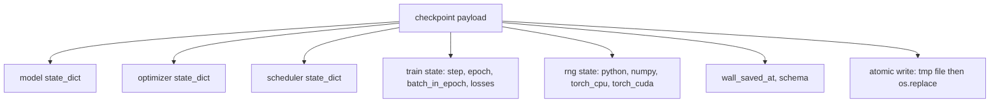
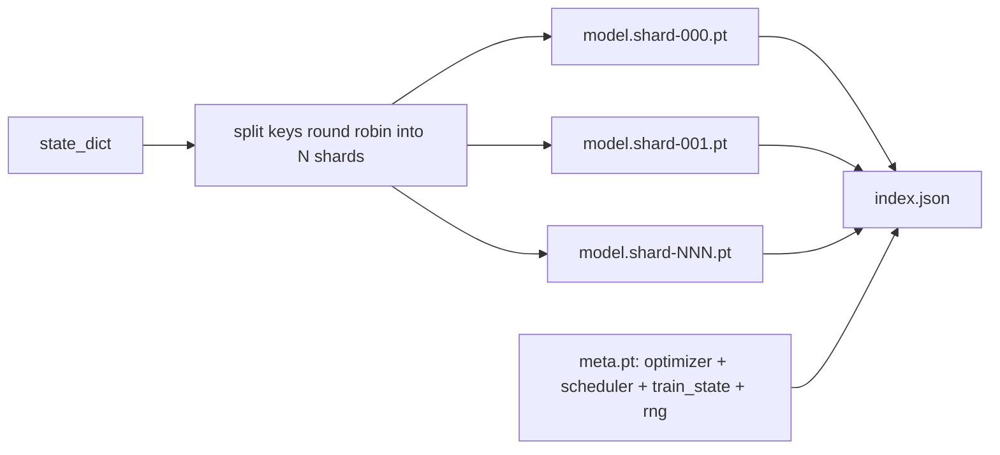

# Checkpoint Save and Resume

> Train interrupts kill runs; checkpoints let them continue. Save model, optimizer, scheduler, loss history, step counter, and RNG state, atomically, so a kill at any moment leaves a valid file on disk.

**Type:** Build
**Languages:** Python
**Prerequisites:** Phase 19 lessons 42 to 45
**Time:** ~90 minutes

## Learning Objectives

- Capture the full training state into a single reloadable payload.
- Implement atomic save with write-to-temp then rename.
- Restore the RNG state for Python, NumPy, and PyTorch.
- Build a sharded checkpoint layout with hash-verified shards.

## The Problem

The cluster reboots at hour 11. Without checkpoints you start over. Without RNG restoration the resumed loss curve is a different curve.

## The Concept



### Atomic save

Write to a temp file in the same directory, then `os.replace` into the final name. POSIX rename is atomic within the same filesystem.

### Sharded checkpoints

Split parameter state into shards, write a small index with sha256 per shard.



## Build It

`code/main.py` implements: `capture_rng_state`, `restore_rng_state`, `atomic_save`, `save_checkpoint`, `load_checkpoint`, `save_sharded_checkpoint`, `load_sharded_checkpoint`, `run_resume_demo`.

Run it:
```bash
python3 code/main.py
```

## Exercises

1. Replace round-robin with parameter-group sharding.
2. Keep the last K checkpoints and prune older ones.
3. Add a `--ckpt-every-seconds` flag.
4. Add a checksum verification path.
5. Implement a `migrate_v1_to_v2` function.

## Key Terms

| Term | What it actually means |
|------|------------------------|
| Atomic save | Write to temp file then os.replace |
| State dict | Model parameters and buffers keyed by name |
| Sharded checkpoint | Multiple files per shard plus meta and JSON index |
| RNG state | Captured state for python random, numpy, torch CPU/ CUDA |
| Mid-epoch resume | Fast-forward RNG and continue from next batch |

[Reference](https://github.com/rohitg00/ai-engineering-from-scratch/tree/main/phases/19-capstone-projects/47-checkpoint-save-resume)
