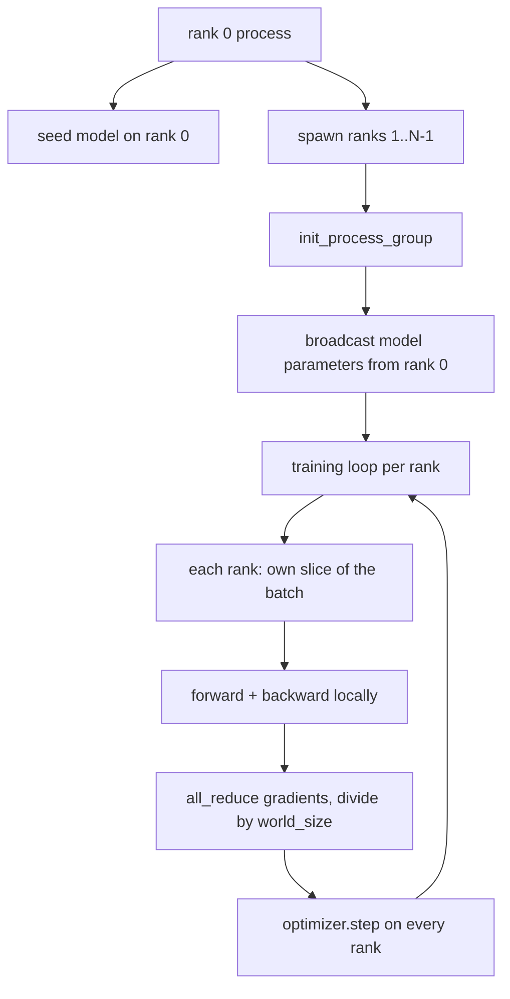
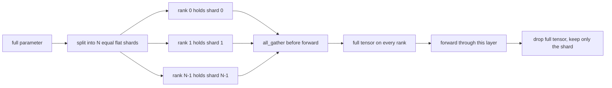

# Distributed Data Parallel and FSDP from Scratch

> Multi-rank training is two collectives and one rule. Broadcast the parameters at startup, average the gradients after backward, never let the ranks disagree about what step they are on.

**Type:** Build
**Languages:** Python
**Prerequisites:** Phase 19 lessons 42 to 45
**Time:** ~90 minutes

## Learning Objectives

- Bring up a process group across N ranks with the gloo backend.
- Implement a minimal DDP wrapper that broadcasts parameters and all-reduces gradients.
- Prove all-reduce matches single-process gradient on concatenated input.
- Sketch FSDP parameter sharding.

## The Problem

The model fits on one device but the dataset does not. Each rank runs the same model on a different slice of the batch, then averages gradients. FSDP handles the case where the model does not fit either: each rank holds a fraction of every parameter.

## The Concept



### FSDP sketch



## Build It

`code/main.py` implements: `MinimalDDP` with broadcast and all-reduce, `fsdp_round_trip_sketch`.

Run it:
```bash
python3 code/main.py
```

## Exercises

1. Run with `--world-size 4`.
2. Replace manual averaging with `dist.ReduceOp.AVG`.
3. Add a post-backward hook for overlap.
4. Implement FSDP re-shard step.
5. Switch backend to nccl on CUDA.

## Key Terms

| Term | What it actually means |
|------|------------------------|
| Backend | The library that implements collective ops (gloo for CPU, nccl for GPU) |
| World size | Number of processes in the group |
| Rank | Process identifier within the group |
| All-reduce | Sum a tensor across all ranks, every rank gets the result |
| Unshard | Reconstruct full tensor from per-rank slices via all_gather |

[Reference](https://github.com/rohitg00/ai-engineering-from-scratch/tree/main/phases/19-capstone-projects/48-distributed-fsdp-ddp)
