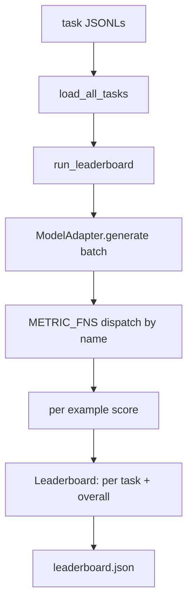

# Language Model Evaluation Harness

> A model that does well on a task you cannot define is a model that does well by accident. The harness is the task definition, the metric, the runner, and the leaderboard, in one shape.

**Type:** Build
**Languages:** Python
**Prerequisites:** Phase 19 lessons 42 to 45
**Time:** ~90 minutes

## Learning Objectives

- Define a task as a JSONL file with prompt, targets, metric, and extras.
- Implement five metrics: exact match, ROUGE-L F1, executable check, multiple choice, substring contains.
- Build a runner that batches examples per task and dispatches to a swappable model adapter.
- Emit a reproducible leaderboard JSON.

## The Concept



### The five fixture tasks

| Task | Metric |
|------|--------|
| arithmetic | exact_match |
| summary | rouge_l |
| code-exec | code_exec |
| multiple-choice | multiple_choice |
| generation | substring_contains |

## Build It

`code/main.py` implements: `seed_fixture_tasks`, `load_all_tasks`, metrics (exact_match, substring_contains, multiple_choice, rouge_l, code_exec), `ModelAdapter` protocol, `run_leaderboard`, `write_leaderboard`.

Run it:
```bash
python3 code/main.py
```

## Exercises

1. Add a sixth task with a custom metric.
2. Extend code_exec to capture stdout.
3. Add a leaderboard diff command.
4. Cap latency per example with a timeout.
5. Pin task content with a sha256 in the leaderboard.

## Key Terms

| Term | What it actually means |
|------|------------------------|
| Task spec | JSONL file with prompt, targets, metric, extras per example |
| Metric | Function from (prediction, targets, extras) to float in [0, 1] |
| Adapter | Object with generate(prompts) -> list[str] method |
| Leaderboard | JSON with per-task scores, latency, and overall average |
| Code exec metric | Execute prediction in restricted namespace, compare against IO pairs |

[Reference](https://github.com/rohitg00/ai-engineering-from-scratch/tree/main/phases/19-capstone-projects/49-lm-eval-harness)
