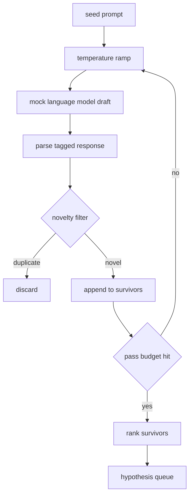

# Hypothesis Generator

> A research agent that asks the same question twice is wasting tokens. The trick is forcing each draft to land somewhere new.

**Type:** Build
**Languages:** Python
**Prerequisites:** Phase 19 Track A lessons 20-29
**Time:** ~90 minutes

## Learning Objectives

- Drive a sampler from a seed prompt and turn its outputs into typed hypothesis records.
- Ramp the sampler temperature on each pass so the next draft drifts further.
- Filter near duplicates with a small embedding model and cosine distance threshold.
- Rank survivors with a scoring function blending novelty, specificity, and testability.
- Keep every step deterministic so the same seed always produces the same queue.

## Why generate, then filter

The loop wants a ranked queue with depth. Temperature ramping and novelty filtering combine to produce it. Each pass raises the temperature notch, and each draft is measured against prior survivors.

## The Hypothesis shape

```
Hypothesis
  id             : int
  text           : str
  variables      : list[str]
  metric         : str
  baseline_ref   : str | None
  draft_pass     : int
  temperature    : float
  novelty_score  : float
  rank_score     : float
```

## Architecture



## Build It

`code/main.py` defines `Hypothesis`, `MockLLM`, `HypothesisGenerator`, and a deterministic demo.

## Key Terms

| Term | What it actually means |
|------|------------------------|
| Temperature ramp | Linearly increasing temperature across passes |
| Novelty filter | Embedding distance threshold to reject near-duplicates |
| Rank score | Weighted blend of novelty, specificity, and testability |

[Reference](https://github.com/rohitg00/ai-engineering-from-scratch/tree/main/phases/19-capstone-projects/50-hypothesis-generator)
