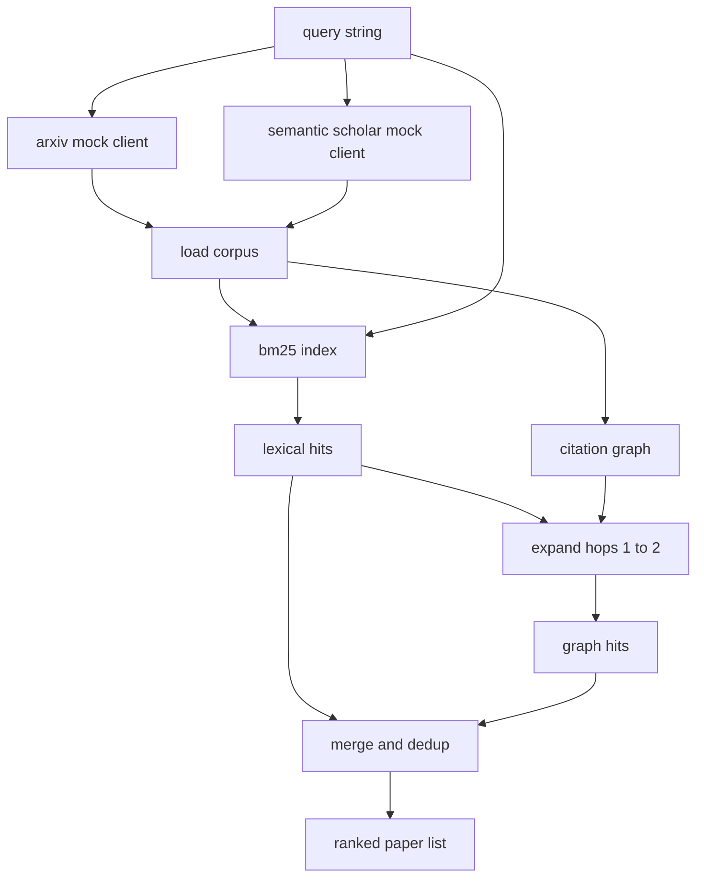

# Literature Retrieval

> A hypothesis is cheap. Knowing whether someone already proved it is the expensive part.

**Type:** Build
**Languages:** Python
**Prerequisites:** Phase 19 Track A lessons 20-29
**Time:** ~90 minutes

## Learning Objectives

- Model a small paper record with fields the loop reads downstream.
- Build a BM25 index over abstracts with stdlib data structures.
- Walk a citation graph to surface papers lexical search misses.
- Deduplicate hits across lexical and graph passes by stable paper id.
- Wrap two mock external APIs behind a single client.

## Why two retrieval passes

BM25 over abstracts catches lexical hits. Citation graph traversal expands a seed set by one or two hops. The union is deduplicated and ranked.

## Architecture

## Build It

`code/main.py` defines `Paper`, `ArxivMockClient`, `SemanticScholarMockClient`, `BM25Index`, `CitationGraph`, `RetrievalClient`, and a deterministic demo.

## Key Terms

| Term | What it actually means |
|------|------------------------|
| BM25 | Probabilistic lexical retrieval with IDF x saturating TF x length normalization |
| Citation graph | Directed graph of paper references and citations |
| Recency score | Linear ramp from corpus minimum year to maximum |

[Reference](https://github.com/rohitg00/ai-engineering-from-scratch/tree/main/phases/19-capstone-projects/51-literature-retrieval)
