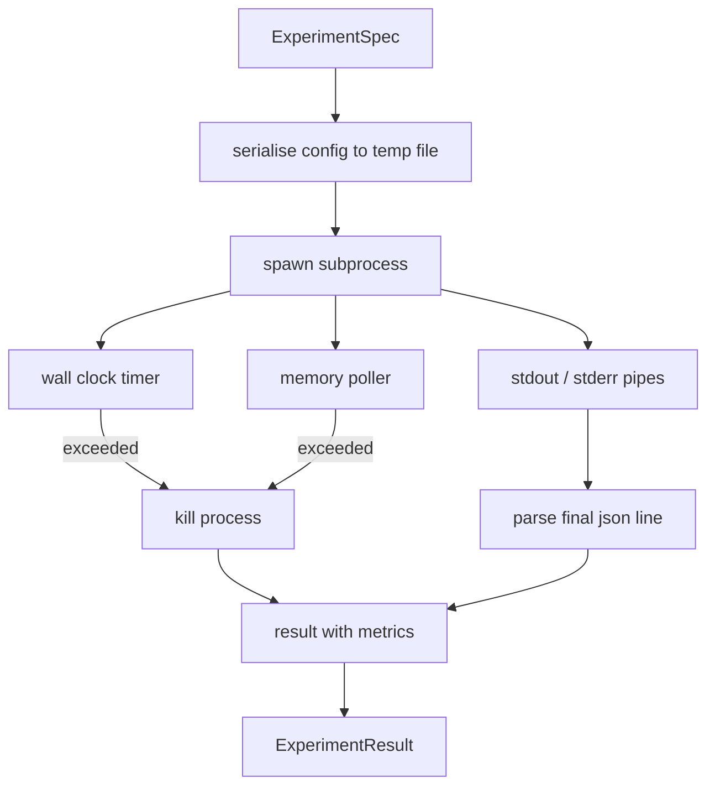

# Experiment Runner

> The loop is only as honest as its measurements. Build the runner that takes a spec, executes it in a sandboxed subprocess, and emits a JSON metrics blob.

**Type:** Build
**Languages:** Python
**Prerequisites:** Phase 19 Track A lessons 20-29
**Time:** ~90 minutes

## Learning Objectives

- Encode an experiment as a typed spec serializable to a subprocess.
- Launch a subprocess with a hard wall-clock timeout and a soft memory cap.
- Capture stdout, stderr, and structured metrics into a single result record.
- Build an ablation table that sweeps one configuration knob at a time.
- Keep every result deterministic given a seed.

## Why a subprocess

Untrusted code from a sampler needs isolation. Subprocesses are the simplest isolation the language ships: separate process, independent address space, signal handle on the parent side.

## Architecture

## Build It

`code/main.py` defines `ExperimentSpec`, `ExperimentResult`, `ExperimentRunner`, `AblationRunner`, and a deterministic demo.

## Key Terms

| Term | What it actually means |
|------|------------------------|
| Spec | Typed experiment definition with config, timeout, and memory cap |
| Terminal | One of ok, timeout, oom, crash |
| Ablation table | One spec per knob value with derived spec_id |

[Reference](https://github.com/rohitg00/ai-engineering-from-scratch/tree/main/phases/19-capstone-projects/52-experiment-runner)
