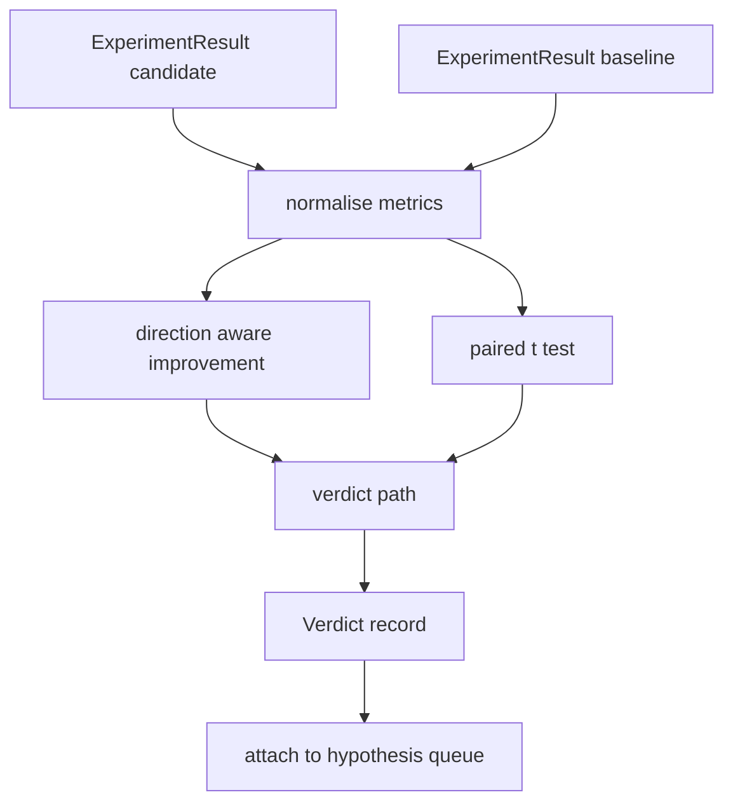

# Result Evaluator

> The runner produced numbers. The evaluator decides whether those numbers are an improvement, a regression, or noise.

**Type:** Build
**Languages:** Python
**Prerequisites:** Phase 19 Track A lessons 20-29
**Time:** ~90 minutes

## Learning Objectives

- Compare candidate vs baseline using direction-aware improvement and a fixed threshold.
- Run a paired t-test from scratch over per-seed metrics.
- Normalise log-scaled metrics so a downstream report can blend them with linear metrics.
- Emit a per-hypothesis verdict the orchestrator can attach to the queue.
- Keep every step pure so inputs always produce the same verdict.

## Why a paired test

The same configuration with a different seed gives a different perplexity. The paired test compares the same seeds with the same data, once with candidate and once with baseline. Each seed contributes a difference.

```text
diffs    = [a_i - b_i for i in seeds]
mean     = sum(diffs) / n
variance = sum((d - mean) ** 2 for d in diffs) / (n - 1)
t_stat   = mean / sqrt(variance / n)
df       = n - 1
p_value  = two_sided_p(t_stat, df)
```

## Architecture



## Build It

`code/main.py` defines `MetricSpec`, `Verdict`, `Evaluator`, t-statistic and incomplete beta helpers, and a deterministic demo.

## Key Terms

| Term | What it actually means |
|------|------------------------|
| Paired test | Each seed matched between candidate and baseline |
| Direction aware | higher_is_better vs lower_is_better for signed improvement |
| Log normalisation | Natural log transform before computing improvement |
| Verdict | improved, regressed, noise, or failed |

[Reference](https://github.com/rohitg00/ai-engineering-from-scratch/tree/main/phases/19-capstone-projects/53-result-evaluator)
