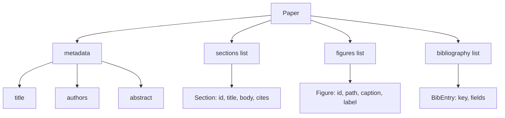

# Paper Writer

> A LaTeX skeleton is a contract between researcher and typesetter. Build the skeleton first, then fill it.

**Type:** Build
**Languages:** Python
**Prerequisites:** Phase 19 lessons 50-53
**Time:** ~90 minutes

## Learning Objectives

- Treat a research paper as a structured artifact with a known section graph.
- Generate a LaTeX skeleton with abstract, sections, figure slots, and bibliography.
- Inject figures from experiment outputs through a deterministic slot mechanism.
- Wire a mocked prose generator for testability.
- Emit paper.tex, references.bib, and a manifest.

## Why a skeleton first

Structure declared up front as data means the harness can validate before any prose is written: every figure has a slot, every citation has an entry, every section appears in the TOC.

## The Paper shape

## Build It

`code/main.py` defines `Paper`, `Section`, `Figure`, `BibEntry`, `PaperValidationError`, `MockProseGenerator`, `PaperWriter`, and `render_latex`.

## Key Terms

| Term | What it actually means |
|------|------------------------|
| Skeleton | Declared section graph with figure slots and bib keys before prose |
| Figure injection | Deterministic conversion of experiment manifests to Figure records |
| Manifest | JSON with figures referenced, citations used, sections rendered |

[Reference](https://github.com/rohitg00/ai-engineering-from-scratch/tree/main/phases/19-capstone-projects/54-paper-writer)
