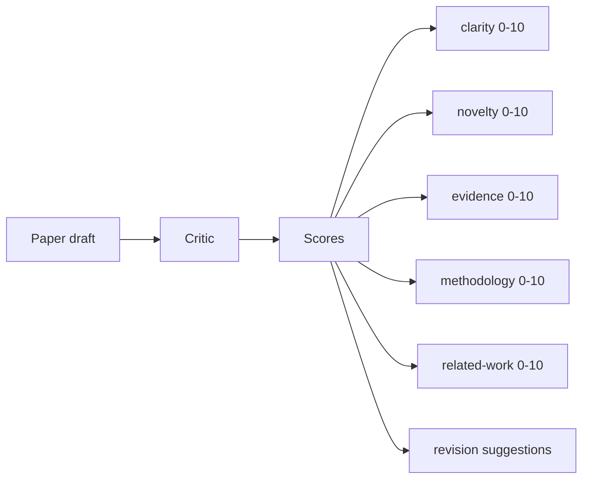
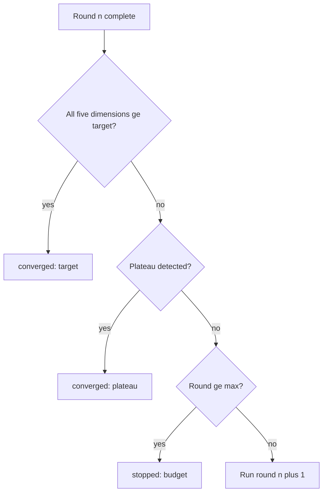

# Critic Loop

> A critic that always returns "looks good" or "needs work" is broken. The interesting critic is the one that converges, and you have to engineer convergence.

**Type:** Build
**Languages:** Python
**Prerequisites:** Phase 19 lessons 50-53
**Time:** ~90 minutes

## Learning Objectives

- Score a paper draft across five fixed dimensions: clarity, novelty, evidence, methodology, related-work.
- Apply each round's critique as a structured revision diff.
- Detect convergence by comparing scores across rounds.
- Cap rounds with a max-iteration budget.
- Emit a per-round trace for the dashboard.

## Why five fixed dimensions

A score vector lets the harness watch each dimension across rounds. A revision that raises clarity but tanks evidence is a regression on evidence, and the convergence check sees it.

## Convergence rules

## Build It

`code/main.py` defines `Critique`, `Suggestion`, `Critic` protocol, `Reviser` protocol, `CriticLoop`, and `make_deterministic_critic_pair`.

## Key Terms

| Term | What it actually means |
|------|------------------------|
| Score vector | Five-dimensional evaluation (clarity, novelty, evidence, methodology, related_work) |
| Plateau | Two consecutive rounds with improvement below epsilon |
| Trace | Per-round record of scores, suggestion count, and convergence verdict |

[Reference](https://github.com/rohitg00/ai-engineering-from-scratch/tree/main/phases/19-capstone-projects/55-critic-loop)
