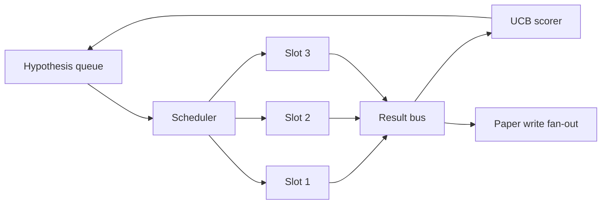

# Iteration Scheduler

> A research loop without a scheduler is a queue with delusions. The scheduler decides what to stop exploring.

**Type:** Build
**Languages:** Python
**Prerequisites:** Phase 19 lessons 50-53
**Time:** ~90 minutes

## Learning Objectives

- Model a research workflow as hypothesis queue feeding parallel experiment slots.
- Run multiple experiments concurrently with asyncio.
- Score each branch with UCB for explore-exploit balance.
- Fan out finished results to paper-write stage and re-queue stage.
- Surface a per-iteration trace with branch scores and pruning decisions.

## The system shape



## UCB scoring

```text
ucb(branch) = mean_reward(branch) + c * sqrt( ln(total_runs) / runs(branch) )
```

Untried branches get +inf. Pruning removes branches with mean reward below floor after enough trials.

## Build It

`code/main.py` defines `Hypothesis`, `Result`, `BranchStats`, `IterationScheduler`, and `make_deterministic_runner`.

## Key Terms

| Term | What it actually means |
|------|------------------------|
| UCB1 | Upper confidence bound with sqrt(2) exploration constant |
| Pruning | Remove low-yield branches from the queue |
| Fan-out | Paper triggers and follow-up hypothesis expansion |

[Reference](https://github.com/rohitg00/ai-engineering-from-scratch/tree/main/phases/19-capstone-projects/56-iteration-scheduler)
