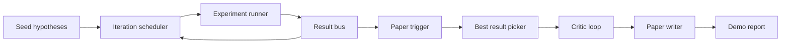

# End-to-End Research Demo

> A demo is where every contract you wrote earlier has to compose. If any one of them leaks, the demo catches it.

**Type:** Build
**Languages:** Python
**Prerequisites:** Phase 19 lessons 50-53
**Time:** ~90 minutes

## Learning Objectives

- Wire the auto-research loop end to end: hypothesis seed, scheduler, runner, critic loop, paper writer.
- Compose primitives from four earlier Track D lessons through plain Python imports.
- Run the loop to self-termination and emit a single demo report.
- Keep the demo deterministic for test assertions.
- Surface clear failure modes when any stage's contract breaks.

## What composes here

## Build It

`code/main.py` defines `BestResultError`, `NoTriggerError`, `DemoReport`, `pick_best_branch`, `build_mini_paper`, `mini_to_full_paper`, and `run_demo`.

## Key Terms

| Term | What it actually means |
|------|------------------------|
| Import, not copy | Adjust sys.path to pull from sibling lesson modules |
| Best-result picker | Select branch with highest mean reward |
| Mini to full paper | Upgrade critic's MiniPaper to Paper shape with figures and bib |

[Reference](https://github.com/rohitg00/ai-engineering-from-scratch/tree/main/phases/19-capstone-projects/57-end-to-end-research-demo)
